# Spectro — method guide

How to apply every spectrophotometric method in Spectro, with a worked example and a screenshot of the method being applied. The examples use the simulated guide systems below (Gaussian bands, 0.0004 AU noise) — not measured data — and every number was produced by the app itself when this guide was generated (`python tools/method_guide.py`).

**Tip:** *Tools → Method optimizer* tries most of these methods automatically on your standards and ranks them; this guide explains what each one does and how to set it up by hand.

## Guide systems

* **Binary A + B** — A absorbs below 300 nm; B overlaps A and extends alone above 300 nm (plateau region). The spectra cross at an isoabsorptive point. Standards 4–20 µg/mL; divisors B′ = 10 µg/mL.
* **Ternary X + Y + Z** — X and Y overlap completely below 300 nm; Z overlaps both and extends alone above 330 nm. Standards 4–24 µg/mL; divisors X′ = 12 µg/mL, Y′ = 12 µg/mL, Z′ = 24 µg/mL.
* **Ternary U + V + W** — Successive extension: U absorbs alone above 320 nm, U and V together at 275–300 nm, all three below 260 nm. Standards 2–18 µg/mL; divisors U′ = 10 µg/mL, V′ = 8 µg/mL.

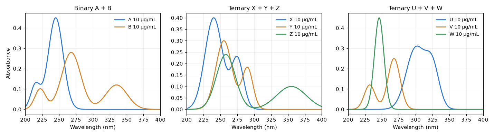

## Contents

* **Zero-order spectra (absorbance)** — [Direct measurement at λmax](#direct), [Dual wavelength (DW)](#dw), [Induced dual wavelength (IDW)](#idw), [Area under the curve — single component](#auc1), [Absorbance ratio (Q-analysis)](#q), [Absorbance subtraction (AS)](#as), [Advanced absorbance subtraction (AAS)](#aas), [Successive absorption factor method (MAFM)](#mafm)
* **Simultaneous equations (several signals)** — [Simultaneous equations (Vierordt)](#vierordt), [Bivariate calibration (Kaiser)](#bivariate), [Area under the curve — simultaneous (binary / ternary)](#auc_eq)
* **Derivative spectra** — [Zero-crossing derivative (D1–D4)](#zc), [Derivative peak-to-peak](#p2p), [Dual wavelength in derivative mode (D1 DWL)](#d1dwl)
* **Ratio spectra — derivative and mean centering** — [Derivative ratio (DD1 / DR1)](#dd1), [Derivative ratio of derivative spectra (D1 DR)](#d1dr), [Mean centering of ratio spectra (MCR)](#mcr), [Mean centering of ratio spectra — ternary](#mcr3), [Successive derivative ratio (ternary)](#sdr), [Double divisor ratio derivative (ternary)](#dd)
* **Ratio spectra — amplitude methods** — [Ratio difference (RD)](#rd), [Dual amplitude difference (ternary)](#dad), [Constant value (ratio plateau)](#cv), [Concentration value (no regression)](#concval), [Amplitude modulation (AM)](#am), [Induced amplitude modulation (IAM)](#iam), [Constant value via amplitude difference (CV-AD)](#cvad), [Advanced amplitude centering — partial overlap (AAC)](#aac), [Amplitude centering — complete overlap (AAC / MACM)](#macm), [Ratio difference–isoabsorptive (RIDSS)](#ridss)
* **Spectrum resolution (recover each component's spectrum)** — [Ratio subtraction (RS) / spectrum subtraction of the extended component](#rs), [Constant multiplication (CM) / SS-CM](#cm), [Extended ratio subtraction (ERS)](#ers), [Successive ratio subtraction (SRS, ternary)](#srs), [Successive spectrum subtraction (ternary)](#sss), [Spectrum subtraction (SS)](#ss), [Factorized zero-order method (FZM)](#fzm), [Constant center (CC)](#cc), [Derivative transformation (DT, DT-SS)](#dt), [Derivative subtraction (DS) and DS-CM](#ds)
* **Multivariate calibration (chemometrics)** — [Chemometrics: CLS, ILS, PCR, PLS, MCR-ALS, ANN, SVR](#chemo)
* **Standard addition and sample enrichment** — [Standard addition (recovery in the matrix)](#stdadd), [H-point standard addition (HPSAM)](#hpsam), [Sample enrichment: spiking and spectrum addition](#enrich)

## Zero-order spectra (absorbance)

Work directly on the absorbance spectra: one wavelength where only the analyte absorbs, or two wavelengths chosen so that the interferent cancels.

### Direct measurement at λmax

**Principle.** A = a·b·C (Beer–Lambert): the absorbance at a wavelength where only the analyte absorbs is proportional to its concentration.

**Use when.** The analyte has a region where no other compound absorbs (usually the extended component of a mixture).

**How to apply in Spectro**

1. Methods → Univariate calibration → template *Direct (zero order, λmax)*.
2. Choose the compound, then drag the λ marker to a wavelength where only it absorbs (check the pure spectra of the other compounds).
3. Check the calibration standards and the mixtures → *Calibrate* → *Determine*.

**Example**

* Compound: B; template: *Direct (zero order, λmax)*
* Measurement: Amplitude at λ — w1 = 335
* The screenshot shows the laboratory mixtures after the processing steps, with the measuring wavelength(s) marked.
* Calibration: slope 0.011976, intercept 0.000213, r = 1.00000 (n = 5)
* B absorbs alone above 300 nm, so 335 nm (its second band) is free from A.

| Mixture | B found | B taken | Rec. % |
|---|---|---|---|
| Mix A 6, B 10 | 9.977 | 10 | 99.77 |
| Mix A 10, B 6 | 5.991 | 6 | 99.84 |
| Mix A 14, B 14 | 14.002 | 14 | 100.01 |
| Mix A 8, B 16 | 16.008 | 16 | 100.05 |
| Mix A 18, B 5 | 5.036 | 5 | 100.72 |

Result: B: mean recovery 100.08 %, RSD 0.38 %.

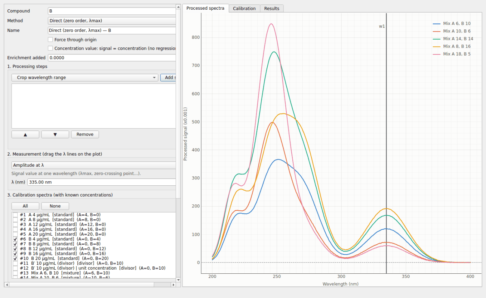

### Dual wavelength (DW)

**Principle.** ΔA = A(λ1) − A(λ2). At λ1 and λ2 the interferent Y has the same absorbance, so its contribution cancels and ΔA ∝ C_X.

**Use when.** Y has two wavelengths with equal absorbance where X absorbs differently.

**How to apply in Spectro**

1. Tools → Spectral finder → *Equal amplitude*: select a pure Y spectrum and λ1 (usually λmax of X) to list the λ2 values where Y is equal.
2. Methods → Univariate calibration → template *Dual wavelength*; enter λ1 and λ2.
3. Calibrate on pure X standards (ΔA vs C), determine the mixtures.

**Example**

* Compound: A; template: *Dual wavelength*
* Measurement: Difference P(λ1) − P(λ2) — w1 = 245, w2 = 215.8
* The screenshot shows the laboratory mixtures after the processing steps, with the measuring wavelength(s) marked.
* Calibration: slope 0.031718, intercept 0.000566, r = 1.00000 (n = 5)
* Finder: B has the same absorbance at 245 nm and 215.8 nm.

| Mixture | A found | A taken | Rec. % |
|---|---|---|---|
| Mix A 6, B 10 | 6.009 | 6 | 100.15 |
| Mix A 10, B 6 | 10.015 | 10 | 100.15 |
| Mix A 14, B 14 | 14.000 | 14 | 100.00 |
| Mix A 8, B 16 | 8.019 | 8 | 100.24 |
| Mix A 18, B 5 | 17.997 | 18 | 99.98 |

Result: A: mean recovery 100.11 %, RSD 0.11 %.

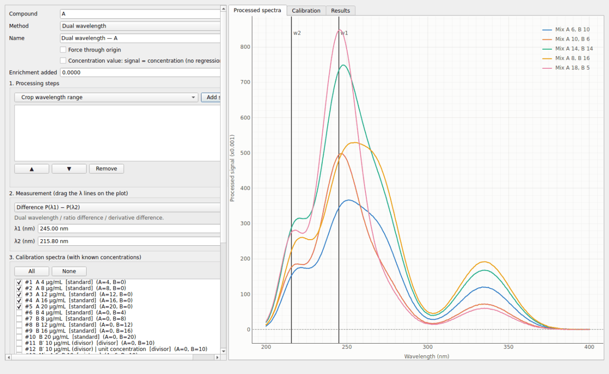

*Literature:* Eissa & Abou Al Alamein, Spectrochim. Acta A 193 (2018) 365, doi:10.1016/j.saa.2017.12.050

### Induced dual wavelength (IDW)

**Principle.** ΔA = A(λ1) − F·A(λ2) with the equality factor F = A_Y(λ1)/A_Y(λ2) of pure Y. Any λ pair works: F 'induces' equal Y absorbance.

**Use when.** Y has no pair of equal absorbance in a useful region, or a better sensitivity for X is obtained at another pair.

**How to apply in Spectro**

1. Template *Induced dual wavelength*; enter λ1 and λ2.
2. In the measurement, choose a pure Y standard as *Interferent spectrum for F* (F is computed from it) or type F.
3. Calibrate on pure X standards, determine.

**Example**

* Compound: A; template: *Induced dual wavelength*
* Measurement: Induced dual wavelength P(λ1) − F·P(λ2) — w1 = 245, w2 = 230, reference = B′
* The screenshot shows the laboratory mixtures after the processing steps, with the measuring wavelength(s) marked.
* Calibration: slope 0.024056, intercept 0.000727, r = 1.00000 (n = 5)
* F = A_B(245)/A_B(230) is computed from the B′ standard.

| Mixture | A found | A taken | Rec. % |
|---|---|---|---|
| Mix A 6, B 10 | 5.988 | 6 | 99.80 |
| Mix A 10, B 6 | 10.025 | 10 | 100.25 |
| Mix A 14, B 14 | 14.005 | 14 | 100.04 |
| Mix A 8, B 16 | 8.005 | 8 | 100.06 |
| Mix A 18, B 5 | 17.960 | 18 | 99.78 |

Result: A: mean recovery 99.99 %, RSD 0.20 %.

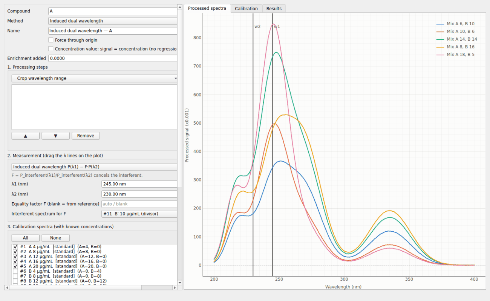

*Literature:* Eissa & Abou Al Alamein, Spectrochim. Acta A 193 (2018) 365, doi:10.1016/j.saa.2017.12.050

### Area under the curve — single component

**Principle.** The integral of the absorbance between λ1 and λ2 is proportional to C.

**Use when.** The analyte absorbs alone over a band; integration averages out noise.

**How to apply in Spectro**

1. Template *Area under curve (single component)*; set the integration range.
2. Choose a zero or linear baseline for the area. Calibrate, determine.

**Example**

* Compound: B; template: *Area under curve (single component)*
* Measurement: Area under curve (AUC) — w1 = 320, w2 = 350, baseline = zero
* The screenshot shows the laboratory mixtures after the processing steps, with the measuring wavelength(s) marked.
* Calibration: slope 0.31356, intercept 0.000234, r = 1.00000 (n = 5)

| Mixture | B found | B taken | Rec. % |
|---|---|---|---|
| Mix A 6, B 10 | 10.007 | 10 | 100.07 |
| Mix A 10, B 6 | 5.995 | 6 | 99.92 |
| Mix A 14, B 14 | 14.014 | 14 | 100.10 |
| Mix A 8, B 16 | 16.001 | 16 | 100.00 |
| Mix A 18, B 5 | 4.992 | 5 | 99.85 |

Result: B: mean recovery 99.99 %, RSD 0.11 %.

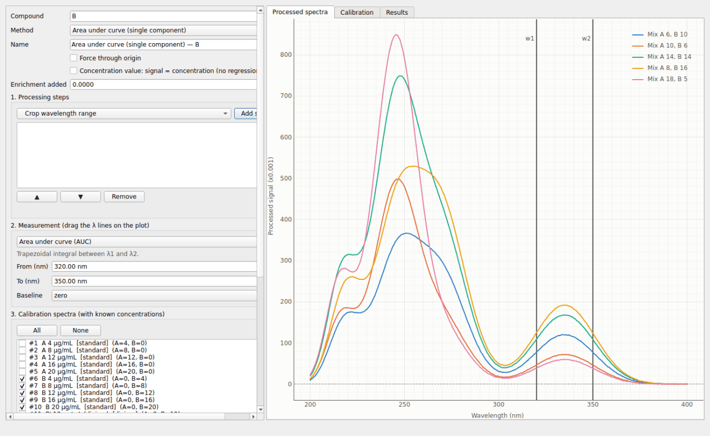

### Absorbance ratio (Q-analysis)

**Principle.** At the isoabsorptive point A_iso = a_iso(C_X + C_Y); the ratio Q = A(λ2)/A(iso) of the mixture interpolates between those of X and Y: C_X = (Q_m − Q_Y)/(Q_X − Q_Y) · A_iso/a_iso.

**Use when.** Binary mixture with an isoabsorptive point.

**How to apply in Spectro**

1. Methods → Binary two-signal methods → tab *Zero order: Q-analysis*.
2. Choose X and Y, press *Find isoabsorptive point*, set λ2 (λmax of X).
3. Check the X standards, Y standards and the mixtures → *Calculate*.

**Example**

* Isoabsorptive point (finder): 258.2 nm; λ2 = 245 nm (λmax of A)
* iso: 258.2
* w2: 245
* ax_iso: 0.0219
* ax2: 0.045
* ay2: 0.007416

| Mixture | A found | A taken | Rec. % | B found | B taken | Rec. % |
|---|---|---|---|---|---|---|
| Mix A 6, B 10 | 6.010 | 6 | 100.17 | 10.013 | 10 | 100.13 |
| Mix A 10, B 6 | 10.022 | 10 | 100.22 | 5.967 | 6 | 99.44 |
| Mix A 14, B 14 | 13.998 | 14 | 99.98 | 14.021 | 14 | 100.15 |
| Mix A 8, B 16 | 8.026 | 8 | 100.33 | 15.975 | 16 | 99.84 |
| Mix A 18, B 5 | 17.995 | 18 | 99.97 | 5.016 | 5 | 100.32 |

Result: A: mean recovery 100.13 %, RSD 0.15 %; B: mean recovery 99.98 %, RSD 0.34 %.

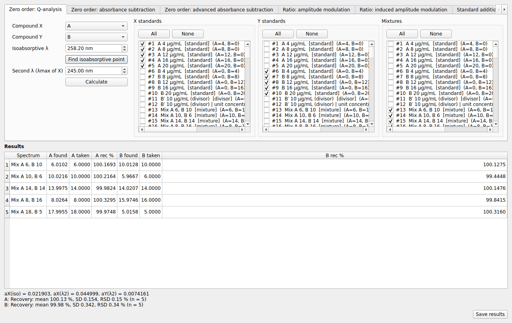

### Absorbance subtraction (AS)

**Principle.** X absorbs alone at λ2. The amplitude factor AF = A_X(iso)/A_X(λ2) of pure X turns the mixture absorbance at λ2 into X's absorbance at the isoabsorptive point; the total at iso gives C_X + C_Y.

**Use when.** Binary mixture with an isoabsorptive point and a region where one compound absorbs alone (the extended one).

**How to apply in Spectro**

1. Binary two-signal methods → *Zero order: absorbance subtraction*.
2. X = the compound that absorbs alone at λ2; iso = isoabsorptive point.
3. Check pure X standards (for AF), standards for the iso calibration, mixtures → *Calculate*.

**Example**

* X = B (absorbs alone at λ2 = 335 nm); iso = 258.2 nm
* iso: 258.2
* w2: 335
* AF: 1.825

| Mixture | B found | B taken | Rec. % | A found | A taken | Rec. % |
|---|---|---|---|---|---|---|
| Mix A 6, B 10 | 9.972 | 10 | 99.72 | 6.044 | 6 | 100.74 |
| Mix A 10, B 6 | 5.999 | 6 | 99.99 | 9.983 | 10 | 99.83 |
| Mix A 14, B 14 | 13.984 | 14 | 99.89 | 14.016 | 14 | 100.11 |
| Mix A 8, B 16 | 15.985 | 16 | 99.90 | 8.002 | 8 | 100.03 |
| Mix A 18, B 5 | 5.048 | 5 | 100.95 | 17.950 | 18 | 99.72 |

Result: B: mean recovery 100.09 %, RSD 0.49 %; A: mean recovery 100.09 %, RSD 0.40 %.

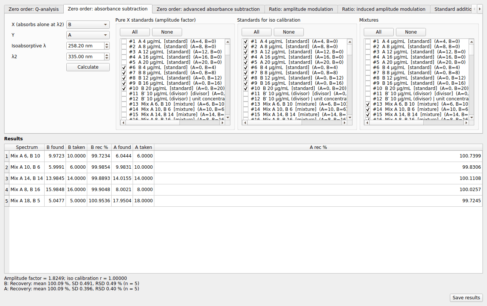

### Advanced absorbance subtraction (AAS)

**Principle.** λ1 and λ2 are chosen where Y has equal absorbance (one of them at the isoabsorptive point): ΔA = A(λ2) − A(λ1) gives C_X; X's absorbance at λ2 follows from ΔA and is subtracted; the remainder gives C_Y.

**Use when.** Binary mixture with an isoabsorptive point and a second wavelength where Y equals its iso absorbance.

**How to apply in Spectro**

1. Binary two-signal methods → *Zero order: advanced absorbance subtraction*.
2. λ2 = isoabsorptive point; press *Find λ1 where Y equals its value at λ2*.
3. Check X standards, Y standards and mixtures → *Calculate*.

**Example**

* λ2 = isoabsorptive point 258.2 nm; λ1 = 277.8 nm where B has the same absorbance
* w1: 277.8
* w2: 258.2
* AF: 1.025

| Mixture | A found | A taken | Rec. % | B found | B taken | Rec. % |
|---|---|---|---|---|---|---|
| Mix A 6, B 10 | 6.024 | 6 | 100.40 | 10.001 | 10 | 100.01 |
| Mix A 10, B 6 | 9.948 | 10 | 99.48 | 6.046 | 6 | 100.76 |
| Mix A 14, B 14 | 13.979 | 14 | 99.85 | 14.031 | 14 | 100.22 |
| Mix A 8, B 16 | 8.009 | 8 | 100.12 | 15.984 | 16 | 99.90 |
| Mix A 18, B 5 | 17.998 | 18 | 99.99 | 5.015 | 5 | 100.29 |

Result: A: mean recovery 99.97 %, RSD 0.34 %; B: mean recovery 100.24 %, RSD 0.33 %.

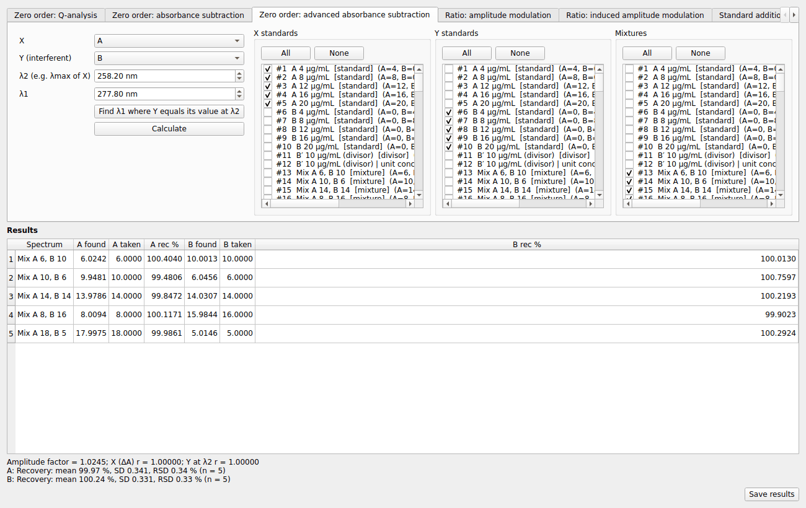

*Literature:* Eissa & Abou Al Alamein, Spectrochim. Acta A 193 (2018) 365, doi:10.1016/j.saa.2017.12.050

### Successive absorption factor method (MAFM)

**Principle.** Compounds are taken in order of extension. The first absorbs alone at λ1. Its absorption factors F(λ) = A(λ)/A(λ1) give its contribution at the next wavelengths, which is subtracted; the second compound is then alone at λ2, and so on.

**Use when.** Successive extension: one compound alone at long λ, the next one overlapped only by the first, … (binary: the classic absorption factor method).

**How to apply in Spectro**

1. Methods → Progressive resolution → tab *Zero order: successive absorption factor*.
2. Enter the compounds in order with the wavelength where each is 'added' (the first alone, the second overlapped only by the first …); optionally a quantitation λ.
3. Check the pure standards and the mixtures → *Calculate*; *Save method* to reuse it.

**Example**

* U at 335.0 nm (read at 300.0) → V at 280.0 nm → W at 246.0 nm

| Mixture | U found | U taken | Rec. % | V found | V taken | Rec. % | W found | W taken | Rec. % |
|---|---|---|---|---|---|---|---|---|---|
| Mix U 10, V 10, W 10 | 10.021 | 10 | 100.21 | 9.996 | 10 | 99.96 | 10.027 | 10 | 100.27 |
| Mix U 16, V 4, W 4 | 15.979 | 16 | 99.87 | 4.055 | 4 | 101.37 | 4.029 | 4 | 100.72 |
| Mix U 4, V 14, W 8 | 4.062 | 4 | 101.54 | 13.925 | 14 | 99.46 | 8.013 | 8 | 100.16 |
| Mix U 8, V 8, W 16 | 7.971 | 8 | 99.63 | 8.050 | 8 | 100.62 | 16.033 | 16 | 100.20 |
| Mix U 12, V 6, W 12 | 12.031 | 12 | 100.26 | 5.948 | 6 | 99.14 | 12.034 | 12 | 100.29 |

Result: U: mean recovery 100.30 %, RSD 0.74 %; V: mean recovery 100.11 %, RSD 0.90 %; W: mean recovery 100.33 %, RSD 0.22 %.

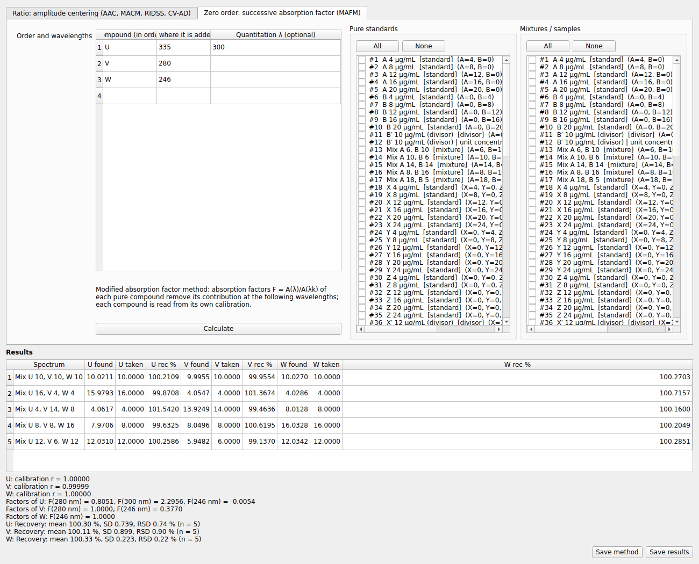

*Literature:* Abdelwahab & Mohamed, Chem. Pharm. Bull. 65 (2017) 558

## Simultaneous equations (several signals)

Measure as many signals as there are compounds (or more) and solve the linear system — all compounds at once.

### Simultaneous equations (Vierordt)

**Principle.** A(λ1) = a_X1·C_X + a_Y1·C_Y and A(λ2) = a_X2·C_X + a_Y2·C_Y, solved for both concentrations (more wavelengths → least squares).

**Use when.** Each compound has a band where it dominates; check the condition number of K.

**How to apply in Spectro**

1. Methods → Equation methods. Tick the compounds, enter one amplitude signal per compound (their λmax) or more.
2. Calibrate on the pure standards (*Fit*) — the absorptivity matrix K and its condition number are shown — then *Determine*.

**Example**

* Signals: amplitude 245 nm; amplitude 268 nm
* A: Recovery: mean 100.13 %, SD 0.106, RSD 0.11 % (n = 5)

| Mixture | A found | A taken | Rec. % | B found | B taken | Rec. % |
|---|---|---|---|---|---|---|
| Mix A 6, B 10 | 6.012 | 6 | 100.20 | 10.003 | 10 | 100.03 |
| Mix A 10, B 6 | 10.015 | 10 | 100.15 | 6.008 | 6 | 100.13 |
| Mix A 14, B 14 | 14.003 | 14 | 100.02 | 13.986 | 14 | 99.90 |
| Mix A 8, B 16 | 8.021 | 8 | 100.26 | 16.008 | 16 | 100.05 |
| Mix A 18, B 5 | 18.004 | 18 | 100.02 | 4.966 | 5 | 99.32 |

Result: A: mean recovery 100.13 %, RSD 0.11 %; B: mean recovery 99.88 %, RSD 0.33 %.

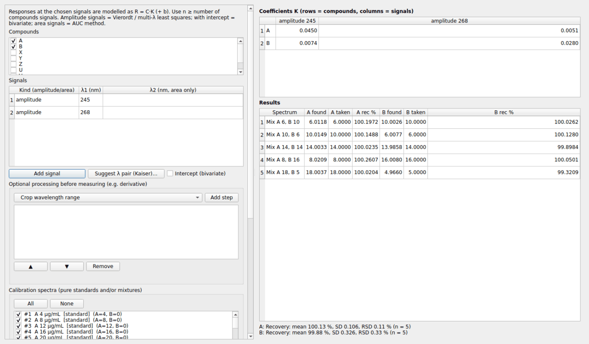

### Bivariate calibration (Kaiser)

**Principle.** Two wavelengths that maximise the determinant of the sensitivity matrix (Kaiser) are used with linear calibrations that include intercepts.

**Use when.** Binary mixtures; picks the best-conditioned wavelength pair automatically.

**How to apply in Spectro**

1. Equation methods → press *Kaiser* (uses one pure standard of each compound) — the best pair is filled in and intercepts are switched on.
2. *Fit* on the pure standards, *Determine*.

**Example**

* Signals: amplitude 244.5 nm; amplitude 269 nm
* A: Recovery: mean 99.99 %, SD 0.123, RSD 0.12 % (n = 5)

| Mixture | A found | A taken | Rec. % | B found | B taken | Rec. % |
|---|---|---|---|---|---|---|
| Mix A 6, B 10 | 5.988 | 6 | 99.79 | 10.005 | 10 | 100.05 |
| Mix A 10, B 6 | 10.001 | 10 | 100.01 | 6.005 | 6 | 100.08 |
| Mix A 14, B 14 | 14.009 | 14 | 100.06 | 13.976 | 14 | 99.83 |
| Mix A 8, B 16 | 7.997 | 8 | 99.97 | 16.011 | 16 | 100.07 |
| Mix A 18, B 5 | 18.021 | 18 | 100.12 | 4.989 | 5 | 99.77 |

Result: A: mean recovery 99.99 %, RSD 0.12 %; B: mean recovery 99.96 %, RSD 0.15 %.

### Area under the curve — simultaneous (binary / ternary)

**Principle.** The areas in n ranges are linear in the n concentrations: A_k = Σ a_kj·C_j; solved with Cramer's rule / least squares.

**Use when.** Overlapping bands; areas are less noisy than single amplitudes.

**How to apply in Spectro**

1. Equation methods → one *area* signal per compound (λ1–λ2 ranges chosen where the compounds differ most). *Fit*, *Determine*.

**Example**

* Signals: area 230–245 nm; area 285–295 nm; area 340–370 nm
* X: Recovery: mean 100.00 %, SD 0.018, RSD 0.02 % (n = 5)

| Mixture | X found | X taken | Rec. % | Y found | Y taken | Rec. % | Z found | Z taken | Rec. % |
|---|---|---|---|---|---|---|---|---|---|
| Mix X 10, Y 10, Z 10 | 10.000 | 10 | 100.00 | 9.990 | 10 | 99.90 | 10.005 | 10 | 100.05 |
| Mix X 20, Y 10, Z 10 | 19.998 | 20 | 99.99 | 9.999 | 10 | 99.99 | 10.007 | 10 | 100.07 |
| Mix X 6, Y 6, Z 18 | 6.001 | 6 | 100.02 | 5.999 | 6 | 99.98 | 17.994 | 18 | 99.97 |
| Mix X 10, Y 20, Z 10 | 10.000 | 10 | 100.00 | 20.000 | 20 | 100.00 | 10.002 | 10 | 100.02 |
| Mix X 12, Y 8, Z 6 | 11.997 | 12 | 99.97 | 8.006 | 8 | 100.08 | 6.004 | 6 | 100.07 |

Result: X: mean recovery 100.00 %, RSD 0.02 %; Y: mean recovery 99.99 %, RSD 0.07 %; Z: mean recovery 100.03 %, RSD 0.04 %.

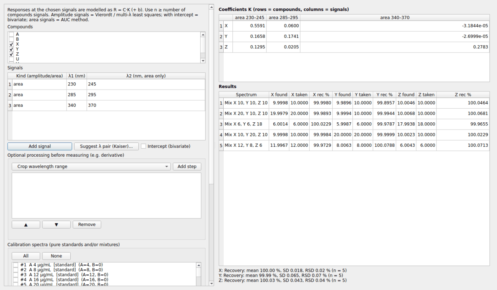

*Literature:* Abdelwahab & Mohamed, Chem. Pharm. Bull. 65 (2017) 558; Abdelrahman et al., Spectrochim. Acta A 124 (2014) 389, doi:10.1016/j.saa.2014.01.020

## Derivative spectra

Differentiate the spectra: broad overlapping bands are narrowed and a compound can be read where the other one's derivative is zero.

### Zero-crossing derivative (D1–D4)

**Principle.** The derivative dⁿA/dλⁿ of Y is zero at its zero-crossing wavelengths; there the mixture's derivative depends on X only.

**Use when.** Y's derivative crosses zero where X's derivative is large.

**How to apply in Spectro**

1. Tools → Spectral finder → *Zero-crossings* on a processed (D1) pure Y spectrum, or watch the processed plot in the Univariate dialog.
2. Template *Zero-crossing derivative (D1)* (or *Zero-crossing derivative (D2)*); set Δλ (4 nm) and the scaling factor (10) in the Derivative step; put λ at Y's zero-crossing.
3. Calibrate on pure X, determine.

**Example**

* Compound: A; template: *Zero-crossing derivative (D1)*
* Step: Derivative (D1–D4) (order=1, method=difference, delta_lambda=4, window=11, polyorder=3, scaling=10)
* Measurement: Amplitude at λ — w1 = 237.2
* The screenshot shows the laboratory mixtures after the processing steps, with the measuring wavelength(s) marked.
* Calibration: slope 0.02185, intercept -0.000999, r = 0.99996 (n = 5)
* Finder: B's D1 crosses zero at 237.2 nm.

| Mixture | A found | A taken | Rec. % |
|---|---|---|---|
| Mix A 6, B 10 | 6.032 | 6 | 100.53 |
| Mix A 10, B 6 | 10.068 | 10 | 100.68 |
| Mix A 14, B 14 | 14.033 | 14 | 100.23 |
| Mix A 8, B 16 | 8.080 | 8 | 101.00 |
| Mix A 18, B 5 | 18.034 | 18 | 100.19 |

Result: A: mean recovery 100.53 %, RSD 0.33 %.

### Derivative peak-to-peak

**Principle.** The difference between the maximum and minimum of the derivative in a range is proportional to C (larger signal, insensitive to baseline offsets).

**Use when.** The analyte's derivative band is free from the other compounds in that range.

**How to apply in Spectro**

1. Template *Derivative peak-to-peak*; set the range around the derivative band.
2. Calibrate, determine.

**Example**

* Compound: B; template: *Derivative peak-to-peak*
* Step: Derivative (D1–D4) (order=1, method=difference, delta_lambda=4, window=11, polyorder=3, scaling=10)
* Measurement: Peak-to-trough in range (max − min) — w1 = 310, w2 = 365
* The screenshot shows the laboratory mixtures after the processing steps, with the measuring wavelength(s) marked.
* Calibration: slope 0.0089361, intercept 0.00416, r = 0.99979 (n = 5)

| Mixture | B found | B taken | Rec. % |
|---|---|---|---|
| Mix A 6, B 10 | 10.026 | 10 | 100.26 |
| Mix A 10, B 6 | 5.793 | 6 | 96.56 |
| Mix A 14, B 14 | 14.093 | 14 | 100.66 |
| Mix A 8, B 16 | 15.925 | 16 | 99.53 |
| Mix A 18, B 5 | 5.056 | 5 | 101.12 |

Result: B: mean recovery 99.63 %, RSD 1.82 %.

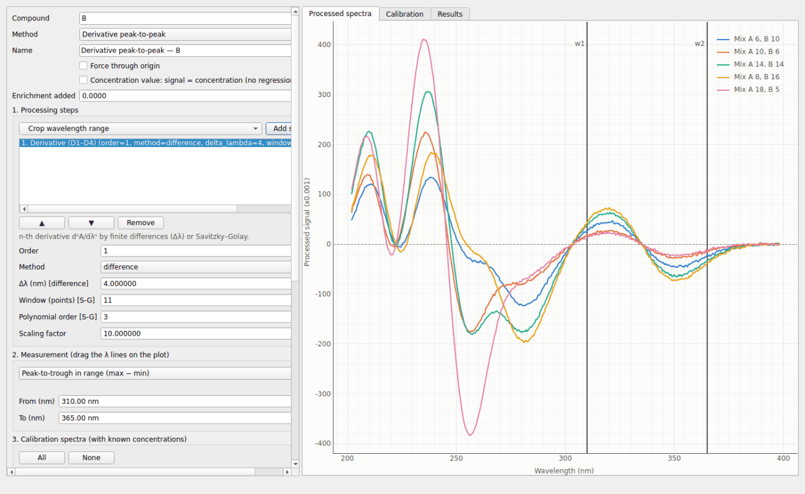

### Dual wavelength in derivative mode (D1 DWL)

**Principle.** ΔD1 = D1(λ1) − D1(λ2) at two wavelengths where Y's D1 is equal → depends on X only.

**Use when.** Y's derivative has two equal amplitudes; avoids divisors (no ratio spectra).

**How to apply in Spectro**

1. Finder → *Equal amplitude* on the D1 spectrum of pure Y.
2. Template *Dual wavelength in derivative mode*; enter λ1, λ2. Calibrate, determine.

**Example**

* Compound: A; template: *Dual wavelength in derivative mode*
* Step: Derivative (D1–D4) (order=1, method=difference, delta_lambda=4, window=11, polyorder=3, scaling=10)
* Measurement: Difference P(λ1) − P(λ2) — w1 = 237, w2 = 268.2
* The screenshot shows the laboratory mixtures after the processing steps, with the measuring wavelength(s) marked.
* Calibration: slope 0.031601, intercept -0.00178, r = 0.99997 (n = 5)
* Finder: B's D1 is equal at 237 and 268.2 nm; of all such pairs this one gives A the largest difference.

| Mixture | A found | A taken | Rec. % |
|---|---|---|---|
| Mix A 6, B 10 | 6.050 | 6 | 100.83 |
| Mix A 10, B 6 | 10.043 | 10 | 100.43 |
| Mix A 14, B 14 | 13.994 | 14 | 99.96 |
| Mix A 8, B 16 | 8.131 | 8 | 101.63 |
| Mix A 18, B 5 | 18.094 | 18 | 100.52 |

Result: A: mean recovery 100.68 %, RSD 0.62 %.

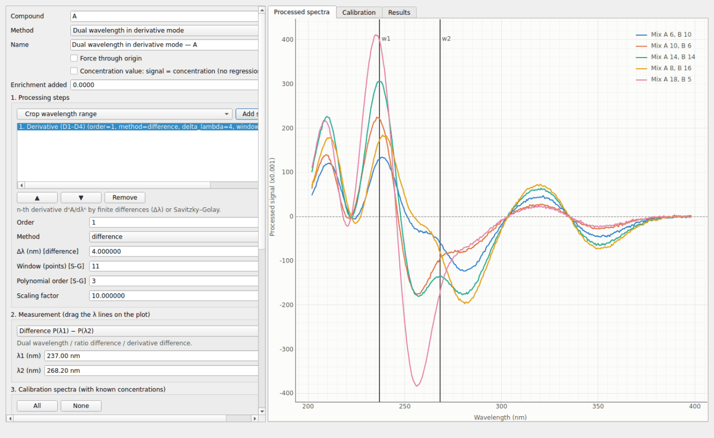

*Literature:* Lotfy et al., Spectrochim. Acta A 136 (2015) 937, doi:10.1016/j.saa.2014.09.117

## Ratio spectra — derivative and mean centering

Divide by the spectrum of an interferent (the divisor) — the interferent becomes a constant — then remove that constant by differentiation or mean centering.

### Derivative ratio (DD1 / DR1)

**Principle.** (X + Y)/Y′ = X/Y′ + constant; the first derivative removes the constant and leaves d(X/Y′)/dλ ∝ C_X, read at a maximum or minimum.

**Use when.** Binary mixtures; the classic ratio-spectra method.

**How to apply in Spectro**

1. Template *Derivative ratio (DD1)*; choose the divisor Y′ in the Divide step (a standard of Y, or a unit-concentration spectrum — see *Normalize → concentration*).
2. Set Δλ and scaling in the Derivative step, put λ at a peak of the processed X spectra.
3. Calibrate on pure X (processed the same way), determine.

**Example**

* Compound: A; template: *Derivative ratio (DD1)*
* Step: Divide by spectrum (ratio spectrum) (reference=B′, threshold=0.0001, divisor_derivative=0, divisor_delta_lambda=4)
* Step: Derivative (D1–D4) (order=1, method=difference, delta_lambda=4, window=11, polyorder=3, scaling=10)
* Measurement: Amplitude at λ — w1 = 254
* The screenshot shows the laboratory mixtures after the processing steps, with the measuring wavelength(s) marked.
* Calibration: slope -0.27838, intercept -0.00961, r = -1.00000 (n = 5)

| Mixture | A found | A taken | Rec. % |
|---|---|---|---|
| Mix A 6, B 10 | 5.990 | 6 | 99.83 |
| Mix A 10, B 6 | 9.969 | 10 | 99.69 |
| Mix A 14, B 14 | 14.065 | 14 | 100.47 |
| Mix A 8, B 16 | 7.990 | 8 | 99.87 |
| Mix A 18, B 5 | 18.008 | 18 | 100.04 |

Result: A: mean recovery 99.98 %, RSD 0.30 %.

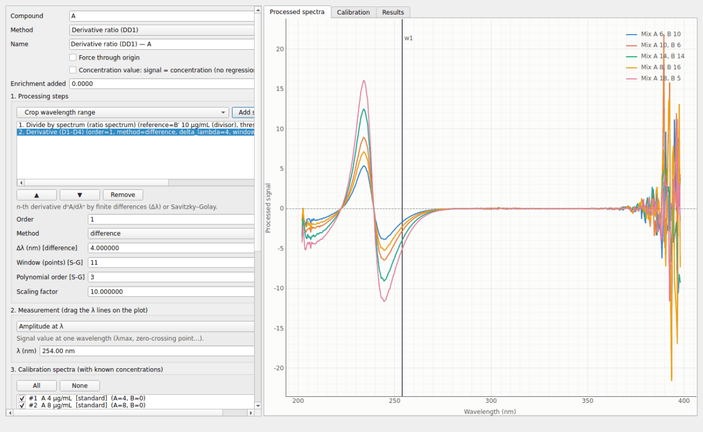

*Literature:* Eissa & Abou Al Alamein, Spectrochim. Acta A 193 (2018) 365, doi:10.1016/j.saa.2017.12.050

### Derivative ratio of derivative spectra (D1 DR)

**Principle.** D1(mixture) ÷ D1(Y′) = D1X/D1Y′ + constant; differentiating again removes Y.

**Use when.** When the ordinary ratio spectra give no usable peaks for X.

**How to apply in Spectro**

1. Template *Derivative ratio of D1 spectra (D1 DR)*: Derivative → Divide (with *Differentiate divisor first* = 1) → Derivative.
2. Choose the divisor Y′, set λ at a peak away from the divisor's D1 zero-crossings.
3. Calibrate, determine.

**Example**

* Compound: A; template: *Derivative ratio of D1 spectra (D1 DR)*
* Step: Derivative (D1–D4) (order=1, method=difference, delta_lambda=4, window=11, polyorder=3, scaling=10)
* Step: Divide by spectrum (ratio spectrum) (reference=B′, threshold=0.0001, divisor_derivative=1, divisor_delta_lambda=4)
* Step: Derivative (D1–D4) (order=1, method=difference, delta_lambda=4, window=11, polyorder=3, scaling=10)
* Measurement: Amplitude at λ — w1 = 236.5
* The screenshot shows the laboratory mixtures after the processing steps, with the measuring wavelength(s) marked.
* Calibration: slope 52.773, intercept 0.913, r = 0.99999 (n = 5)
* 236.5 nm: best signal-to-noise of the processed A spectrum (spikes where B's D1 crosses zero avoided).

| Mixture | A found | A taken | Rec. % |
|---|---|---|---|
| Mix A 6, B 10 | 6.004 | 6 | 100.07 |
| Mix A 10, B 6 | 9.915 | 10 | 99.15 |
| Mix A 14, B 14 | 14.023 | 14 | 100.17 |
| Mix A 8, B 16 | 8.011 | 8 | 100.14 |
| Mix A 18, B 5 | 17.976 | 18 | 99.86 |

Result: A: mean recovery 99.88 %, RSD 0.42 %.

*Literature:* Lotfy et al., Spectrochim. Acta A 136 (2015) 937, doi:10.1016/j.saa.2014.09.117

### Mean centering of ratio spectra (MCR)

**Principle.** The ratio spectrum X/Y′ + constant is mean centred over a range: the constant vanishes, MC(X/Y′) ∝ C_X.

**Use when.** Binary mixtures; no derivative, so less noise amplification.

**How to apply in Spectro**

1. Template *Mean centering of ratio spectra (MCR)*; choose Y′; set the mean-centring range inside the region where Y′ is not near zero.
2. Read at a maximum/minimum of the processed X spectra. Calibrate, determine.

**Example**

* Compound: A; template: *Mean centering of ratio spectra (MCR)*
* Step: Divide by spectrum (ratio spectrum) (reference=B′, threshold=0.0001, divisor_derivative=0, divisor_delta_lambda=4)
* Step: Mean centering (of this vector) (start=220, end=300)
* Measurement: Amplitude at λ — w1 = 240
* The screenshot shows the laboratory mixtures after the processing steps, with the measuring wavelength(s) marked.
* Calibration: slope 0.68391, intercept 0.0115, r = 1.00000 (n = 5)

| Mixture | A found | A taken | Rec. % |
|---|---|---|---|
| Mix A 6, B 10 | 6.004 | 6 | 100.07 |
| Mix A 10, B 6 | 10.005 | 10 | 100.05 |
| Mix A 14, B 14 | 14.023 | 14 | 100.17 |
| Mix A 8, B 16 | 7.992 | 8 | 99.90 |
| Mix A 18, B 5 | 18.003 | 18 | 100.02 |

Result: A: mean recovery 100.04 %, RSD 0.10 %.

*Literature:* Eissa & Abou Al Alamein, Spectrochim. Acta A 193 (2018) 365, doi:10.1016/j.saa.2017.12.050

### Mean centering of ratio spectra — ternary

**Principle.** ÷ Z′ → MC → ÷ MC(Y′/Z′) → MC: after the first division Z is a constant (removed by MC); after dividing by the mean-centred ratio of Y, Y is a constant too (removed by the second MC). The result depends on X only.

**Use when.** Ternary mixtures; two divisors, one wavelength.

**How to apply in Spectro**

1. Template *Mean centering of ratio spectra (ternary)*: in the first Divide choose Z′, in *Divide by mean-centred ratio* choose Y′ (second component) and Z′ (same first divisor), same range in all mean-centring steps.
2. Read X at an extremum away from the spikes where MC(Y′/Z′) crosses zero. Calibrate, determine.

**Example**

* Compound: X; template: *Mean centering of ratio spectra (ternary)*
* Step: Divide by spectrum (ratio spectrum) (reference=Z′, threshold=0.0001, divisor_derivative=0, divisor_delta_lambda=4)
* Step: Mean centering (of this vector) (start=220, end=300)
* Step: Divide by mean-centred ratio (ternary MCR) (reference=Y′, divisor=Z′, start=220, end=300, threshold=0.0001)
* Step: Mean centering (of this vector) (start=220, end=300)
* Measurement: Amplitude at λ — w1 = 264.5
* The screenshot shows the laboratory mixtures after the processing steps, with the measuring wavelength(s) marked.
* Calibration: slope 0.15779, intercept -0.00439, r = 0.99999 (n = 6)
* 264.5 nm: best signal-to-noise of the processed X spectrum.

| Mixture | X found | X taken | Rec. % |
|---|---|---|---|
| Mix X 10, Y 10, Z 10 | 10.026 | 10 | 100.26 |
| Mix X 20, Y 10, Z 10 | 19.990 | 20 | 99.95 |
| Mix X 6, Y 6, Z 18 | 5.988 | 6 | 99.80 |
| Mix X 10, Y 20, Z 10 | 10.057 | 10 | 100.57 |
| Mix X 12, Y 8, Z 6 | 12.011 | 12 | 100.09 |

Result: X: mean recovery 100.13 %, RSD 0.29 %.

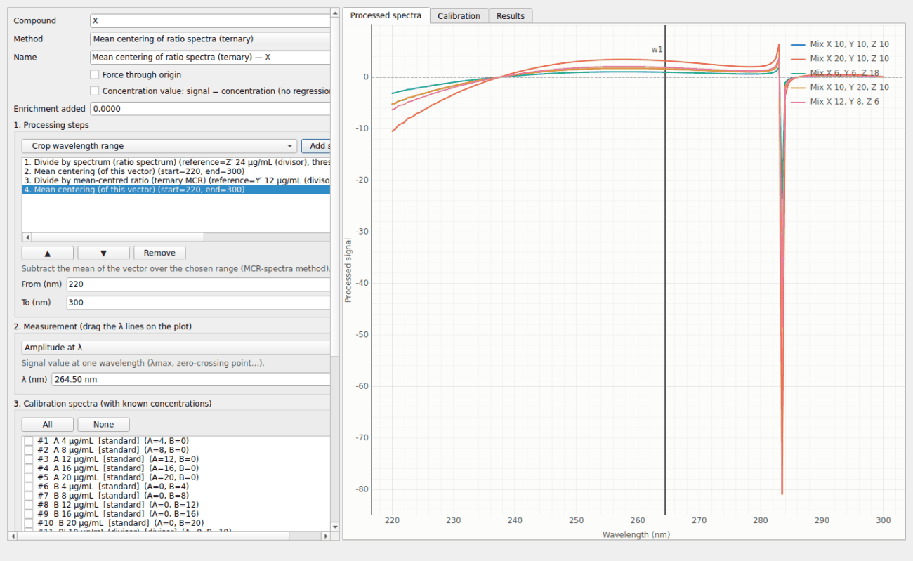

*Literature:* Abdelrahman et al., Spectrochim. Acta A 124 (2014) 389, doi:10.1016/j.saa.2014.01.020

### Successive derivative ratio (ternary)

**Principle.** (X+Y+Z)/Y′ → D1 removes Y; dividing by D1(Z′/Y′) makes Z a constant; a second D1 removes it.

**Use when.** Ternary mixtures where X has peaks in the final spectrum.

**How to apply in Spectro**

1. Create the second divisor once: Process → pipeline on a Z standard: Divide by Y′ → Derivative (same Δλ) → saved as a derived spectrum.
2. Template *Successive derivative ratio (ternary)*: first Divide = Y′, second Divide = that derived D1(Z′/Y′) spectrum.
3. Read X at a peak away from spikes. Calibrate, determine.

**Example**

* Compound: X; template: *Successive derivative ratio (ternary)*
* Step: Divide by spectrum (ratio spectrum) (reference=Y′, threshold=0.0001, divisor_derivative=0, divisor_delta_lambda=4)
* Step: Derivative (D1–D4) (order=1, method=difference, delta_lambda=4, window=11, polyorder=3, scaling=1)
* Step: Divide by spectrum (ratio spectrum) (reference=D1(Z′/Y′), threshold=0.0001, divisor_derivative=0, divisor_delta_lambda=4)
* Step: Derivative (D1–D4) (order=1, method=difference, delta_lambda=4, window=11, polyorder=3, scaling=1)
* Measurement: Amplitude at λ — w1 = 246
* The screenshot shows the laboratory mixtures after the processing steps, with the measuring wavelength(s) marked.
* Calibration: slope -1.229, intercept 0.0349, r = -0.99999 (n = 6)
* Second divisor: D1 of (Z′ ÷ Y′), made once with Process → pipeline and stored as a derived spectrum.
* 246.0 nm: best signal-to-noise of the processed X spectrum.

| Mixture | X found | X taken | Rec. % |
|---|---|---|---|
| Mix X 10, Y 10, Z 10 | 9.974 | 10 | 99.74 |
| Mix X 20, Y 10, Z 10 | 20.019 | 20 | 100.10 |
| Mix X 6, Y 6, Z 18 | 6.037 | 6 | 100.61 |
| Mix X 10, Y 20, Z 10 | 10.046 | 10 | 100.46 |
| Mix X 12, Y 8, Z 6 | 11.996 | 12 | 99.97 |

Result: X: mean recovery 100.17 %, RSD 0.36 %.

### Double divisor ratio derivative (ternary)

**Principle.** The mixture is divided by the sum of the other two standards (Y′ + Z′) and differentiated. Y and Z cancel only when they are present in the same proportion as in the divisor, so the method is approximate.

**Use when.** Ternary mixtures in a fixed ratio (e.g. one dosage form); check recoveries on laboratory mixtures of varying ratio.

**How to apply in Spectro**

1. Template *Double divisor ratio derivative (ternary)*; choose Y′ and Z′ (equal concentrations, as in the papers) in *Divide by sum*.
2. Read X at a D1 extremum, calibrate, determine.

**Example**

* Compound: X; template: *Double divisor ratio derivative (ternary)*
* Step: Divide by sum of two spectra (double divisor) (reference=Y′, reference2=Z′, factor2=1, threshold=0.0001)
* Step: Derivative (D1–D4) (order=1, method=difference, delta_lambda=4, window=11, polyorder=3, scaling=10)
* Measurement: Amplitude at λ — w1 = 247
* The screenshot shows the laboratory mixtures after the processing steps, with the measuring wavelength(s) marked.
* Calibration: slope -0.046924, intercept 0.000321, r = -0.99996 (n = 6)
* 247.0 nm: largest X signal relative to the residual Y and Z signals (from the pure spectra).
* Approximate: Y and Z cancel only in the proportion of the divisor (here 12 : 24). Compare the recoveries of mixtures with different Y : Z ratios.

| Mixture | X found | X taken | Rec. % |
|---|---|---|---|
| Mix X 10, Y 10, Z 10 | 10.138 | 10 | 101.38 |
| Mix X 20, Y 10, Z 10 | 20.059 | 20 | 100.30 |
| Mix X 6, Y 6, Z 18 | 5.966 | 6 | 99.43 |
| Mix X 10, Y 20, Z 10 | 10.069 | 10 | 100.69 |
| Mix X 12, Y 8, Z 6 | 12.033 | 12 | 100.27 |

Result: X: mean recovery 100.41 %, RSD 0.71 %.

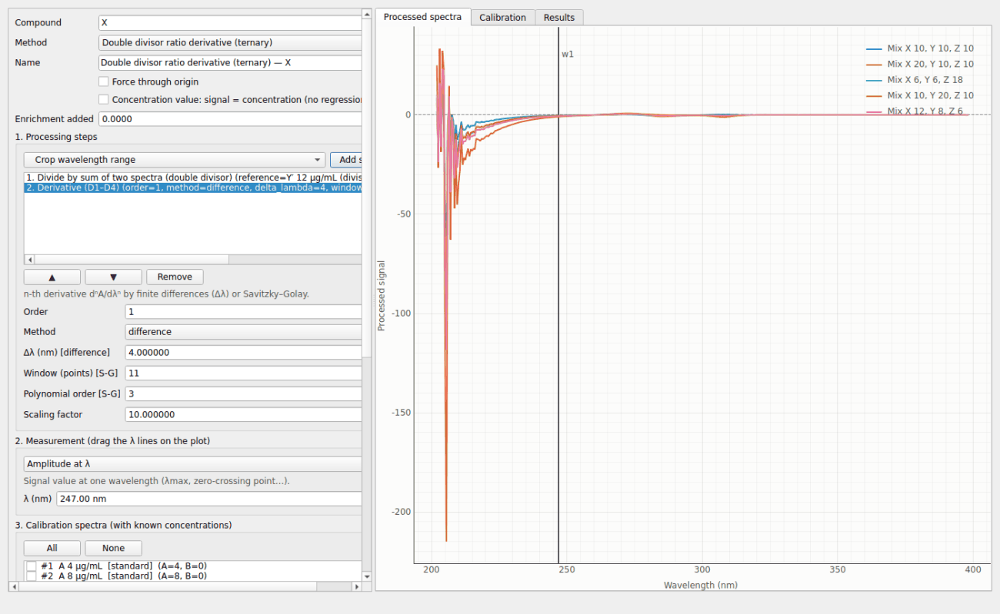

*Literature:* Abdelrahman et al., Spectrochim. Acta A 124 (2014) 389, doi:10.1016/j.saa.2014.01.020

## Ratio spectra — amplitude methods

Divide by a divisor and use amplitudes of the ratio spectrum: differences that cancel the constant, the plateau that gives the divisor compound, or amplitudes at an isoabsorptive point / common λ.

### Ratio difference (RD)

**Principle.** ΔP = P(λ1) − P(λ2) of the ratio spectrum X/Y′ + constant: the constant cancels, ΔP ∝ C_X.

**Use when.** Binary mixtures; two wavelengths with a large difference for X/Y′.

**How to apply in Spectro**

1. Template *Ratio difference (RD)*; choose Y′ (a standard or a unit-concentration spectrum).
2. Drag λ1 and λ2 to a peak and a trough of the processed X spectra. Calibrate, determine.

**Example**

* Compound: A; template: *Ratio difference (RD)*
* Step: Divide by spectrum (ratio spectrum) (reference=B′, threshold=0.0001, divisor_derivative=0, divisor_delta_lambda=4)
* Measurement: Difference P(λ1) − P(λ2) — w1 = 245, w2 = 275
* The screenshot shows the laboratory mixtures after the processing steps, with the measuring wavelength(s) marked.
* Calibration: slope 0.59908, intercept 0.00758, r = 1.00000 (n = 5)

| Mixture | A found | A taken | Rec. % |
|---|---|---|---|
| Mix A 6, B 10 | 5.995 | 6 | 99.91 |
| Mix A 10, B 6 | 10.008 | 10 | 100.08 |
| Mix A 14, B 14 | 13.996 | 14 | 99.97 |
| Mix A 8, B 16 | 8.002 | 8 | 100.02 |
| Mix A 18, B 5 | 17.993 | 18 | 99.96 |

Result: A: mean recovery 99.99 %, RSD 0.06 %.

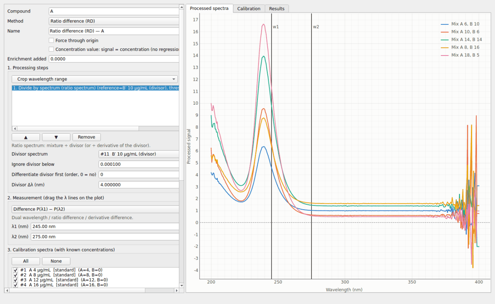

*Literature:* Eissa & Abou Al Alamein, Spectrochim. Acta A 193 (2018) 365, doi:10.1016/j.saa.2017.12.050; Lotfy et al., Spectrochim. Acta A 136 (2015) 937, doi:10.1016/j.saa.2014.09.117

### Dual amplitude difference (ternary)

**Principle.** Divide by Z′ (Z becomes a constant). Choose λ1, λ2 where Y/Z′ has equal amplitudes: P(λ1) − P(λ2) cancels Y and Z together and depends on X only (an equality factor F from Y corrects a residual difference).

**Use when.** Ternary mixtures.

**How to apply in Spectro**

1. Finder → *Equal amplitude* on the ratio spectrum Y′/Z′ (process a Y standard by Divide by Z′ first).
2. Template *Dual amplitude difference (ternary)*: divisor Z′, λ1 and λ2, interferent Y′ for F.
3. Calibrate on pure X, determine.

**Example**

* Compound: X; template: *Dual amplitude difference (ternary)*
* Step: Divide by spectrum (ratio spectrum) (reference=Z′, threshold=0.0001, divisor_derivative=0, divisor_delta_lambda=4)
* Measurement: Induced dual wavelength P(λ1) − F·P(λ2) — w1 = 240, w2 = 253.4, reference = Y′
* The screenshot shows the laboratory mixtures after the processing steps, with the measuring wavelength(s) marked.
* Calibration: slope 0.11324, intercept 0.00213, r = 1.00000 (n = 6)
* Finder: Y/Z′ equal at 240 and 253.4 nm.

| Mixture | X found | X taken | Rec. % |
|---|---|---|---|
| Mix X 10, Y 10, Z 10 | 9.976 | 10 | 99.76 |
| Mix X 20, Y 10, Z 10 | 20.002 | 20 | 100.01 |
| Mix X 6, Y 6, Z 18 | 5.982 | 6 | 99.69 |
| Mix X 10, Y 20, Z 10 | 9.968 | 10 | 99.68 |
| Mix X 12, Y 8, Z 6 | 11.997 | 12 | 99.97 |

Result: X: mean recovery 99.82 %, RSD 0.16 %.

### Constant value (ratio plateau)

**Principle.** Where only Y absorbs, the ratio spectrum (X + Y)/Y′ is a flat line (plateau) equal to C_Y/C_Y′.

**Use when.** Y extends alone (the extended component).

**How to apply in Spectro**

1. Tools → Spectral finder → *Plateaus* on a mixture ÷ Y′ to find the flat region.
2. Template *Ratio plateau / constant value (Y)*; divisor Y′; set the plateau range.
3. Calibrate on pure Y standards, determine.

**Example**

* Compound: B; template: *Ratio plateau / constant value (Y)*
* Step: Divide by spectrum (ratio spectrum) (reference=B′, threshold=0.0001, divisor_derivative=0, divisor_delta_lambda=4)
* Measurement: Mean in range (plateau) — w1 = 310, w2 = 350
* The screenshot shows the laboratory mixtures after the processing steps, with the measuring wavelength(s) marked.
* Calibration: slope 0.10005, intercept -0.000896, r = 1.00000 (n = 5)

| Mixture | B found | B taken | Rec. % |
|---|---|---|---|
| Mix A 6, B 10 | 10.012 | 10 | 100.12 |
| Mix A 10, B 6 | 6.006 | 6 | 100.10 |
| Mix A 14, B 14 | 14.018 | 14 | 100.13 |
| Mix A 8, B 16 | 16.000 | 16 | 100.00 |
| Mix A 18, B 5 | 5.002 | 5 | 100.04 |

Result: B: mean recovery 100.08 %, RSD 0.06 %.

*Literature:* Lotfy et al., Spectrochim. Acta A 136 (2015) 937, doi:10.1016/j.saa.2014.09.117; Fahmy et al., Spectrochim. Acta A 261 (2021) 119999, doi:10.1016/j.saa.2021.119999

### Concentration value (no regression)

**Principle.** With a unit-concentration (normalized) divisor the plateau value IS the concentration of Y — no calibration line is needed.

**Use when.** Same conditions as constant value.

**How to apply in Spectro**

1. Make the normalized divisor once: Process → *Normalize* (mode *concentration*) on a pure Y standard.
2. Template *Concentration value*; choose that unit spectrum; the option *Concentration value: signal = concentration* is ticked.
3. *Calibrate* (still reports the calibration line as a check), *Determine*.

**Example**

* Compound: B; template: *Concentration value (unit divisor plateau, no regression)*
* Step: Divide by spectrum (ratio spectrum) (reference=B unit, threshold=0.0001, divisor_derivative=0, divisor_delta_lambda=4)
* Measurement: Mean in range (plateau) — w1 = 310, w2 = 350
* The screenshot shows the laboratory mixtures after the processing steps, with the measuring wavelength(s) marked.
* Calibration: slope 1.0005, intercept -0.00896, r = 1.00000 (n = 5)
* The plateau value is reported directly as µg/mL.

| Mixture | B found | B taken | Rec. % |
|---|---|---|---|
| Mix A 6, B 10 | 10.009 | 10 | 100.09 |
| Mix A 10, B 6 | 6.000 | 6 | 100.00 |
| Mix A 14, B 14 | 14.017 | 14 | 100.12 |
| Mix A 8, B 16 | 15.999 | 16 | 99.99 |
| Mix A 18, B 5 | 4.995 | 5 | 99.91 |

Result: B: mean recovery 100.02 %, RSD 0.08 %.

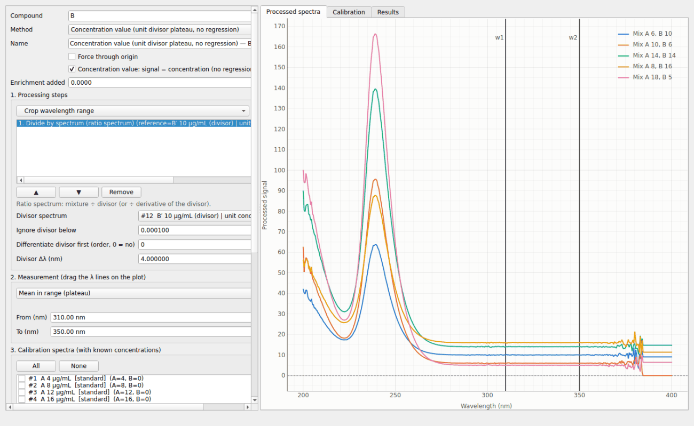

*Literature:* Fahmy et al., Spectrochim. Acta A 261 (2021) 119999, doi:10.1016/j.saa.2021.119999

### Amplitude modulation (AM)

**Principle.** With a unit-concentration divisor Y′ the ratio spectrum at the isoabsorptive point equals C_X + C_Y and the plateau equals C_Y; C_X = total − C_Y. A unified regression at the iso point corrects small deviations.

**Use when.** Binary mixture with an isoabsorptive point; Y extended.

**How to apply in Spectro**

1. Make the unit Y spectrum (Normalize → concentration).
2. Binary two-signal methods → *Ratio: amplitude modulation*: X, Y, iso, plateau, divisor = unit Y, divisor concentration = 1.
3. Check standards of both compounds (unified calibration) and mixtures → *Calculate*.

**Example**

* Divisor: unit-concentration B (Normalize → concentration); iso 258.2 nm; plateau 310–350 nm
* iso: 258.2

| Mixture | A found | A taken | Rec. % | B found | B taken | Rec. % |
|---|---|---|---|---|---|---|
| Mix A 6, B 10 | 6.007 | 6 | 100.11 | 10.009 | 10 | 100.09 |
| Mix A 10, B 6 | 9.983 | 10 | 99.83 | 6.000 | 6 | 100.00 |
| Mix A 14, B 14 | 13.983 | 14 | 99.88 | 14.017 | 14 | 100.12 |
| Mix A 8, B 16 | 7.986 | 8 | 99.82 | 15.999 | 16 | 99.99 |
| Mix A 18, B 5 | 18.006 | 18 | 100.03 | 4.995 | 5 | 99.91 |

Result: A: mean recovery 99.94 %, RSD 0.13 %; B: mean recovery 100.02 %, RSD 0.08 %.

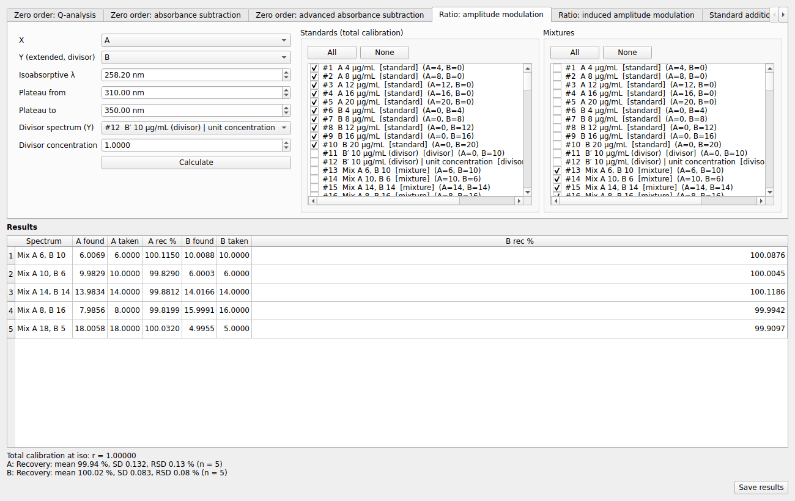

*Literature:* Zaghary et al., J. Anal. Chem. 75 (2020) 742, doi:10.1134/S1061934820060180; Lotfy et al., Spectrochim. Acta A 136 (2015) 937, doi:10.1016/j.saa.2014.09.117

### Induced amplitude modulation (IAM)

**Principle.** Amplitude modulation without an isoabsorptive point: P(λ) − C_Y = r·C_X with r = (a_X/a_Y)(λ) from pure X.

**Use when.** Y extended; no isoabsorptive point needed.

**How to apply in Spectro**

1. Binary two-signal methods → *Ratio: induced amplitude modulation*; λ for X, plateau.
2. Check X standards, Y standards (the unit divisor is averaged from them), mixtures.

**Example**

* wavelength: 245
* factor: 6.059

| Mixture | A found | A taken | Rec. % | B found | B taken | Rec. % |
|---|---|---|---|---|---|---|
| Mix A 6, B 10 | 6.003 | 6 | 100.05 | 10.014 | 10 | 100.14 |
| Mix A 10, B 6 | 10.008 | 10 | 100.08 | 6.003 | 6 | 100.06 |
| Mix A 14, B 14 | 13.984 | 14 | 99.89 | 14.024 | 14 | 100.17 |
| Mix A 8, B 16 | 8.011 | 8 | 100.14 | 16.008 | 16 | 100.05 |
| Mix A 18, B 5 | 17.986 | 18 | 99.92 | 4.998 | 5 | 99.96 |

Result: A: mean recovery 100.01 %, RSD 0.11 %; B: mean recovery 100.08 %, RSD 0.08 %.

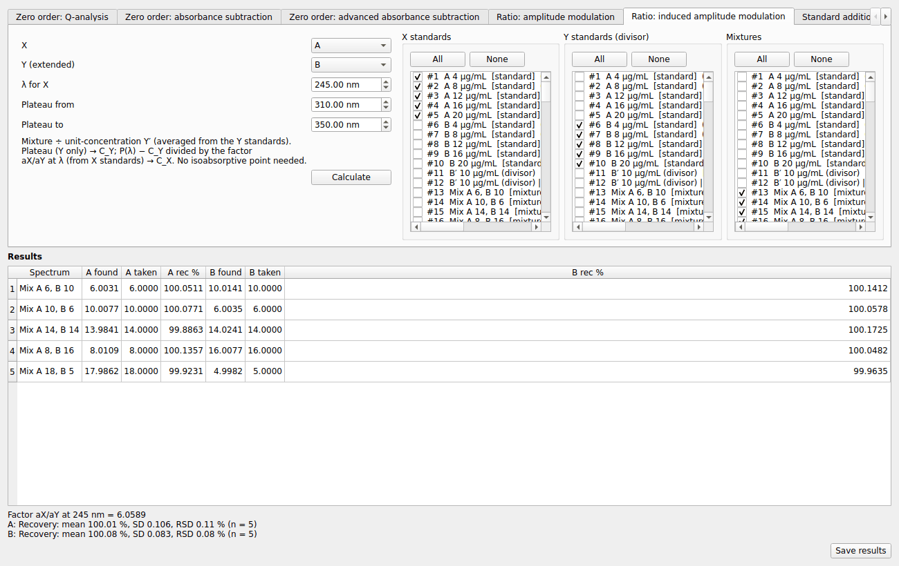

### Constant value via amplitude difference (CV-AD)

**Principle.** Divide by Y′. The ratio difference of X between λ1 and λ2 gives X's postulated amplitude at λ2 (from a line ΔP vs P(λ2) of pure X); the recorded amplitude minus it is the constant C_Y/C_Y′.

**Use when.** Binary (or ternary where the third compound does not absorb there); no plateau needed.

**How to apply in Spectro**

1. Methods → Progressive resolution → *Ratio: amplitude centering*.
2. Compounds X and Y; divisor Y′; divisor compound Y; common λc = λ2; amplitude difference row: X, λ1, λ2; amplitude subtraction for Y.
3. Check standards and mixtures → *Calculate*.

**Example**

* ÷ B, λc 251.0 nm; A: P261.0 − P251.0; B by subtraction

| Mixture | A found | A taken | Rec. % | B found | B taken | Rec. % |
|---|---|---|---|---|---|---|
| Mix A 6, B 10 | 5.996 | 6 | 99.94 | 10.017 | 10 | 100.17 |
| Mix A 10, B 6 | 9.953 | 10 | 99.53 | 6.089 | 6 | 101.49 |
| Mix A 14, B 14 | 13.993 | 14 | 99.95 | 14.017 | 14 | 100.12 |
| Mix A 8, B 16 | 8.008 | 8 | 100.10 | 16.032 | 16 | 100.20 |
| Mix A 18, B 5 | 17.988 | 18 | 99.93 | 4.992 | 5 | 99.84 |

Result: A: mean recovery 99.89 %, RSD 0.21 %; B: mean recovery 100.36 %, RSD 0.64 %.

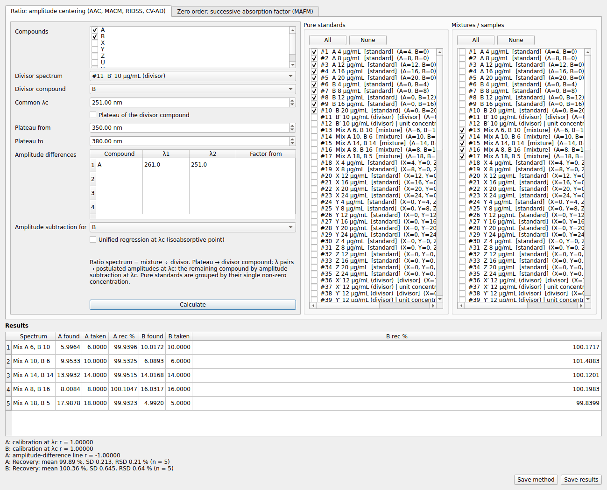

*Literature:* Lotfy et al., Spectrochim. Acta A 136 (2015) 937, doi:10.1016/j.saa.2014.09.117

### Advanced amplitude centering — partial overlap (AAC)

**Principle.** One divisor Z′ and one wavelength λc for all compounds: the plateau gives Z; after subtracting it, P(λ1) − F_Y·P(λ2) depends on X only (equality factor of Y) and gives X's postulated amplitude at λc; Y = recorded − Z − X at λc.

**Use when.** Ternary; Z extended alone (plateau).

**How to apply in Spectro**

1. Progressive resolution → *Ratio: amplitude centering*: divisor Z′, divisor compound Z, *Plateau* ticked with its range, λc.
2. Amplitude difference row: X, λc, λ2, factor from Y. Amplitude subtraction for Y.
3. *Calculate*; *Save method* to reuse it. The optimizer proposes these settings automatically.

**Example**

* ÷ Z, λc 275.0 nm; Z from plateau 340–380 nm; X: P275.0 − F(Y)·P240.0; Y by subtraction

| Mixture | X found | X taken | Rec. % | Y found | Y taken | Rec. % | Z found | Z taken | Rec. % |
|---|---|---|---|---|---|---|---|---|---|
| Mix X 10, Y 10, Z 10 | 9.914 | 10 | 99.14 | 10.225 | 10 | 102.25 | 9.981 | 10 | 99.81 |
| Mix X 20, Y 10, Z 10 | 19.997 | 20 | 99.98 | 10.016 | 10 | 100.16 | 9.985 | 10 | 99.85 |
| Mix X 6, Y 6, Z 18 | 5.916 | 6 | 98.60 | 6.205 | 6 | 103.42 | 17.994 | 18 | 99.97 |
| Mix X 10, Y 20, Z 10 | 9.893 | 10 | 98.93 | 20.283 | 20 | 101.42 | 9.987 | 10 | 99.87 |
| Mix X 12, Y 8, Z 6 | 12.001 | 12 | 100.01 | 7.989 | 8 | 99.86 | 5.974 | 6 | 99.56 |

Result: X: mean recovery 99.33 %, RSD 0.64 %; Y: mean recovery 101.42 %, RSD 1.46 %; Z: mean recovery 99.81 %, RSD 0.15 %.

*Literature:* Saleh et al., Int. J. Pharm. Pharm. Sci. 9 (2017) 43, doi:10.22159/ijpps.2017v9i5.16960

### Amplitude centering — complete overlap (AAC / MACM)

**Principle.** No plateau: X from a λ pair where Y/Z′ is equal, Y from a λ pair where X/Z′ is equal (Z/Z′ is constant and cancels in both); Z by subtraction at the common λc.

**Use when.** Ternary with severe overlap; one divisor.

**How to apply in Spectro**

1. Any of the three compounds can be the divisor (called Z here); the method optimizer tries each one and proposes λc and the λ pairs.
2. By hand: Finder → *Equal amplitude* on Y/Z′ and on X/Z′ at the chosen λc.
3. Amplitude centering: divisor Z′, divisor compound Z, no plateau; rows X (λc, partner of Y) and Y (λc, partner of X); subtraction for Z.
4. *Calculate*.

**Example**

* ÷ Y, λc 255.5 nm; X: P255.5 − P278.3; Z: P255.5 − P285.1; Y by subtraction
* Settings proposed by Tools → Method optimizer (λc and the partner wavelengths where the other compound's ratio amplitudes are equal).

| Mixture | X found | X taken | Rec. % | Y found | Y taken | Rec. % | Z found | Z taken | Rec. % |
|---|---|---|---|---|---|---|---|---|---|
| Mix X 10, Y 10, Z 10 | 9.952 | 10 | 99.52 | 10.052 | 10 | 100.52 | 9.985 | 10 | 99.85 |
| Mix X 20, Y 10, Z 10 | 19.961 | 20 | 99.80 | 10.119 | 10 | 101.19 | 9.863 | 10 | 98.63 |
| Mix X 6, Y 6, Z 18 | 5.912 | 6 | 98.53 | 6.093 | 6 | 101.56 | 17.995 | 18 | 99.97 |
| Mix X 10, Y 20, Z 10 | 9.959 | 10 | 99.59 | 20.016 | 20 | 100.08 | 10.054 | 10 | 100.54 |
| Mix X 12, Y 8, Z 6 | 11.993 | 12 | 99.94 | 8.023 | 8 | 100.28 | 5.978 | 6 | 99.63 |

Result: X: mean recovery 99.48 %, RSD 0.56 %; Y: mean recovery 100.73 %, RSD 0.62 %; Z: mean recovery 99.73 %, RSD 0.70 %.

*Literature:* Saleh et al., Int. J. Pharm. Pharm. Sci. 9 (2017) 43, doi:10.22159/ijpps.2017v9i5.16960; Abdelwahab & Mohamed, Chem. Pharm. Bull. 65 (2017) 558

### Ratio difference–isoabsorptive (RIDSS)

**Principle.** Z from the plateau; Y from a ratio difference at a pair where X/Z′ is equal; at the isoabsorptive point of X and Y the amplitude after removing Z is C_X + C_Y (unified regression), so X = total − Y.

**Use when.** Ternary; Z extended; X and Y have an isoabsorptive point.

**How to apply in Spectro**

1. Finder → *Isoabsorptive points* (X and Y standards) for λc, *Equal amplitude* on X/Z′ for the partner.
2. Amplitude centering: plateau, row Y (λc, partner), subtraction for X, *Unified regression* ticked.

**Example**

* ÷ Z, λc 251.1 nm; Z from plateau 340–380 nm; Y: P251.1 − P270.3; X by subtraction
* Isoabsorptive point of X and Y: 251.1 nm; X/Z′ equal at 270.3 nm

| Mixture | X found | X taken | Rec. % | Y found | Y taken | Rec. % | Z found | Z taken | Rec. % |
|---|---|---|---|---|---|---|---|---|---|
| Mix X 10, Y 10, Z 10 | 10.010 | 10 | 100.10 | 9.997 | 10 | 99.97 | 10.006 | 10 | 100.06 |
| Mix X 20, Y 10, Z 10 | 19.957 | 20 | 99.79 | 10.049 | 10 | 100.49 | 10.011 | 10 | 100.11 |
| Mix X 6, Y 6, Z 18 | 5.997 | 6 | 99.95 | 6.003 | 6 | 100.04 | 17.999 | 18 | 99.99 |
| Mix X 10, Y 20, Z 10 | 10.050 | 10 | 100.50 | 19.930 | 20 | 99.65 | 10.012 | 10 | 100.12 |
| Mix X 12, Y 8, Z 6 | 11.997 | 12 | 99.97 | 7.994 | 8 | 99.92 | 6.010 | 6 | 100.16 |

Result: X: mean recovery 100.06 %, RSD 0.27 %; Y: mean recovery 100.02 %, RSD 0.30 %; Z: mean recovery 100.09 %, RSD 0.07 %.

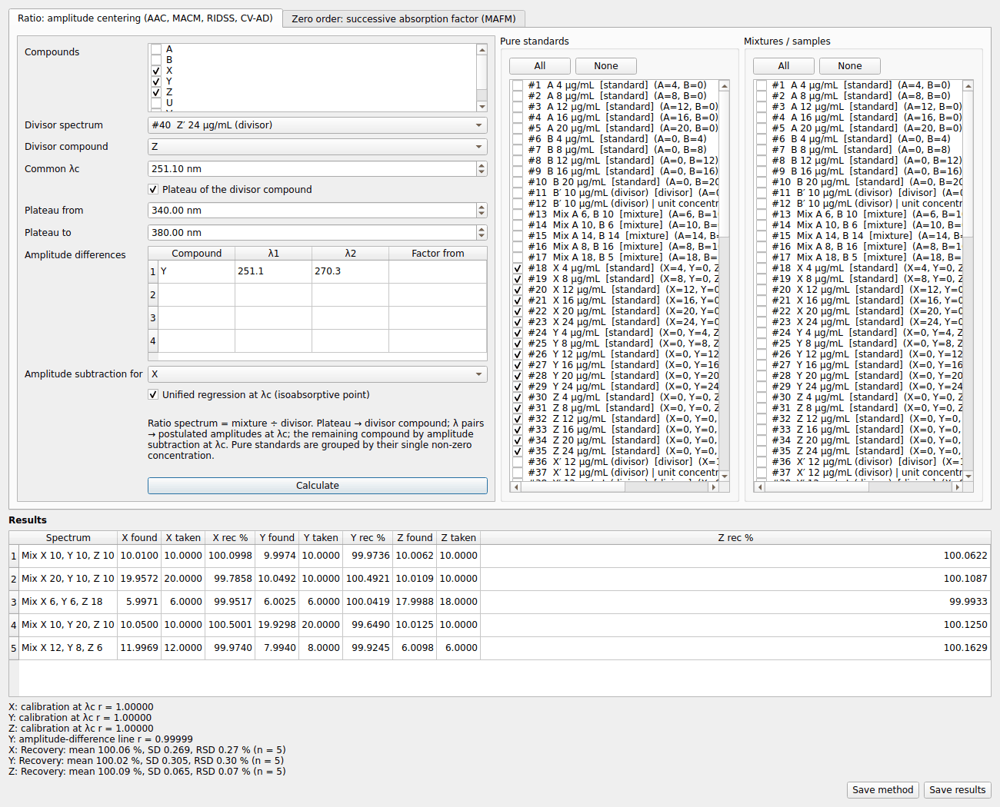

*Literature:* Abdelrahman et al., Anal. Methods 6 (2014) 509, doi:10.1039/c3ay41564c

## Spectrum resolution (recover each component's spectrum)

Recover the zero-order (or derivative) spectrum of each component from the mixture, then measure each at its own λmax as if it were pure.

### Ratio subtraction (RS) / spectrum subtraction of the extended component

**Principle.** (X + Y)/Y′ − constant (plateau) = X/Y′; × Y′ gives X's zero-order spectrum, read at X's λmax. Spectro computes it as mixture − constant·Y′ (identical, exact everywhere).

**Use when.** Y extended alone (plateau).

**How to apply in Spectro**

1. Template *Ratio subtraction / spectrum subtraction (X)*; divisor Y′, plateau range.
2. The processed mixtures now look like pure X: read at X's λmax. Calibrate, determine.

**Example**

* Compound: A; template: *Ratio subtraction / spectrum subtraction (X)*
* Step: Ratio subtraction (recover X) (divisor=B′, start=310, end=350, divisor_derivative=0, divisor_delta_lambda=4)
* Measurement: Amplitude at λ — w1 = 245
* The screenshot shows the laboratory mixtures after the processing steps, with the measuring wavelength(s) marked.
* Calibration: slope 0.044954, intercept 0.000645, r = 1.00000 (n = 5)

| Mixture | A found | A taken | Rec. % |
|---|---|---|---|
| Mix A 6, B 10 | 5.995 | 6 | 99.92 |
| Mix A 10, B 6 | 10.007 | 10 | 100.07 |
| Mix A 14, B 14 | 13.987 | 14 | 99.91 |
| Mix A 8, B 16 | 8.004 | 8 | 100.05 |
| Mix A 18, B 5 | 17.999 | 18 | 99.99 |

Result: A: mean recovery 99.99 %, RSD 0.07 %.

*Literature:* Zaghary et al., J. Anal. Chem. 75 (2020) 742, doi:10.1134/S1061934820060180; Lotfy et al., Spectrochim. Acta A 136 (2015) 937, doi:10.1016/j.saa.2014.09.117

### Constant multiplication (CM) / SS-CM

**Principle.** The plateau constant × Y′ is Y's zero-order spectrum in the mixture (CM); subtracting it from the mixture gives X (spectrum subtraction, SS). Both spectra are then read at their λmax.

**Use when.** Y extended alone.

**How to apply in Spectro**

1. Template *Constant multiplication / SS-CM (extended Y)*; divisor Y′, plateau.
2. Read Y at its λmax. For X use the ratio subtraction template (same divisor/plateau).

**Example**

* Compound: B; template: *Constant multiplication / SS-CM (extended Y)*
* Step: Constant multiplication (recover Y) (divisor=B′, start=310, end=350, divisor_derivative=0, divisor_delta_lambda=4)
* Measurement: Amplitude at λ — w1 = 268
* The screenshot shows the laboratory mixtures after the processing steps, with the measuring wavelength(s) marked.
* Calibration: slope 0.028034, intercept -0.000251, r = 1.00000 (n = 5)

| Mixture | B found | B taken | Rec. % |
|---|---|---|---|
| Mix A 6, B 10 | 10.012 | 10 | 100.12 |
| Mix A 10, B 6 | 6.006 | 6 | 100.10 |
| Mix A 14, B 14 | 14.018 | 14 | 100.13 |
| Mix A 8, B 16 | 16.000 | 16 | 100.00 |
| Mix A 18, B 5 | 5.002 | 5 | 100.04 |

Result: B: mean recovery 100.08 %, RSD 0.06 %.

*Literature:* Zaghary et al., J. Anal. Chem. 75 (2020) 742, doi:10.1134/S1061934820060180; Fahmy et al., Spectrochim. Acta A 261 (2021) 119999, doi:10.1016/j.saa.2021.119999

### Extended ratio subtraction (ERS)

**Principle.** After ratio subtraction recovers X, X's amount is matched to its pure spectrum X′ and subtracted from the mixture → Y's spectrum, read at Y's λmax (also where Y has no region of its own).

**Use when.** Y extended; Y measured at its band maximum.

**How to apply in Spectro**

1. Template *Extended ratio subtraction (Y)*; divisor Y′, pure X′, plateau. Read Y at λmax.

**Example**

* Compound: B; template: *Extended ratio subtraction (Y)*
* Step: Extended ratio subtraction (recover Y) (divisor=B′, reference=A 12, start=310, end=350)
* Measurement: Amplitude at λ — w1 = 268
* The screenshot shows the laboratory mixtures after the processing steps, with the measuring wavelength(s) marked.
* Calibration: slope 0.027975, intercept 0.000503, r = 1.00000 (n = 5)

| Mixture | B found | B taken | Rec. % |
|---|---|---|---|
| Mix A 6, B 10 | 10.003 | 10 | 100.03 |
| Mix A 10, B 6 | 6.005 | 6 | 100.09 |
| Mix A 14, B 14 | 13.994 | 14 | 99.96 |
| Mix A 8, B 16 | 16.017 | 16 | 100.11 |
| Mix A 18, B 5 | 4.964 | 5 | 99.28 |

Result: B: mean recovery 99.89 %, RSD 0.35 %.

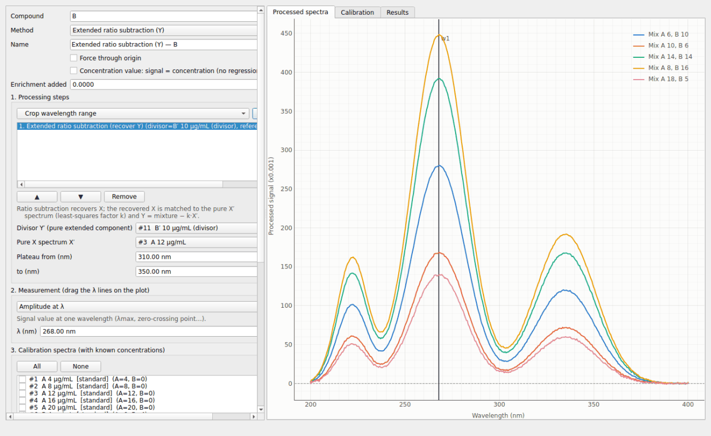

*Literature:* Lotfy et al., Spectrochim. Acta A 136 (2015) 937, doi:10.1016/j.saa.2014.09.117; Emam et al., Spectrochim. Acta A (2018), doi:10.1016/j.saa.2017.11.034

### Successive ratio subtraction (SRS, ternary)

**Principle.** Ratio subtraction with the most extended component's divisor removes it; a second ratio subtraction with the next component's divisor (its own plateau) removes that one; the third component's spectrum remains.

**Use when.** Successive extension (U alone at long λ, V alone after U is removed).

**How to apply in Spectro**

1. Template *Successive ratio subtraction (ternary SRS, Z)*: first step divisor U′ with U's plateau, second step divisor V′ with V's plateau.
2. Read W at its λmax. Calibrate, determine.

**Example**

* Compound: W; template: *Successive ratio subtraction (ternary SRS, Z)*
* Step: Ratio subtraction (recover X) (divisor=U′, start=330, end=345, divisor_derivative=0, divisor_delta_lambda=4)
* Step: Ratio subtraction (recover X) (divisor=V′, start=278, end=290, divisor_derivative=0, divisor_delta_lambda=4)
* Measurement: Amplitude at λ — w1 = 246
* The screenshot shows the laboratory mixtures after the processing steps, with the measuring wavelength(s) marked.
* Calibration: slope 0.044938, intercept 0.000642, r = 1.00000 (n = 5)

| Mixture | W found | W taken | Rec. % |
|---|---|---|---|
| Mix U 10, V 10, W 10 | 10.013 | 10 | 100.13 |
| Mix U 16, V 4, W 4 | 4.002 | 4 | 100.04 |
| Mix U 4, V 14, W 8 | 7.987 | 8 | 99.83 |
| Mix U 8, V 8, W 16 | 16.015 | 16 | 100.09 |
| Mix U 12, V 6, W 12 | 12.002 | 12 | 100.01 |

Result: W: mean recovery 100.02 %, RSD 0.12 %.

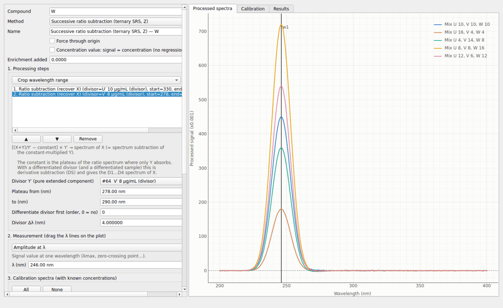

*Literature:* Emam et al., Spectrochim. Acta A (2018), doi:10.1016/j.saa.2017.11.034

### Successive spectrum subtraction (ternary)

**Principle.** Spectrum subtraction (factor k from a wavelength where the first component absorbs alone) removes it; ratio subtraction then removes the second.

**Use when.** Successive extension.

**How to apply in Spectro**

1. Template *Successive spectrum subtraction (ternary)*: Spectrum subtraction with U′ at a λ where only U absorbs, then Ratio subtraction with V′ and V's plateau.
2. Read W at its λmax.

**Example**

* Compound: W; template: *Successive spectrum subtraction (ternary)*
* Step: Spectrum subtraction (reference=U′, wavelength=330, derivative_order=0, delta_lambda=4, wavelength_end=345)
* Step: Ratio subtraction (recover X) (divisor=V′, start=278, end=290, divisor_derivative=0, divisor_delta_lambda=4)
* Measurement: Amplitude at λ — w1 = 246
* The screenshot shows the laboratory mixtures after the processing steps, with the measuring wavelength(s) marked.
* Calibration: slope 0.044938, intercept 0.000642, r = 1.00000 (n = 5)

| Mixture | W found | W taken | Rec. % |
|---|---|---|---|
| Mix U 10, V 10, W 10 | 10.013 | 10 | 100.13 |
| Mix U 16, V 4, W 4 | 4.002 | 4 | 100.04 |
| Mix U 4, V 14, W 8 | 7.987 | 8 | 99.83 |
| Mix U 8, V 8, W 16 | 16.015 | 16 | 100.09 |
| Mix U 12, V 6, W 12 | 12.002 | 12 | 100.01 |

Result: W: mean recovery 100.02 %, RSD 0.12 %.

### Spectrum subtraction (SS)

**Principle.** k = A_mixture(λ)/A_Y′(λ) at a wavelength (or plateau range) where only Y absorbs; mixture − k·Y′ = X.

**Use when.** Y absorbs alone at some wavelength.

**How to apply in Spectro**

1. Template *Spectrum subtraction*: reference Y′, wavelength (and optionally *…to* for a range), derivative order 0. Read X at λmax.

**Example**

* Compound: A; template: *Spectrum subtraction*
* Step: Spectrum subtraction (reference=B′, wavelength=320, derivative_order=0, delta_lambda=4, wavelength_end=350)
* Measurement: Amplitude at λ — w1 = 245
* The screenshot shows the laboratory mixtures after the processing steps, with the measuring wavelength(s) marked.
* Calibration: slope 0.044956, intercept 0.000609, r = 1.00000 (n = 5)

| Mixture | A found | A taken | Rec. % |
|---|---|---|---|
| Mix A 6, B 10 | 5.996 | 6 | 99.94 |
| Mix A 10, B 6 | 10.009 | 10 | 100.09 |
| Mix A 14, B 14 | 13.988 | 14 | 99.92 |
| Mix A 8, B 16 | 8.005 | 8 | 100.06 |
| Mix A 18, B 5 | 18.000 | 18 | 100.00 |

Result: A: mean recovery 100.00 %, RSD 0.07 %.

### Factorized zero-order method (FZM)

**Principle.** k from the D1 amplitude at a zero-crossing of the other component: k = D1_mixture(λ)/D1_X′(λ); k·X′ is X's zero-order spectrum, read at its λmax.

**Use when.** The other component's derivative crosses zero where X's is large.

**How to apply in Spectro**

1. Template *Factorized zero-order (FZM)*: reference X′, wavelength = zero-crossing of Y's D1, derivative order 1. Read X at λmax.

**Example**

* Compound: A; template: *Factorized zero-order (FZM)*
* Step: Factorized spectrum / derivative transformation (reference=A 12, wavelength=237.2, derivative_order=1, delta_lambda=4)
* Measurement: Amplitude at λ — w1 = 245
* The screenshot shows the laboratory mixtures after the processing steps, with the measuring wavelength(s) marked.
* Calibration: slope 0.045138, intercept -0.00206, r = 0.99996 (n = 5)
* λ = 237.2 nm, zero-crossing of B's D1 (finder).

| Mixture | A found | A taken | Rec. % |
|---|---|---|---|
| Mix A 6, B 10 | 6.032 | 6 | 100.53 |
| Mix A 10, B 6 | 10.068 | 10 | 100.68 |
| Mix A 14, B 14 | 14.033 | 14 | 100.23 |
| Mix A 8, B 16 | 8.080 | 8 | 101.00 |
| Mix A 18, B 5 | 18.034 | 18 | 100.19 |

Result: A: mean recovery 100.53 %, RSD 0.33 %.

### Constant center (CC)

**Principle.** For X the ratio r = P_X(λ1)/P_X(λ2) of X/Y′ is constant, so the constant of Y is k = P2 − (P1 − P2)/(r − 1); (P − k)·Y′ = X, k·Y′ = Y.

**Use when.** No plateau needed; X's ratio spectrum has different amplitudes at λ1 and λ2.

**How to apply in Spectro**

1. Template *Constant center*: divisor Y′, pure X′, λ1, λ2, recover X (or Y).
2. Read the recovered component at its λmax.

**Example**

* Compound: A; template: *Constant center*
* Step: Constant center (recover X or Y) (divisor=B′, reference=A 12, w1=240, w2=255, target=X)
* Measurement: Amplitude at λ — w1 = 245
* The screenshot shows the laboratory mixtures after the processing steps, with the measuring wavelength(s) marked.
* Calibration: slope 0.044957, intercept 0.00063, r = 1.00000 (n = 5)

| Mixture | A found | A taken | Rec. % |
|---|---|---|---|
| Mix A 6, B 10 | 6.000 | 6 | 100.00 |
| Mix A 10, B 6 | 10.007 | 10 | 100.07 |
| Mix A 14, B 14 | 13.995 | 14 | 99.97 |
| Mix A 8, B 16 | 8.002 | 8 | 100.03 |
| Mix A 18, B 5 | 17.999 | 18 | 100.00 |

Result: A: mean recovery 100.01 %, RSD 0.04 %.

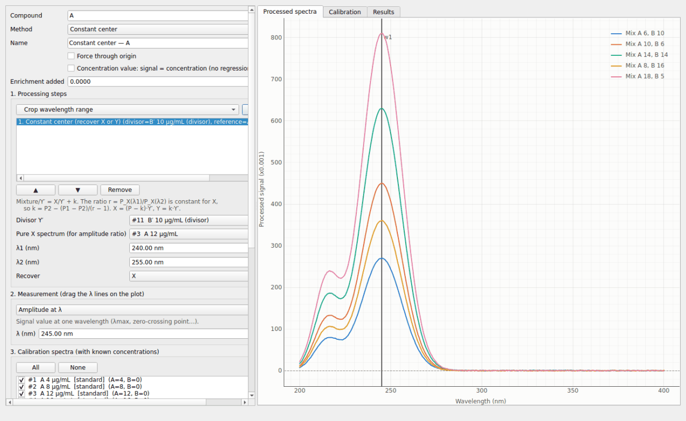

*Literature:* Lotfy et al., Spectrochim. Acta A 136 (2015) 937, doi:10.1016/j.saa.2014.09.117

### Derivative transformation (DT, DT-SS)

**Principle.** In the D1 spectra the interferent is flat (D1 = 0) over a region where Y's D1 is not: the mean of D1(mixture)/D1(Y′) there is k; k·Y′ (zero order) is Y's spectrum; mixture − k·Y′ (DT-SS) is the other's.

**Use when.** The interferent is flat (or zero) over a region where Y still changes.

**How to apply in Spectro**

1. Template *Derivative transformation (DT, recover zero order)*: reference Y′, wavelength and *…to* = the plateau of the D1 ratio, derivative order 1.
2. Read Y at its λmax (zero order).

**Example**

* Compound: B; template: *Derivative transformation (DT, recover zero order)*
* Step: Factorized spectrum / derivative transformation (reference=B′, wavelength=305, derivative_order=1, delta_lambda=4, wavelength_end=320)
* Measurement: Amplitude at λ — w1 = 268
* The screenshot shows the laboratory mixtures after the processing steps, with the measuring wavelength(s) marked.
* Calibration: slope 0.028195, intercept -0.000743, r = 0.99993 (n = 5)
* A's D1 is zero above 300 nm, B's is not: 305–320 nm.

| Mixture | B found | B taken | Rec. % |
|---|---|---|---|
| Mix A 6, B 10 | 10.002 | 10 | 100.02 |
| Mix A 10, B 6 | 6.080 | 6 | 101.33 |
| Mix A 14, B 14 | 13.906 | 14 | 99.33 |
| Mix A 8, B 16 | 15.941 | 16 | 99.63 |
| Mix A 18, B 5 | 5.004 | 5 | 100.08 |

Result: B: mean recovery 100.08 %, RSD 0.76 %.

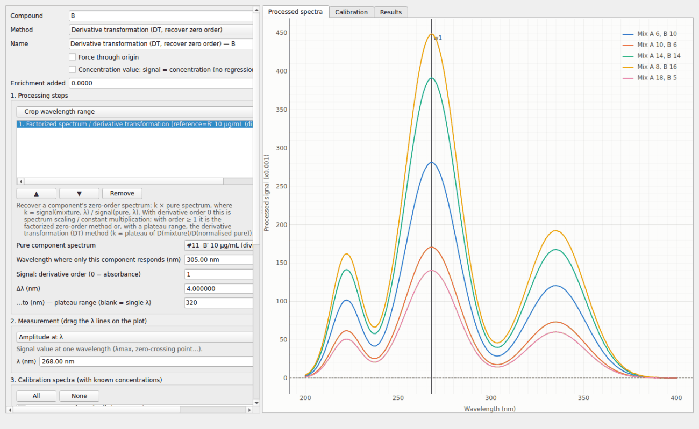

*Literature:* Fahmy et al., Spectrochim. Acta A 261 (2021) 119999, doi:10.1016/j.saa.2021.119999

### Derivative subtraction (DS) and DS-CM

**Principle.** Ratio subtraction / constant multiplication in the D1 domain: D1 of the mixture ÷ D1 of Y′ has a plateau where only Y's D1 is non-zero; DS gives X's D1 spectrum, DS-CM gives Y's.

**Use when.** Useful when the zero-order plateau is noisy (small extension).

**How to apply in Spectro**

1. Template *Derivative subtraction (DS, X in D1)* or *…(DS-CM, Y in D1)*: Derivative, then Ratio subtraction / Constant multiplication with *Differentiate divisor first* = 1 and the D1 plateau.
2. Read the component's D1 at a peak. Calibrate, determine.

**Example**

* Compound: B; template: *Derivative subtraction–constant multiplication (DS-CM, Y in D1)*
* Step: Derivative (D1–D4) (order=1, method=difference, delta_lambda=4, window=11, polyorder=3, scaling=10)
* Step: Constant multiplication (recover Y) (divisor=B′, start=305, end=320, divisor_derivative=1, divisor_delta_lambda=4)
* Measurement: Amplitude at λ — w1 = 312
* The screenshot shows the laboratory mixtures after the processing steps, with the measuring wavelength(s) marked.
* Calibration: slope 0.003352, intercept -8.83e-05, r = 0.99993 (n = 5)
* DS-CM shown (B's D1 spectrum recovered); the DS template gives A's D1 spectrum the same way.

| Mixture | B found | B taken | Rec. % |
|---|---|---|---|
| Mix A 6, B 10 | 10.002 | 10 | 100.02 |
| Mix A 10, B 6 | 6.080 | 6 | 101.33 |
| Mix A 14, B 14 | 13.906 | 14 | 99.33 |
| Mix A 8, B 16 | 15.941 | 16 | 99.63 |
| Mix A 18, B 5 | 5.004 | 5 | 100.08 |

Result: B: mean recovery 100.08 %, RSD 0.76 %.

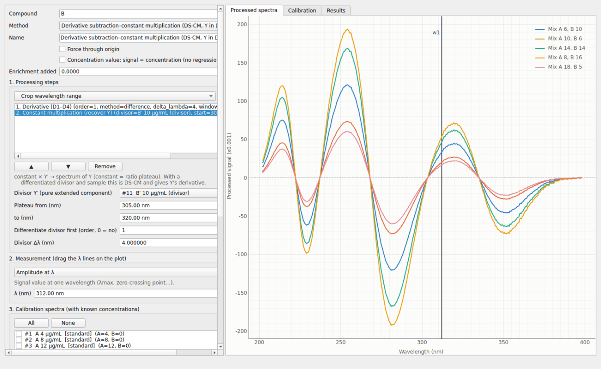

*Literature:* Zaghary et al., J. Anal. Chem. 75 (2020) 742, doi:10.1134/S1061934820060180; Lotfy et al., Spectrochim. Acta A 136 (2015) 937, doi:10.1016/j.saa.2014.09.117

## Multivariate calibration (chemometrics)

Calibrate on whole spectra of mixtures (or pure spectra) and predict all compounds at once.

### Chemometrics: CLS, ILS, PCR, PLS, MCR-ALS, ANN, SVR

**Principle.** Calibration on whole spectra. CLS uses pure spectra (K matrix); ILS/PCR/PLS regress concentrations on spectra of a mixture training set; MCR-ALS resolves pure profiles; ANN and SVR model non-linearity.

**Use when.** Severe overlap, three or more compounds, or when univariate methods fail. Needs a designed training set (Tools → Calibration design, e.g. Brereton 5-level).

**How to apply in Spectro**

1. Tools → Calibration design to plan the training mixtures; import them with role *calibration*.
2. Methods → Chemometrics: model type, wavelength range, preprocessing.
3. *Cross-validate* (number of components is suggested), *Fit + predict* the validation mixtures; check T²/Q outliers; *Save method*.

**Example**

* Training set: 25-mixture Brereton design (Tools → Calibration design), 220–390 nm; validation: the 5 laboratory mixtures

| Model | X recovery % | Y recovery % | Z recovery % |
|---|---|---|---|
| CLS | 100.00 ± 0.01 | 100.01 ± 0.08 | 100.00 ± 0.03 |
| ILS | 100.01 ± 0.08 | 99.97 ± 0.23 | 100.00 ± 0.11 |
| PCR (3 components) | 100.00 ± 0.01 | 100.01 ± 0.08 | 100.00 ± 0.03 |
| PLS2 (3 components) | 100.00 ± 0.01 | 100.01 ± 0.08 | 100.00 ± 0.03 |
| MCR-ALS | 99.98 ± 0.05 | 100.00 ± 0.17 | 100.03 ± 0.04 |
| ANN | 99.90 ± 0.57 | 99.91 ± 0.61 | 99.85 ± 0.43 |
| SVR | 100.07 ± 0.35 | 100.17 ± 0.44 | 100.29 ± 0.38 |

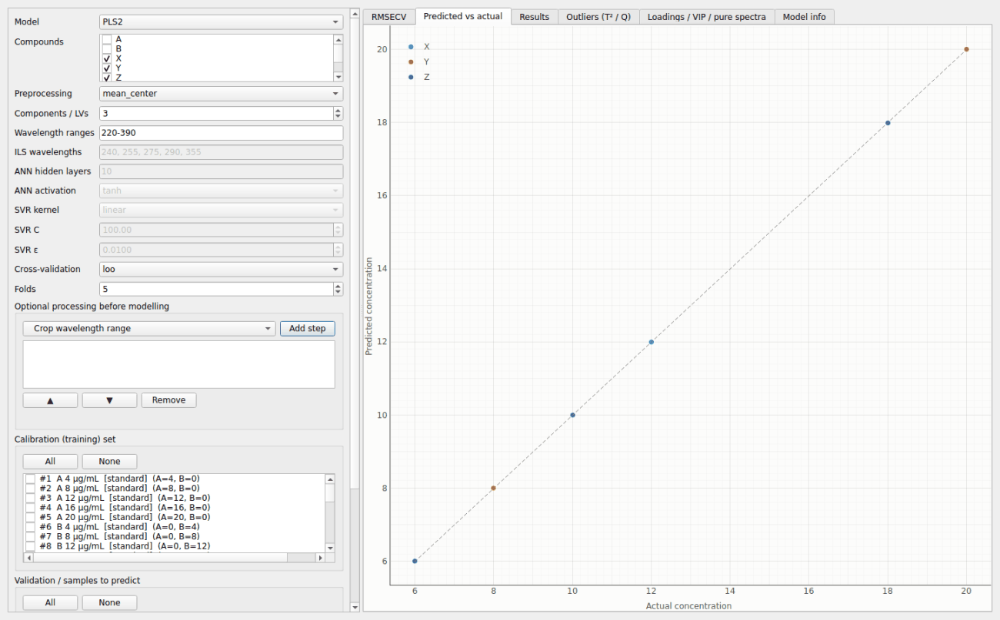

*Literature:* Saleh et al., Int. J. Pharm. Pharm. Sci. 9 (2017) 43, doi:10.22159/ijpps.2017v9i5.16960

## Standard addition and sample enrichment

Add known amounts of analyte to the sample (physically or by adding a stored spectrum) to check or correct for the matrix, or to lift a minor component into its linear range.

### Standard addition (recovery in the matrix)

**Principle.** Known amounts of pure analyte are added to the sample; the found − unspiked amount divided by the added amount is the recovery; the x-intercept of found vs added is the sample content.

**Use when.** Check accuracy in a real matrix (excipients) with any calibrated method.

**How to apply in Spectro**

1. Univariate calibration with a calibrated method; import the unspiked and spiked samples with the analyte concentration = amount ADDED (0 for the unspiked).
2. Check them in *Spectra to determine* → *Standard addition…*.

**Example**

* Method: ratio difference for A (÷ B′, 245 − 275 nm)
* A in the sample: 5.982 µg/mL (true 6); extrapolated 5.979

| Spectrum | A added | Found | Recovered | Recovery % |
|---|---|---|---|---|
| Sample + 0 A | 0 | 5.982 |  |  |
| Sample + 4 A | 4 | 9.995 | 4.013 | 100.33 |
| Sample + 8 A | 8 | 13.994 | 8.012 | 100.15 |
| Sample + 12 A | 12 | 17.997 | 12.015 | 100.12 |

Result: Mean recovery of the additions 100.20 %.

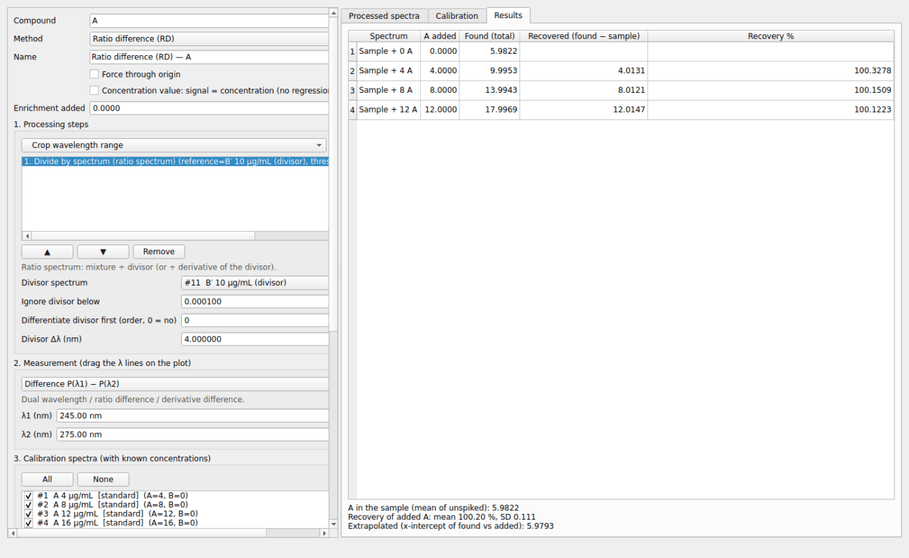

### H-point standard addition (HPSAM)

**Principle.** Standard additions of X measured at λ1 and λ2 where Y has equal absorbance; the two addition lines meet at H(−C_X, A_Y): the analyte concentration free of the interferent and the matrix.

**Use when.** Binary; Y has two wavelengths with equal absorbance.

**How to apply in Spectro**

1. Binary two-signal methods → *Standard addition: H-point*: analyte, λ1, λ2.
2. Check the sample and its additions (X concentration = amount added) → *Calculate*.

**Example**

* Sample: A 6 µg/mL + B 12 µg/mL; additions of A: 0, 4, 8, 12 µg/mL
* λ1 = 245 nm, λ2 = 215.8 nm (B equal, finder)

| Quantity | Value |
|---|---|
| A found (−C_H) | 5.980 µg/mL (true 6) |
| Recovery | 99.66 % |
| A_H (interferent B signal) | 0.0899 |

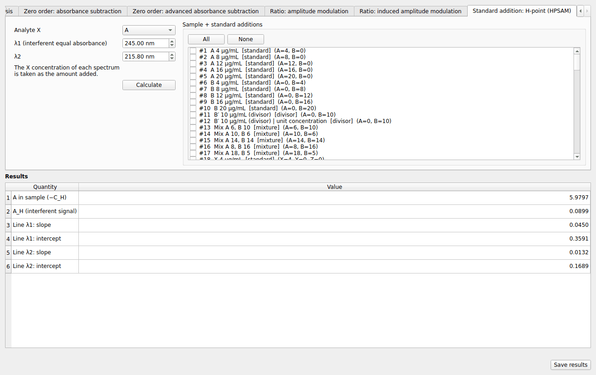

### Sample enrichment: spiking and spectrum addition

**Principle.** A minor component below its linear range is raised by adding a known amount of pure standard (spiking) or by adding the stored spectrum of a standard (spectrum addition); the added amount is subtracted from the result.

**Use when.** Dosage forms with a very unequal ratio (e.g. 20 : 1).

**How to apply in Spectro**

1. Spiking: Univariate calibration → *Enrichment added* = amount added → the results get a *Found − added* column.
2. Spectrum addition: Process → *Add spectrum* (a stored standard) on the sample, then determine and subtract the added amount.

**Example**

* Compound: B; template: *Constant multiplication / SS-CM (extended Y)*
* Step: Constant multiplication (recover Y) (divisor=B′, start=310, end=350, divisor_derivative=0, divisor_delta_lambda=4)
* Measurement: Amplitude at λ — w1 = 268
* The screenshot shows the laboratory mixtures after the processing steps, with the measuring wavelength(s) marked.
* Calibration: slope 0.028034, intercept -0.000251, r = 1.00000 (n = 5)
* Sample A 20 + B 1 µg/mL (ratio 20 : 1, B below its range) spiked with 5 µg/mL B; 'Found − added' is the B content (true 1 µg/mL).

| Mixture | B found | B taken | Rec. % | Found − added |
|---|---|---|---|---|
| Tablet 20:1 + 5 B (1) | 6.009 | 6 | 100.14 | 1.009 |
| Tablet 20:1 + 5 B (2) | 6.010 | 6 | 100.16 | 1.010 |
| Tablet 20:1 + 5 B (3) | 6.015 | 6 | 100.25 | 1.015 |

Result: B: mean recovery 100.18 %, RSD 0.05 %.

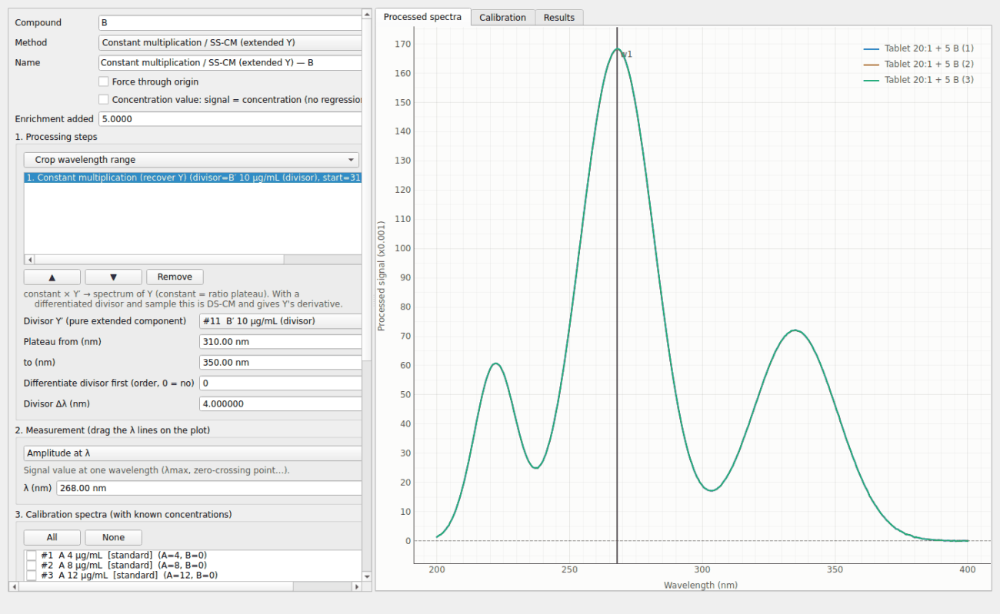

*Literature:* Zaghary et al., J. Anal. Chem. 75 (2020) 742, doi:10.1134/S1061934820060180; Lotfy et al., Spectrochim. Acta A 136 (2015) 937, doi:10.1016/j.saa.2014.09.117; Fahmy et al., Spectrochim. Acta A 261 (2021) 119999, doi:10.1016/j.saa.2021.119999
