# Spectro — method guide

How to apply every spectrophotometric method in Spectro — written for beginners. Each method has: the idea in plain words, the principle, what you need to measure, step-by-step instructions, checks and common mistakes, a worked example with a 'why it works' figure and screenshots of every step, and a **sample Excel workbook** with the example's spectra (import it and reproduce the result). The examples use simulated systems (Gaussian bands, 0.0004 AU noise) — not measured data — and every number was produced by the app itself when this guide was generated (`python tools/method_guide.py`).

**Tip:** *Tools → Method optimizer* tries most of these methods automatically on your standards and ranks them; this guide explains what each one does and how to set it up by hand.

## Getting started

### 1. What these methods are for

A pharmaceutical mixture (e.g. a tablet with two or three drugs) gives one UV
spectrum that is the **sum** of the spectra of its components (Beer–Lambert law:
A = a·b·C for each compound, and absorbances add up). When the bands overlap, a
single wavelength cannot tell the drugs apart. Every method in this guide is a
way to separate that sum:

* **choose wavelengths** where the other compounds cancel (zero order, derivative);
* **divide by an interferent's spectrum** so it becomes a constant that can be
  removed (ratio spectra);
* **rebuild each component's own spectrum** (spectrum resolution);
* **solve equations** with several signals, or **train a model** on many mixtures
  (chemometrics).

In the method descriptions **X** is the compound you determine and **Y**, **Z**
the interfering ones; a prime (Y′) marks a standard spectrum used as divisor or
reference. The worked examples use the compounds of the guide systems
(A, B; X, Y, Z; U, V, W — see section 6).

### 2. Words you will meet

| Term | Meaning |
|---|---|
| Standard | Solution of ONE pure compound at a known concentration; 5–6 levels make a calibration line |
| Calibration line | Signal vs concentration of the standards; its slope and intercept convert a sample's signal into a concentration |
| Laboratory-prepared mixture | Mixture made by you from standards, so the true concentrations are known; used to test a method |
| Recovery % | Found ÷ taken × 100; 98–102 % is the usual acceptance range |
| RSD % | Relative standard deviation of repeated results; ≤ 2 % is usual |
| λmax | Wavelength of maximum absorbance of a band |
| Isoabsorptive (isosbestic) point | Wavelength where two compounds of EQUAL concentration have equal absorbance |
| Extended component | The compound whose spectrum continues alone at longer wavelengths |
| Divisor (Y′) | A standard spectrum of an interfering compound that the mixture is divided by |
| Ratio spectrum | Mixture ÷ divisor; the divisor compound becomes a flat line (constant) |
| Plateau | The flat part of a ratio spectrum where only the divisor compound absorbs |
| Unit (normalised) divisor | Divisor rescaled to 1 µg/mL (*Process → Normalize → concentration*) |
| Derivative D1, D2 | Slope (and slope of the slope) of a spectrum; Δλ = interval used, scaling factor = multiplier for readability |
| Zero-crossing | Wavelength where a derivative is zero (top of a band) |
| Amplitude | Value of a (processed) spectrum at a wavelength |
| Equality factor F | Ratio of an interferent's amplitudes at two wavelengths, used to cancel it |
| Mean centering | Subtracting the average of a spectrum; removes constants |
| LOD / LOQ | Smallest detectable / quantifiable concentration |

### 3. Which method should I try?

1. **Let Spectro choose:** *Tools → Method optimizer* ranks the methods for your
   standards and mixtures. Read its first rows, then look them up here.
2. **One compound absorbs alone somewhere?** → direct measurement for it, and
   ratio subtraction / constant multiplication / constant value for the rest.
3. **There is an isoabsorptive point?** → Q-analysis, absorbance subtraction,
   amplitude modulation, RIDSS.
4. **Complete overlap, two compounds?** → dual wavelength, derivative ratio,
   ratio difference, mean centering.
5. **Three compounds?** → amplitude centering (AAC/MACM), successive ratio
   subtraction, double divisor, ternary mean centering, or chemometrics.
6. **A minor component below its range?** → sample enrichment.

### 4. Using the sample Excel files

Every method below has a sample workbook (*Sample data*) with the spectra of
its example, ready to import:

* sheets **Standards**, **Divisor**, **Mixtures** (or **Samples**, **Calibration**)
  hold the spectra — first column wavelength, one column per spectrum; the
  sheet name becomes the role of its spectra on import;
* the column names contain the concentrations (e.g. `Std: A 8, B 0`), so
  *Fill concentrations from names* fills the table for you;
* sheets starting with `_` are notes and are not imported: **_Read me**
  (what to do), **_Calculation** (the calibration done with Excel formulas, so
  you can follow every number) and **_Expected results** (what Spectro gives).

Steps:

1. *File → New project…*, then *Edit → Compounds…* and add the compounds named in
   the workbook (e.g. A and B).
2. *File → Import spectra… → Add files…* and choose the workbook. Press
   *Fill concentrations from names*. The *Role* column is already filled from
   the sheet names. Press *Import*.
3. Open the method (see *How to apply* below) and compare your results with the
   *_Expected results* sheet.

### 5. Reading the results

* **Calibration:** r ≥ 0.999 and a small intercept; residuals scattered randomly.
* **Mixtures:** mean recovery 98–102 %, RSD ≤ 2 %.
* If a method fails for one compound only, that compound is not cancelled at
  the chosen wavelength(s) — recheck them with the finder.

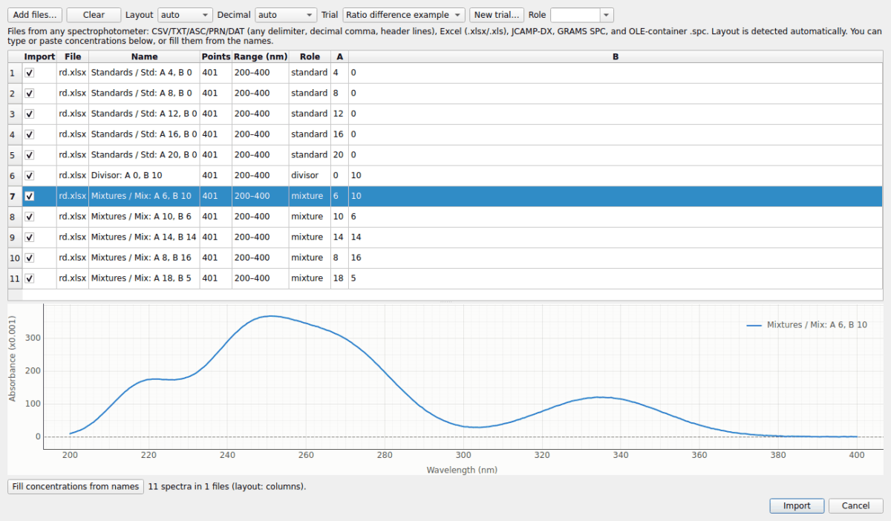

*Importing a sample workbook: *File → Import spectra… → Add files…*, then *Fill concentrations from names*. Each row is one spectrum; the Role column comes from the sheet name and the A / B columns from the column titles.*

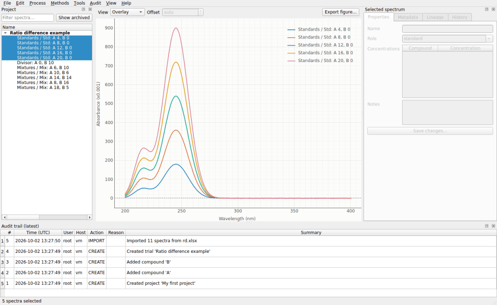

*After import: the spectra are in the project tree with their roles and concentrations; selecting them plots them. Every import is recorded in the audit trail.*

### 6. The guide systems

* **Binary A + B** — A absorbs below 300 nm; B overlaps A and extends alone above 300 nm (plateau region). The spectra cross at an isoabsorptive point. Standards 4–20 µg/mL; divisors B′ = 10 µg/mL.
* **Ternary X + Y + Z** — X and Y overlap completely below 300 nm; Z overlaps both and extends alone above 330 nm. Standards 4–24 µg/mL; divisors X′ = 12 µg/mL, Y′ = 12 µg/mL, Z′ = 24 µg/mL.
* **Ternary U + V + W** — Successive extension: U absorbs alone above 320 nm, U and V together at 275–300 nm, all three below 260 nm. Standards 2–18 µg/mL; divisors U′ = 10 µg/mL, V′ = 8 µg/mL.

## Contents

* **Zero-order spectra (absorbance)** — [Direct measurement at λmax](#direct), [Dual wavelength (DW)](#dw), [Induced dual wavelength (IDW)](#idw), [Area under the curve — single component](#auc1), [Absorbance ratio (Q-analysis)](#q), [Absorbance subtraction (AS)](#as), [Advanced absorbance subtraction (AAS)](#aas), [Successive absorption factor method (MAFM)](#mafm)
* **Simultaneous equations (several signals)** — [Simultaneous equations (Vierordt)](#vierordt), [Bivariate calibration (Kaiser)](#bivariate), [Area under the curve — simultaneous (binary / ternary)](#auc_eq)
* **Derivative spectra** — [Zero-crossing derivative (D1–D4)](#zc), [Derivative peak-to-peak](#p2p), [Dual wavelength in derivative mode (D1 DWL)](#d1dwl)
* **Ratio spectra — derivative and mean centering** — [Derivative ratio (DD1 / DR1)](#dd1), [Derivative ratio of derivative spectra (D1 DR)](#d1dr), [Mean centering of ratio spectra (MCR)](#mcr), [Mean centering of ratio spectra — ternary](#mcr3), [Successive derivative ratio (ternary)](#sdr), [Double divisor ratio derivative (ternary)](#dd)
* **Ratio spectra — amplitude methods** — [Ratio difference (RD)](#rd), [Dual amplitude difference (ternary)](#dad), [Constant value (ratio plateau)](#cv), [Concentration value (no regression)](#concval), [Amplitude modulation (AM)](#am), [Induced amplitude modulation (IAM)](#iam), [Constant value via amplitude difference (CV-AD)](#cvad), [Advanced amplitude centering — partial overlap (AAC)](#aac), [Amplitude centering — complete overlap (AAC / MACM)](#macm), [Ratio difference–isoabsorptive (RIDSS)](#ridss)
* **Spectrum resolution (recover each component's spectrum)** — [Ratio subtraction (RS) / spectrum subtraction of the extended component](#rs), [Constant multiplication (CM) / SS-CM](#cm), [Extended ratio subtraction (ERS)](#ers), [Successive ratio subtraction (SRS, ternary)](#srs), [Successive spectrum subtraction (ternary)](#sss), [Spectrum subtraction (SS)](#ss), [Factorized zero-order method (FZM)](#fzm), [Constant center (CC)](#cc), [Derivative transformation (DT, DT-SS)](#dt), [Derivative subtraction (DS) and DS-CM](#ds)
* **Multivariate calibration (chemometrics)** — [Chemometrics: CLS, ILS, PCR, PLS, MCR-ALS, ANN, SVR](#chemo)
* **Standard addition and sample enrichment** — [Standard addition (recovery in the matrix)](#stdadd), [H-point standard addition (HPSAM)](#hpsam), [Sample enrichment: spiking and spectrum addition](#enrich)

## Zero-order spectra (absorbance)

Work directly on the absorbance spectra: one wavelength where only the analyte absorbs, or two wavelengths chosen so that the interferent cancels.

### Direct measurement at λmax

**In plain words.** If only one compound absorbs light at a certain wavelength, the absorbance there tells you its concentration directly — exactly as for a pure solution.

**Principle.** A = a·b·C (Beer–Lambert): the absorbance at a wavelength where only the analyte absorbs is proportional to its concentration.

**Use when.** The analyte has a region where no other compound absorbs (usually the extended component of a mixture).

**What you need.** 5–6 standards of the compound (e.g. 4–20 µg/mL) and the mixtures.

**How to apply in Spectro**

1. Methods → Univariate calibration → template *Direct (zero order, λmax)*.
2. Choose the compound, then drag the λ marker to a wavelength where only it absorbs (check the pure spectra of the other compounds).
3. Check the calibration standards and the mixtures → *Calibrate* → *Determine*.

**Checks and common mistakes.** Overlay the pure spectra of all compounds first: at the chosen λ every other compound must read ≈ 0. If it does not, the result is biased high.

**Worked example**

📊 **Sample data:** [data/direct.xlsx](data/direct.xlsx) — import it (see *Getting started → 4*) and reproduce the numbers below.

* Compound: B; template: *Direct (zero order, λmax)*
* Measurement: Amplitude at λ — w1 = 335
* Calibration: slope 0.011976, intercept 0.000213, r = 1.00000 (n = 5)
* B absorbs alone above 300 nm, so 335 nm (its second band) is free from A.

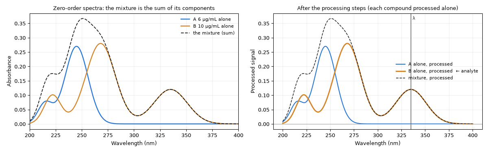

*Why it works — left: the spectra of the components and of the mixture (they overlap). Right: each component processed alone with the method's steps. At the marked wavelength(s) the processed A contribute nothing (≈ 0, or a constant that the measurement cancels), so the mixture's signal there belongs to B only.*

| Mixture | B found | B taken | Rec. % |
|---|---|---|---|
| Mix A 6, B 10 | 9.977 | 10 | 99.77 |
| Mix A 10, B 6 | 5.991 | 6 | 99.84 |
| Mix A 14, B 14 | 14.002 | 14 | 100.01 |
| Mix A 8, B 16 | 16.008 | 16 | 100.05 |
| Mix A 18, B 5 | 5.036 | 5 | 100.72 |

Result: B: mean recovery 100.08 %, RSD 0.38 %.

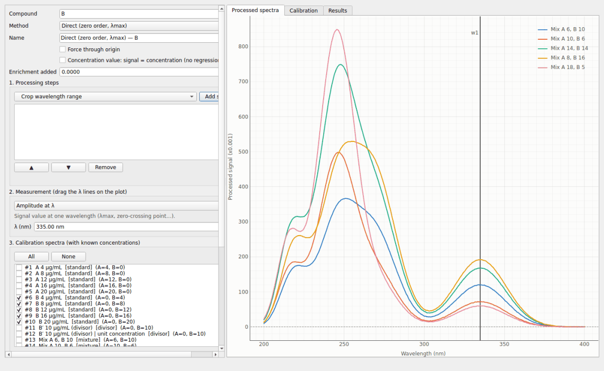

*Step 1 — the method set up in *Methods → Univariate calibration*: compound, template, processing steps (left) and the laboratory mixtures after processing with the measuring wavelength(s) marked (right).*

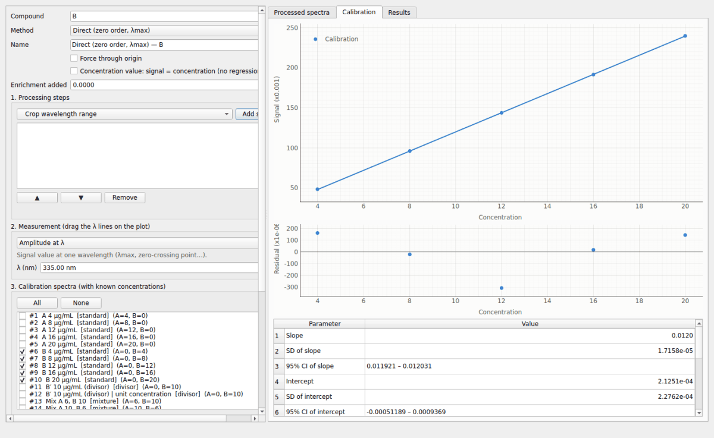

*Step 2 — *Calibrate*: the calibration line of the standards, its residuals and the regression statistics (slope, intercept, r, LOD, LOQ).*

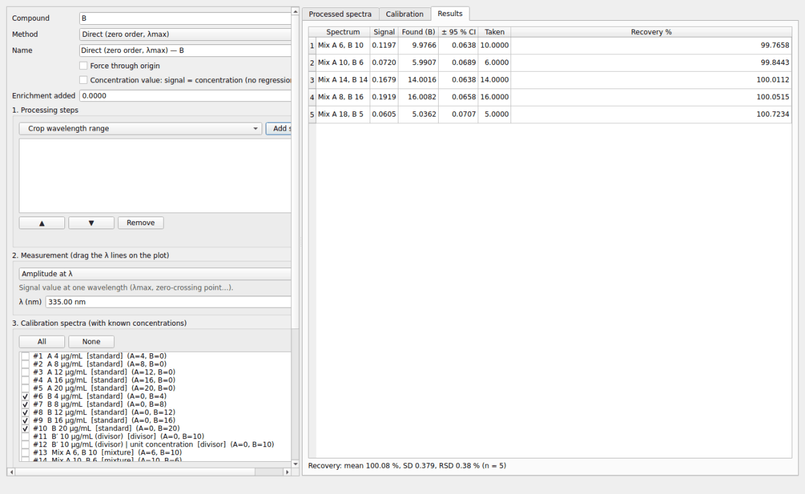

*Step 3 — *Determine*: found and taken concentrations and % recovery of each mixture, with mean and RSD.*

### Dual wavelength (DW)

**In plain words.** Pick two wavelengths where the interfering compound absorbs the SAME amount. Subtracting the two readings removes the interferent completely, and what is left belongs to your analyte only.

**Principle.** ΔA = A(λ1) − A(λ2). At λ1 and λ2 the interferent Y has the same absorbance, so its contribution cancels and ΔA ∝ C_X.

**Use when.** Y has two wavelengths with equal absorbance where X absorbs differently.

**What you need.** Standards of the analyte (for the calibration), one standard of the interferent (to find the two wavelengths), the mixtures.

**How to apply in Spectro**

1. Tools → Spectral finder → *Equal amplitude*: select a pure Y spectrum and λ1 (usually λmax of X) to list the λ2 values where Y is equal.
2. Methods → Univariate calibration → template *Dual wavelength*; enter λ1 and λ2.
3. Calibrate on pure X standards (ΔA vs C), determine the mixtures.

**Checks and common mistakes.** Check with a pure interferent standard: its ΔA must be ≈ 0. Pick a pair where the analyte's two absorbances differ a lot (large ΔA = better sensitivity).

**Worked example**

📊 **Sample data:** [data/dw.xlsx](data/dw.xlsx) — import it (see *Getting started → 4*) and reproduce the numbers below.

* Compound: A; template: *Dual wavelength*
* Measurement: Difference P(λ1) − P(λ2) — w1 = 245, w2 = 215.8
* Calibration: slope 0.031718, intercept 0.000566, r = 1.00000 (n = 5)
* Finder: B has the same absorbance at 245 nm and 215.8 nm.

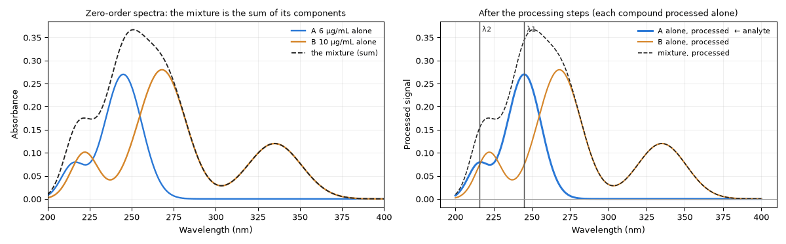

*Why it works — left: the spectra of the components and of the mixture (they overlap). Right: each component processed alone with the method's steps. At the marked wavelength(s) the processed B contribute nothing (≈ 0, or a constant that the measurement cancels), so the mixture's signal there belongs to A only.*

| Mixture | A found | A taken | Rec. % |
|---|---|---|---|
| Mix A 6, B 10 | 6.009 | 6 | 100.15 |
| Mix A 10, B 6 | 10.015 | 10 | 100.15 |
| Mix A 14, B 14 | 14.000 | 14 | 100.00 |
| Mix A 8, B 16 | 8.019 | 8 | 100.24 |
| Mix A 18, B 5 | 17.997 | 18 | 99.98 |

Result: A: mean recovery 100.11 %, RSD 0.11 %.

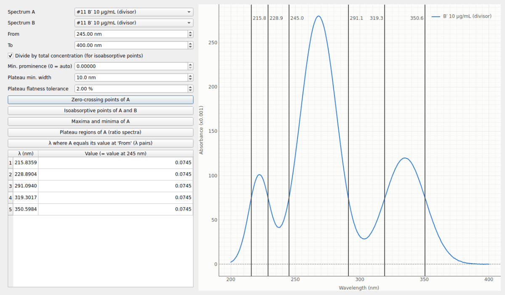

*How the wavelength was found — *Tools → Spectral finder*: spectrum A = the B′ standard, *From* = 245 nm (λmax of A) → *λ where A equals its value at From*: B has the same absorbance at 215.8 nm.*

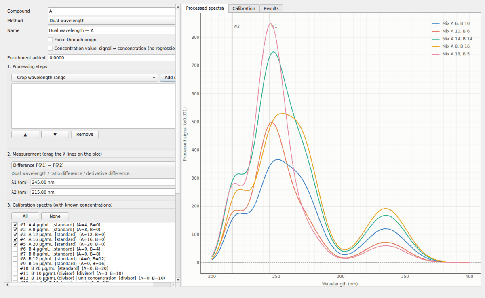

*Step 1 — the method set up in *Methods → Univariate calibration*: compound, template, processing steps (left) and the laboratory mixtures after processing with the measuring wavelength(s) marked (right).*

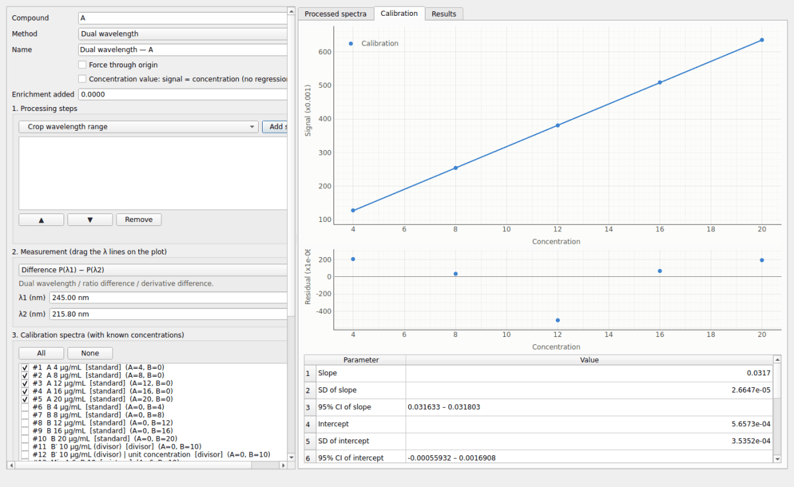

*Step 2 — *Calibrate*: the calibration line of the standards, its residuals and the regression statistics (slope, intercept, r, LOD, LOQ).*

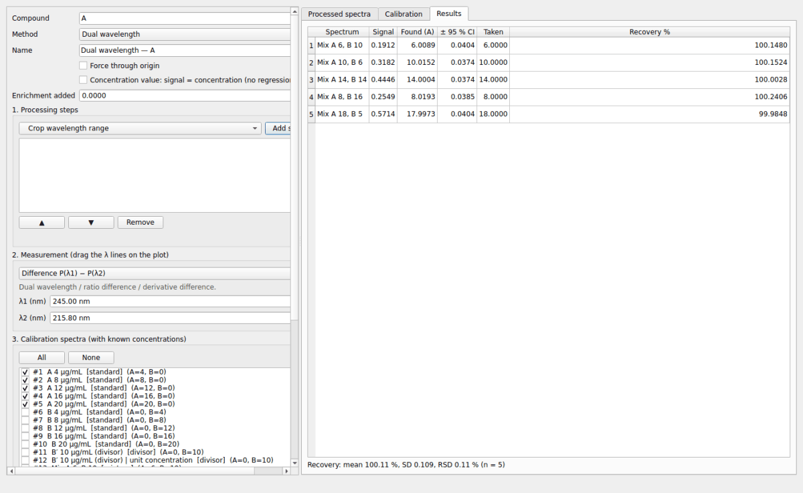

*Step 3 — *Determine*: found and taken concentrations and % recovery of each mixture, with mean and RSD.*

*Literature:* Eissa & Abou Al Alamein, Spectrochim. Acta A 193 (2018) 365, doi:10.1016/j.saa.2017.12.050

### Induced dual wavelength (IDW)

**In plain words.** Like dual wavelength, but the two readings of the interferent need not be equal: the second reading is multiplied by a factor F (= ratio of the interferent's two absorbances) so that the interferent still cancels.

**Principle.** ΔA = A(λ1) − F·A(λ2) with the equality factor F = A_Y(λ1)/A_Y(λ2) of pure Y. Any λ pair works: F 'induces' equal Y absorbance.

**Use when.** Y has no pair of equal absorbance in a useful region, or a better sensitivity for X is obtained at another pair.

**What you need.** Analyte standards, one interferent standard (to compute F), mixtures.

**How to apply in Spectro**

1. Template *Induced dual wavelength*; enter λ1 and λ2.
2. In the measurement, choose a pure Y standard as *Interferent spectrum for F* (F is computed from it) or type F.
3. Calibrate on pure X standards, determine.

**Checks and common mistakes.** F must come from a pure interferent spectrum measured the same way. A pure interferent standard processed like a sample must give ≈ 0.

**Worked example**

📊 **Sample data:** [data/idw.xlsx](data/idw.xlsx) — import it (see *Getting started → 4*) and reproduce the numbers below.

* Compound: A; template: *Induced dual wavelength*
* Measurement: Induced dual wavelength P(λ1) − F·P(λ2) — w1 = 245, w2 = 230, reference = B′
* Calibration: slope 0.024056, intercept 0.000727, r = 1.00000 (n = 5)
* F = A_B(245)/A_B(230) is computed from the B′ standard.

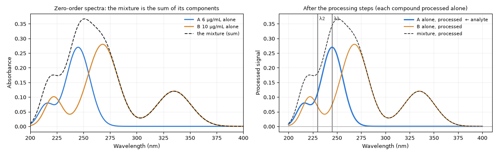

*Why it works — left: the spectra of the components and of the mixture (they overlap). Right: each component processed alone with the method's steps. At the marked wavelength(s) the processed B contribute nothing (≈ 0, or a constant that the measurement cancels), so the mixture's signal there belongs to A only.*

| Mixture | A found | A taken | Rec. % |
|---|---|---|---|
| Mix A 6, B 10 | 5.988 | 6 | 99.80 |
| Mix A 10, B 6 | 10.025 | 10 | 100.25 |
| Mix A 14, B 14 | 14.005 | 14 | 100.04 |
| Mix A 8, B 16 | 8.005 | 8 | 100.06 |
| Mix A 18, B 5 | 17.960 | 18 | 99.78 |

Result: A: mean recovery 99.99 %, RSD 0.20 %.

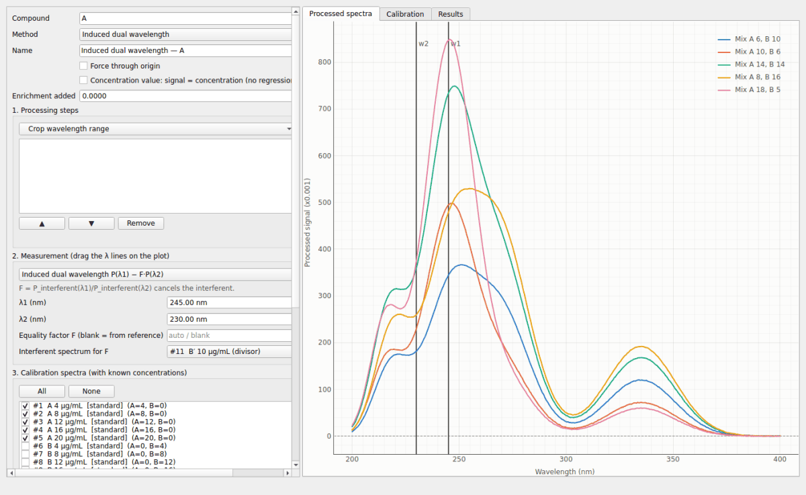

*Step 1 — the method set up in *Methods → Univariate calibration*: compound, template, processing steps (left) and the laboratory mixtures after processing with the measuring wavelength(s) marked (right).*

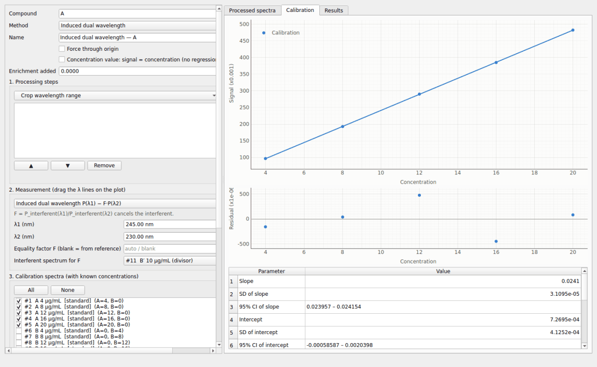

*Step 2 — *Calibrate*: the calibration line of the standards, its residuals and the regression statistics (slope, intercept, r, LOD, LOQ).*

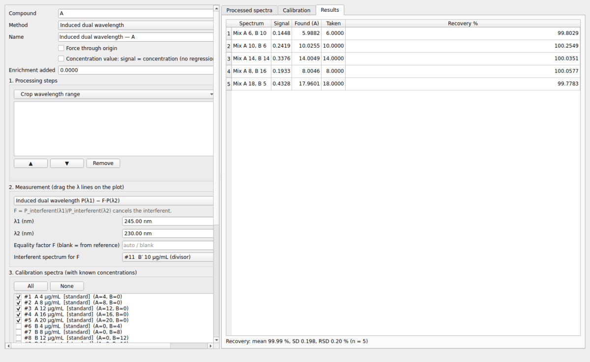

*Step 3 — *Determine*: found and taken concentrations and % recovery of each mixture, with mean and RSD.*

*Literature:* Eissa & Abou Al Alamein, Spectrochim. Acta A 193 (2018) 365, doi:10.1016/j.saa.2017.12.050

### Area under the curve — single component

**In plain words.** Instead of one absorbance value, use the area under the spectrum between two wavelengths — it is proportional to concentration and less sensitive to noise.

**Principle.** The integral of the absorbance between λ1 and λ2 is proportional to C.

**Use when.** The analyte absorbs alone over a band; integration averages out noise.

**What you need.** Standards of the compound, mixtures; a band where only this compound absorbs.

**How to apply in Spectro**

1. Template *Area under curve (single component)*; set the integration range.
2. Choose a zero or linear baseline for the area. Calibrate, determine.

**Checks and common mistakes.** Use the same integration limits for standards and samples; check that other compounds have no absorbance inside the range.

**Worked example**

📊 **Sample data:** [data/auc1.xlsx](data/auc1.xlsx) — import it (see *Getting started → 4*) and reproduce the numbers below.

* Compound: B; template: *Area under curve (single component)*
* Measurement: Area under curve (AUC) — w1 = 320, w2 = 350, baseline = zero
* Calibration: slope 0.31356, intercept 0.000234, r = 1.00000 (n = 5)

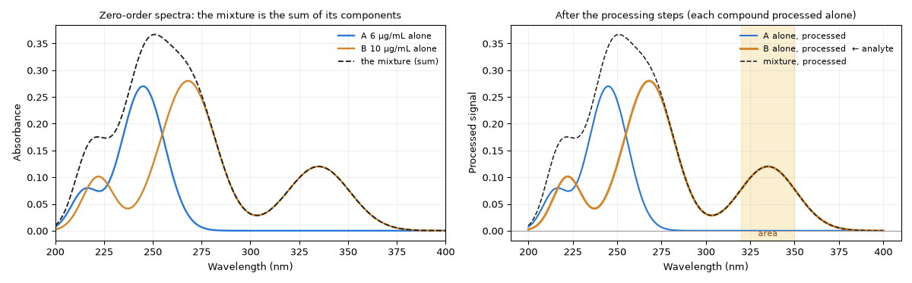

*Why it works — left: the spectra of the components and of the mixture (they overlap). Right: each component processed alone with the method's steps. At the marked wavelength(s) the processed A contribute nothing (≈ 0, or a constant that the measurement cancels), so the mixture's signal there belongs to B only.*

| Mixture | B found | B taken | Rec. % |
|---|---|---|---|
| Mix A 6, B 10 | 10.007 | 10 | 100.07 |
| Mix A 10, B 6 | 5.995 | 6 | 99.92 |
| Mix A 14, B 14 | 14.014 | 14 | 100.10 |
| Mix A 8, B 16 | 16.001 | 16 | 100.00 |
| Mix A 18, B 5 | 4.992 | 5 | 99.85 |

Result: B: mean recovery 99.99 %, RSD 0.11 %.

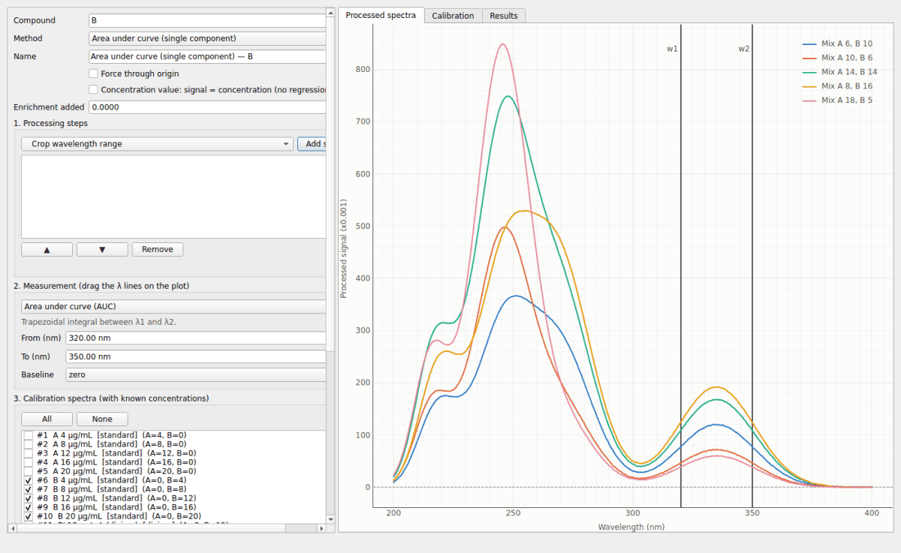

*Step 1 — the method set up in *Methods → Univariate calibration*: compound, template, processing steps (left) and the laboratory mixtures after processing with the measuring wavelength(s) marked (right).*

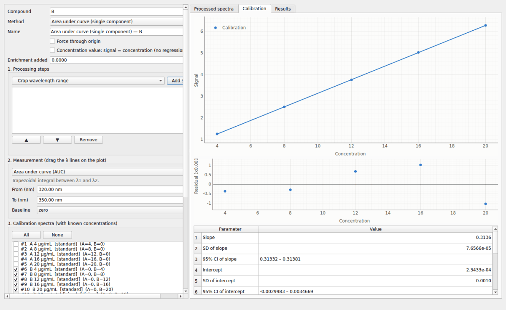

*Step 2 — *Calibrate*: the calibration line of the standards, its residuals and the regression statistics (slope, intercept, r, LOD, LOQ).*

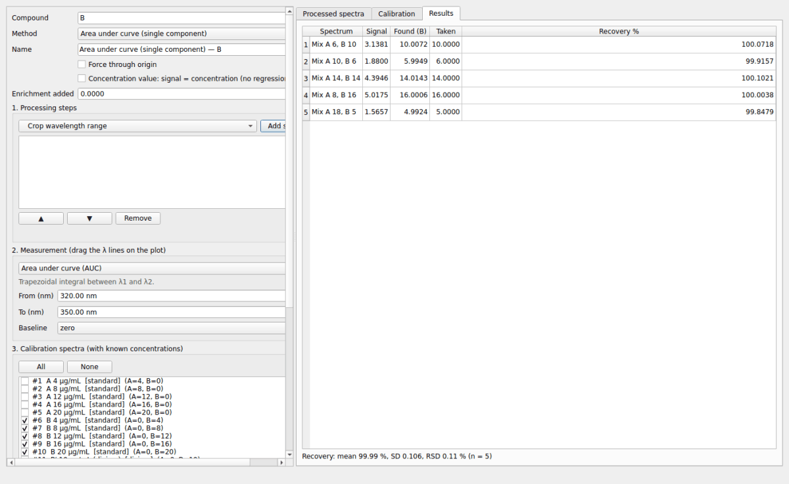

*Step 3 — *Determine*: found and taken concentrations and % recovery of each mixture, with mean and RSD.*

### Absorbance ratio (Q-analysis)

**In plain words.** At the isoabsorptive point both compounds absorb equally, so the absorbance there measures their SUM. A second wavelength tells how that sum is split.

**Principle.** At the isoabsorptive point A_iso = a_iso(C_X + C_Y); the ratio Q = A(λ2)/A(iso) of the mixture interpolates between those of X and Y: C_X = (Q_m − Q_Y)/(Q_X − Q_Y) · A_iso/a_iso.

**Use when.** Binary mixture with an isoabsorptive point.

**What you need.** Standards of both compounds (to find the isoabsorptive point and the absorptivities), mixtures.

**How to apply in Spectro**

1. Methods → Binary two-signal methods → tab *Zero order: Q-analysis*.
2. Choose X and Y, press *Find isoabsorptive point*, set λ2 (λmax of X).
3. Check the X standards, Y standards and the mixtures → *Calculate*.

**Checks and common mistakes.** The isoabsorptive point must be found from spectra of EQUAL concentrations (the finder divides by concentration for you).

**Worked example**

📊 **Sample data:** [data/q.xlsx](data/q.xlsx) — import it (see *Getting started → 4*) and reproduce the numbers below.

* Isoabsorptive point (finder): 258.2 nm; λ2 = 245 nm (λmax of A)
* iso: 258.2
* w2: 245
* ax_iso: 0.0219
* ax2: 0.045
* ay2: 0.007416

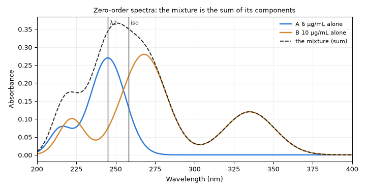

*Why it works — at the isoabsorptive point (258.2 nm) A and B of equal concentration absorb the same, so the mixture's absorbance there measures A + B; the ratio of the mixture's absorbances at λ2 and iso tells how the total is split.*

| Mixture | A found | A taken | Rec. % | B found | B taken | Rec. % |
|---|---|---|---|---|---|---|
| Mix A 6, B 10 | 6.010 | 6 | 100.17 | 10.013 | 10 | 100.13 |
| Mix A 10, B 6 | 10.022 | 10 | 100.22 | 5.967 | 6 | 99.44 |
| Mix A 14, B 14 | 13.998 | 14 | 99.98 | 14.021 | 14 | 100.15 |
| Mix A 8, B 16 | 8.026 | 8 | 100.33 | 15.975 | 16 | 99.84 |
| Mix A 18, B 5 | 17.995 | 18 | 99.97 | 5.016 | 5 | 100.32 |

Result: A: mean recovery 100.13 %, RSD 0.15 %; B: mean recovery 99.98 %, RSD 0.34 %.

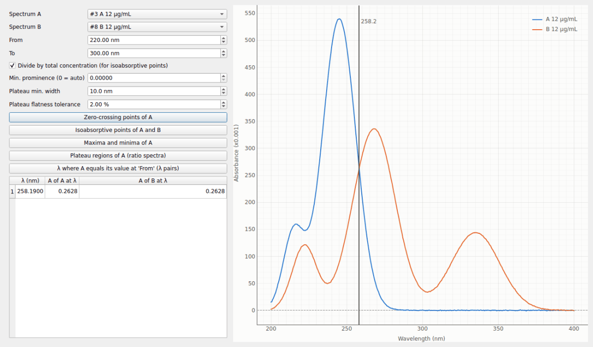

*How the wavelength was found — *Tools → Spectral finder*: spectrum A = an A standard, spectrum B = a B standard, *Divide by total concentration* ticked → *Isoabsorptive points of A and B*.*

*The method in *Methods → Binary two-signal methods → Zero order: Q-analysis*: settings (left), the standards and mixtures used (checked), and the results with recoveries (bottom).*

### Absorbance subtraction (AS)

**In plain words.** One compound (X) absorbs alone at a long wavelength. From X's reading there and X's own spectrum shape, Spectro works out how much X absorbs at the isoabsorptive point; the rest of the absorbance there belongs to the other one.

**Principle.** X absorbs alone at λ2. The amplitude factor AF = A_X(iso)/A_X(λ2) of pure X turns the mixture absorbance at λ2 into X's absorbance at the isoabsorptive point; the total at iso gives C_X + C_Y.

**Use when.** Binary mixture with an isoabsorptive point and a region where one compound absorbs alone (the extended one).

**What you need.** Standards of X (for the amplitude factor), standards of both (for the iso calibration), mixtures.

**How to apply in Spectro**

1. Binary two-signal methods → *Zero order: absorbance subtraction*.
2. X = the compound that absorbs alone at λ2; iso = isoabsorptive point.
3. Check pure X standards (for AF), standards for the iso calibration, mixtures → *Calculate*.

**Checks and common mistakes.** X must be the extended compound (absorbing alone at λ2).

**Worked example**

📊 **Sample data:** [data/as.xlsx](data/as.xlsx) — import it (see *Getting started → 4*) and reproduce the numbers below.

* X = B (absorbs alone at λ2 = 335 nm); iso = 258.2 nm
* iso: 258.2
* w2: 335
* AF: 1.825

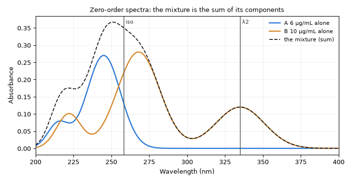

*Why it works — B absorbs alone at λ2 (335 nm): its reading there, times B's own ratio A(iso)/A(λ2), gives B's absorbance at the isoabsorptive point; the rest of the absorbance at iso belongs to A.*

| Mixture | B found | B taken | Rec. % | A found | A taken | Rec. % |
|---|---|---|---|---|---|---|
| Mix A 6, B 10 | 9.972 | 10 | 99.72 | 6.044 | 6 | 100.74 |
| Mix A 10, B 6 | 5.999 | 6 | 99.99 | 9.983 | 10 | 99.83 |
| Mix A 14, B 14 | 13.984 | 14 | 99.89 | 14.016 | 14 | 100.11 |
| Mix A 8, B 16 | 15.985 | 16 | 99.90 | 8.002 | 8 | 100.03 |
| Mix A 18, B 5 | 5.048 | 5 | 100.95 | 17.950 | 18 | 99.72 |

Result: B: mean recovery 100.09 %, RSD 0.49 %; A: mean recovery 100.09 %, RSD 0.40 %.

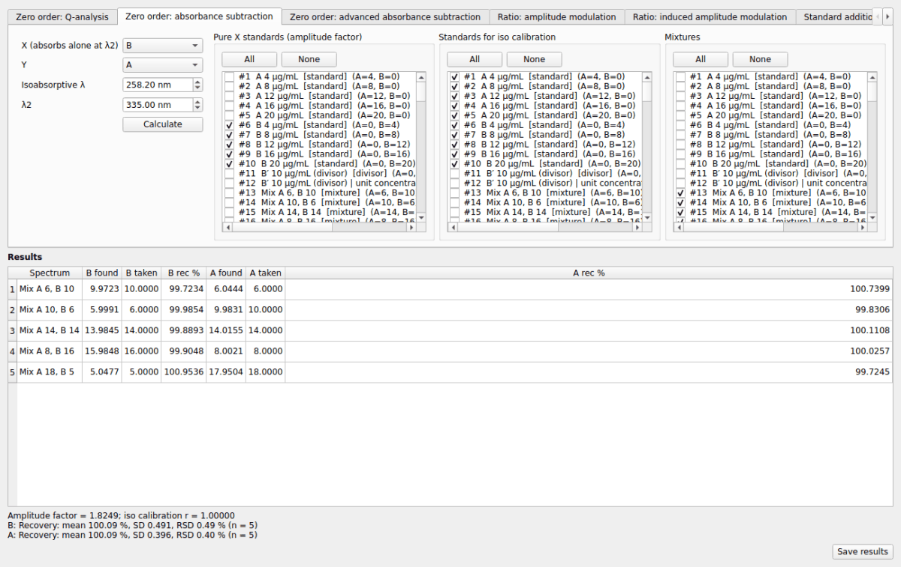

*The method in *Methods → Binary two-signal methods → Zero order: absorbance subtraction*: settings (left), the standards and mixtures used (checked), and the results with recoveries (bottom).*

### Advanced absorbance subtraction (AAS)

**In plain words.** Two wavelengths where the interferent Y reads the same (one of them the isoabsorptive point): their difference gives X; X's share at the iso point is then subtracted to give Y.

**Principle.** λ1 and λ2 are chosen where Y has equal absorbance (one of them at the isoabsorptive point): ΔA = A(λ2) − A(λ1) gives C_X; X's absorbance at λ2 follows from ΔA and is subtracted; the remainder gives C_Y.

**Use when.** Binary mixture with an isoabsorptive point and a second wavelength where Y equals its iso absorbance.

**What you need.** Standards of X, standards of Y, mixtures.

**How to apply in Spectro**

1. Binary two-signal methods → *Zero order: advanced absorbance subtraction*.
2. λ2 = isoabsorptive point; press *Find λ1 where Y equals its value at λ2*.
3. Check X standards, Y standards and mixtures → *Calculate*.

**Checks and common mistakes.** Use the finder button to get λ1 exactly; a wrong λ1 leaves part of Y in ΔA.

**Worked example**

📊 **Sample data:** [data/aas.xlsx](data/aas.xlsx) — import it (see *Getting started → 4*) and reproduce the numbers below.

* λ2 = isoabsorptive point 258.2 nm; λ1 = 277.8 nm where B has the same absorbance
* w1: 277.8
* w2: 258.2
* AF: 1.025

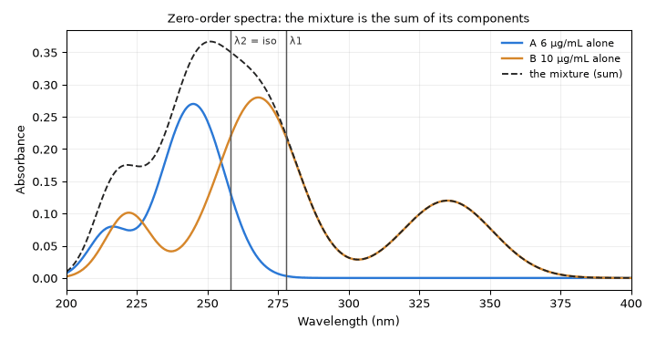

*Why it works — B absorbs the same at λ1 and λ2 (= isoabsorptive point), so A(λ2) − A(λ1) of the mixture depends on A only; A's share at λ2 follows and the remainder is B.*

| Mixture | A found | A taken | Rec. % | B found | B taken | Rec. % |
|---|---|---|---|---|---|---|
| Mix A 6, B 10 | 6.024 | 6 | 100.40 | 10.001 | 10 | 100.01 |
| Mix A 10, B 6 | 9.948 | 10 | 99.48 | 6.046 | 6 | 100.76 |
| Mix A 14, B 14 | 13.979 | 14 | 99.85 | 14.031 | 14 | 100.22 |
| Mix A 8, B 16 | 8.009 | 8 | 100.12 | 15.984 | 16 | 99.90 |
| Mix A 18, B 5 | 17.998 | 18 | 99.99 | 5.015 | 5 | 100.29 |

Result: A: mean recovery 99.97 %, RSD 0.34 %; B: mean recovery 100.24 %, RSD 0.33 %.

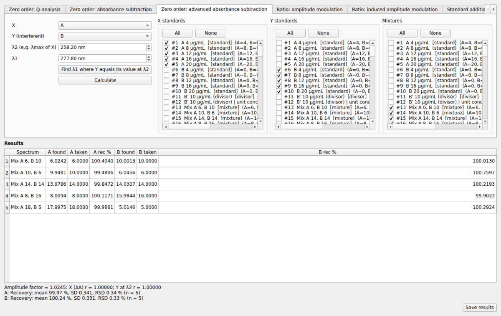

*The method in *Methods → Binary two-signal methods → Zero order: advanced absorbance subtraction*: settings (left), the standards and mixtures used (checked), and the results with recoveries (bottom).*

*Literature:* Eissa & Abou Al Alamein, Spectrochim. Acta A 193 (2018) 365, doi:10.1016/j.saa.2017.12.050

### Successive absorption factor method (MAFM)

**In plain words.** Peel the mixture like an onion: the compound that absorbs alone at the longest wavelength is measured first; its contribution at the next wavelength is calculated from its own spectrum shape and removed; then the next compound, and so on.

**Principle.** Compounds are taken in order of extension. The first absorbs alone at λ1. Its absorption factors F(λ) = A(λ)/A(λ1) give its contribution at the next wavelengths, which is subtracted; the second compound is then alone at λ2, and so on.

**Use when.** Successive extension: one compound alone at long λ, the next one overlapped only by the first, … (binary: the classic absorption factor method).

**What you need.** Standards of every compound, mixtures.

**How to apply in Spectro**

1. Methods → Progressive resolution → tab *Zero order: successive absorption factor*.
2. Enter the compounds in order with the wavelength where each is 'added' (the first alone, the second overlapped only by the first …); optionally a quantitation λ.
3. Check the pure standards and the mixtures → *Calculate*; *Save method* to reuse it.

**Checks and common mistakes.** Order matters: the first compound must truly absorb alone at its wavelength, the second must be overlapped only by the first, and so on. Errors carry forward to the later compounds.

**Worked example**

📊 **Sample data:** [data/mafm.xlsx](data/mafm.xlsx) — import it (see *Getting started → 4*) and reproduce the numbers below.

* U at 335.0 nm (read at 300.0) → V at 280.0 nm → W at 246.0 nm

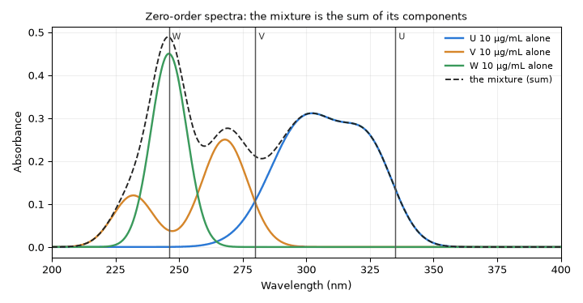

*Why it works — at each marked wavelength the compound named there is added to those already resolved (first: absorbs alone; second: overlapped only by the first; …); their known contributions are subtracted step by step.*

| Mixture | U found | U taken | Rec. % | V found | V taken | Rec. % | W found | W taken | Rec. % |
|---|---|---|---|---|---|---|---|---|---|
| Mix U 10, V 10, W 10 | 10.021 | 10 | 100.21 | 9.996 | 10 | 99.96 | 10.027 | 10 | 100.27 |
| Mix U 16, V 4, W 4 | 15.979 | 16 | 99.87 | 4.055 | 4 | 101.37 | 4.029 | 4 | 100.72 |
| Mix U 4, V 14, W 8 | 4.062 | 4 | 101.54 | 13.925 | 14 | 99.46 | 8.013 | 8 | 100.16 |
| Mix U 8, V 8, W 16 | 7.971 | 8 | 99.63 | 8.050 | 8 | 100.62 | 16.033 | 16 | 100.20 |
| Mix U 12, V 6, W 12 | 12.031 | 12 | 100.26 | 5.948 | 6 | 99.14 | 12.034 | 12 | 100.29 |

Result: U: mean recovery 100.30 %, RSD 0.74 %; V: mean recovery 100.11 %, RSD 0.90 %; W: mean recovery 100.33 %, RSD 0.22 %.

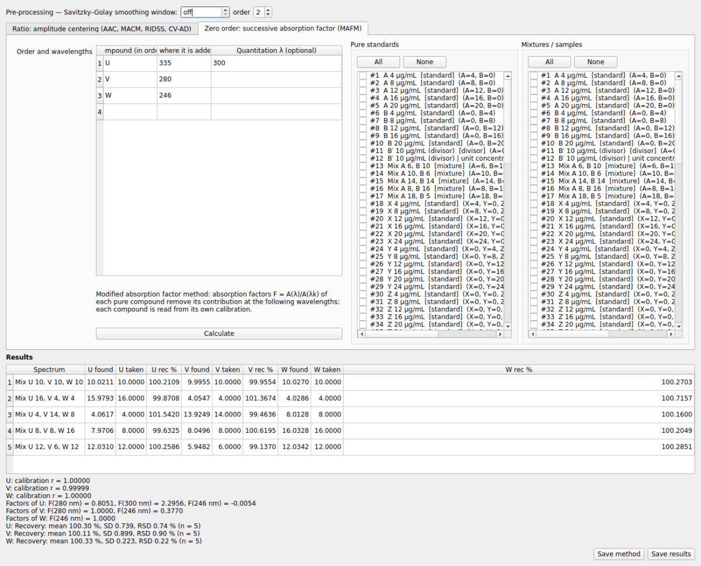

**Methods → Progressive resolution → Zero order: successive absorption factor (MAFM)*: the settings, the standards and mixtures used, and the results with recoveries. *Save method* stores it for reuse.*

*Literature:* Abdelwahab & Mohamed, Chem. Pharm. Bull. 65 (2017) 558

## Simultaneous equations (several signals)

Measure as many signals as there are compounds (or more) and solve the linear system — all compounds at once.

### Simultaneous equations (Vierordt)

**In plain words.** Measure at two (or more) wavelengths. Each reading is the sum of both compounds' contributions, so you get two equations with two unknowns and solve them.

**Principle.** A(λ1) = a_X1·C_X + a_Y1·C_Y and A(λ2) = a_X2·C_X + a_Y2·C_Y, solved for both concentrations (more wavelengths → least squares).

**Use when.** Each compound has a band where it dominates; check the condition number of K.

**What you need.** Standards of each compound (zero concentration for the other), mixtures.

**How to apply in Spectro**

1. Methods → Equation methods. Tick the compounds, enter one amplitude signal per compound (their λmax) or more.
2. Calibrate on the pure standards (*Fit*) — the absorptivity matrix K and its condition number are shown — then *Determine*.

**Checks and common mistakes.** The condition number shown after fitting should be small (< 10 is very good; > 100 means the wavelengths do not distinguish the compounds).

**Worked example**

📊 **Sample data:** [data/vierordt.xlsx](data/vierordt.xlsx) — import it (see *Getting started → 4*) and reproduce the numbers below.

* Signals: amplitude 245 nm; amplitude 268 nm
* A: Recovery: mean 100.13 %, SD 0.106, RSD 0.11 % (n = 5)

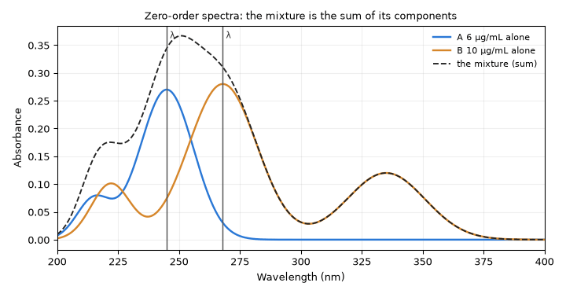

*Why it works — each marked signal of the mixture is the sum of every compound's contribution (absorptivity × concentration); with one signal per compound (or more) the system of equations is solved for all concentrations at once.*

| Mixture | A found | A taken | Rec. % | B found | B taken | Rec. % |
|---|---|---|---|---|---|---|
| Mix A 6, B 10 | 6.012 | 6 | 100.20 | 10.003 | 10 | 100.03 |
| Mix A 10, B 6 | 10.015 | 10 | 100.15 | 6.008 | 6 | 100.13 |
| Mix A 14, B 14 | 14.003 | 14 | 100.02 | 13.986 | 14 | 99.90 |
| Mix A 8, B 16 | 8.021 | 8 | 100.26 | 16.008 | 16 | 100.05 |
| Mix A 18, B 5 | 18.004 | 18 | 100.02 | 4.966 | 5 | 99.32 |

Result: A: mean recovery 100.13 %, RSD 0.11 %; B: mean recovery 99.88 %, RSD 0.33 %.

**Methods → Equation methods*: compounds, signals, the absorptivity matrix K after *Fit* (top right) and the results after *Determine*.*

### Bivariate calibration (Kaiser)

**In plain words.** The same idea as simultaneous equations, but Spectro chooses the two wavelengths that separate the compounds best (Kaiser method).

**Principle.** Two wavelengths that maximise the determinant of the sensitivity matrix (Kaiser) are used with linear calibrations that include intercepts.

**Use when.** Binary mixtures; picks the best-conditioned wavelength pair automatically.

**What you need.** Standards of both compounds, mixtures.

**How to apply in Spectro**

1. Equation methods → press *Kaiser* (uses one pure standard of each compound) — the best pair is filled in and intercepts are switched on.
2. *Fit* on the pure standards, *Determine*.

**Checks and common mistakes.** Look at the top pairs listed: choose one inside a region with good absorbance, not at the noisy ends of the spectrum.

**Worked example**

📊 **Sample data:** [data/bivariate.xlsx](data/bivariate.xlsx) — import it (see *Getting started → 4*) and reproduce the numbers below.

* Signals: amplitude 245 nm; amplitude 281 nm
* A: Recovery: mean 100.18 %, SD 0.156, RSD 0.16 % (n = 5)

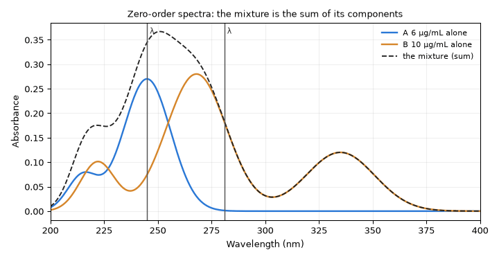

*Why it works — each marked signal of the mixture is the sum of every compound's contribution (absorptivity × concentration); with one signal per compound (or more) the system of equations is solved for all concentrations at once.*

| Mixture | A found | A taken | Rec. % | B found | B taken | Rec. % |
|---|---|---|---|---|---|---|
| Mix A 6, B 10 | 6.018 | 6 | 100.30 | 9.971 | 10 | 99.71 |
| Mix A 10, B 6 | 10.025 | 10 | 100.25 | 5.951 | 6 | 99.18 |
| Mix A 14, B 14 | 14.006 | 14 | 100.04 | 14.024 | 14 | 100.17 |
| Mix A 8, B 16 | 8.027 | 8 | 100.33 | 16.010 | 16 | 100.06 |
| Mix A 18, B 5 | 17.998 | 18 | 99.99 | 5.033 | 5 | 100.66 |

Result: A: mean recovery 100.18 %, RSD 0.16 %; B: mean recovery 99.96 %, RSD 0.55 %.

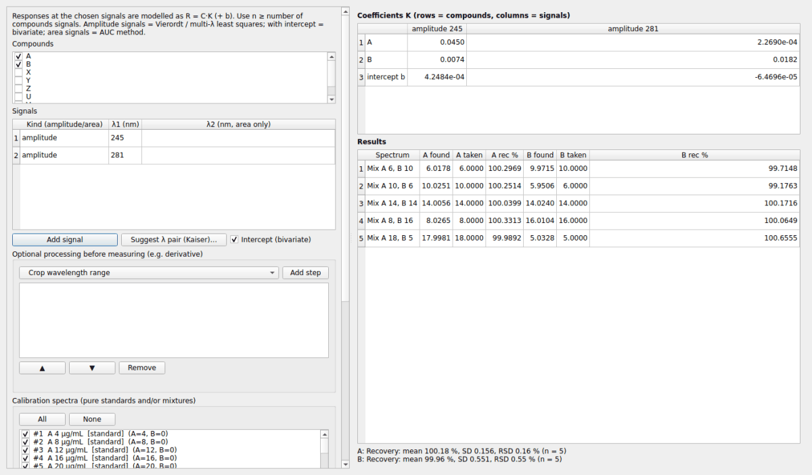

**Methods → Equation methods*: compounds, signals, the absorptivity matrix K after *Fit* (top right) and the results after *Determine*.*

### Area under the curve — simultaneous (binary / ternary)

**In plain words.** Simultaneous equations with areas instead of single absorbances: one area range per compound, solved together.

**Principle.** The areas in n ranges are linear in the n concentrations: A_k = Σ a_kj·C_j; solved with Cramer's rule / least squares.

**Use when.** Overlapping bands; areas are less noisy than single amplitudes.

**What you need.** Standards of every compound (with zeros for the others), mixtures.

**How to apply in Spectro**

1. Equation methods → one *area* signal per compound (λ1–λ2 ranges chosen where the compounds differ most). *Fit*, *Determine*.

**Checks and common mistakes.** Each range should be dominated by a different compound.

**Worked example**

📊 **Sample data:** [data/auc_eq.xlsx](data/auc_eq.xlsx) — import it (see *Getting started → 4*) and reproduce the numbers below.

* Signals: area 230–245 nm; area 285–295 nm; area 340–370 nm
* X: Recovery: mean 100.00 %, SD 0.018, RSD 0.02 % (n = 5)

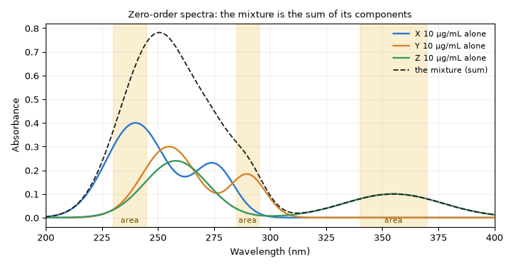

*Why it works — each marked signal of the mixture is the sum of every compound's contribution (absorptivity × concentration); with one signal per compound (or more) the system of equations is solved for all concentrations at once.*

| Mixture | X found | X taken | Rec. % | Y found | Y taken | Rec. % | Z found | Z taken | Rec. % |
|---|---|---|---|---|---|---|---|---|---|
| Mix X 10, Y 10, Z 10 | 10.000 | 10 | 100.00 | 9.990 | 10 | 99.90 | 10.005 | 10 | 100.05 |
| Mix X 20, Y 10, Z 10 | 19.998 | 20 | 99.99 | 9.999 | 10 | 99.99 | 10.007 | 10 | 100.07 |
| Mix X 6, Y 6, Z 18 | 6.001 | 6 | 100.02 | 5.999 | 6 | 99.98 | 17.994 | 18 | 99.97 |
| Mix X 10, Y 20, Z 10 | 10.000 | 10 | 100.00 | 20.000 | 20 | 100.00 | 10.002 | 10 | 100.02 |
| Mix X 12, Y 8, Z 6 | 11.997 | 12 | 99.97 | 8.006 | 8 | 100.08 | 6.004 | 6 | 100.07 |

Result: X: mean recovery 100.00 %, RSD 0.02 %; Y: mean recovery 99.99 %, RSD 0.07 %; Z: mean recovery 100.03 %, RSD 0.04 %.

**Methods → Equation methods*: compounds, signals, the absorptivity matrix K after *Fit* (top right) and the results after *Determine*.*

*Literature:* Abdelwahab & Mohamed, Chem. Pharm. Bull. 65 (2017) 558; Abdelrahman et al., Spectrochim. Acta A 124 (2014) 389, doi:10.1016/j.saa.2014.01.020

## Derivative spectra

Differentiate the spectra: broad overlapping bands are narrowed and a compound can be read where the other one's derivative is zero.

### Zero-crossing derivative (D1–D4)

**In plain words.** Differentiating a spectrum gives its slope. The slope of the interferent is zero at the top of its band (zero-crossing): read your analyte's derivative exactly there and the interferent contributes nothing.

**Principle.** The derivative dⁿA/dλⁿ of Y is zero at its zero-crossing wavelengths; there the mixture's derivative depends on X only.

**Use when.** Y's derivative crosses zero where X's derivative is large.

**What you need.** Analyte standards, one interferent standard (to find its zero-crossings), mixtures.

**How to apply in Spectro**

1. Tools → Spectral finder → *Zero-crossings* on a processed (D1) pure Y spectrum, or watch the processed plot in the Univariate dialog.
2. Template *Zero-crossing derivative (D1)* (or *Zero-crossing derivative (D2)*); set Δλ (4 nm) and the scaling factor (10) in the Derivative step; put λ at Y's zero-crossing.
3. Calibrate on pure X, determine.

**Checks and common mistakes.** Keep Δλ and the scaling factor identical for standards and samples. Avoid zero-crossings where the analyte's derivative is small.

**Worked example**

📊 **Sample data:** [data/zc.xlsx](data/zc.xlsx) — import it (see *Getting started → 4*) and reproduce the numbers below.

* Compound: A; template: *Zero-crossing derivative (D1)*
* Step: Derivative (D1–D4) (order=1, method=difference, delta_lambda=4, window=11, polyorder=3, scaling=10)
* Measurement: Amplitude at λ — w1 = 237.2
* Calibration: slope 0.02185, intercept -0.000999, r = 0.99996 (n = 5)
* Finder: B's D1 crosses zero at 237.2 nm.

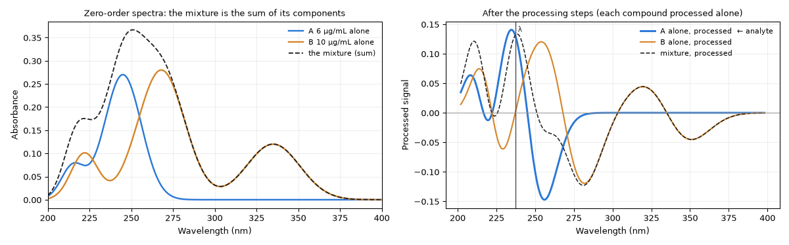

*Why it works — left: the spectra of the components and of the mixture (they overlap). Right: each component processed alone with the method's steps. At the marked wavelength(s) the processed B contribute nothing (≈ 0, or a constant that the measurement cancels), so the mixture's signal there belongs to A only.*

| Mixture | A found | A taken | Rec. % |
|---|---|---|---|
| Mix A 6, B 10 | 6.032 | 6 | 100.53 |
| Mix A 10, B 6 | 10.068 | 10 | 100.68 |
| Mix A 14, B 14 | 14.033 | 14 | 100.23 |
| Mix A 8, B 16 | 8.080 | 8 | 101.00 |
| Mix A 18, B 5 | 18.034 | 18 | 100.19 |

Result: A: mean recovery 100.53 %, RSD 0.33 %.

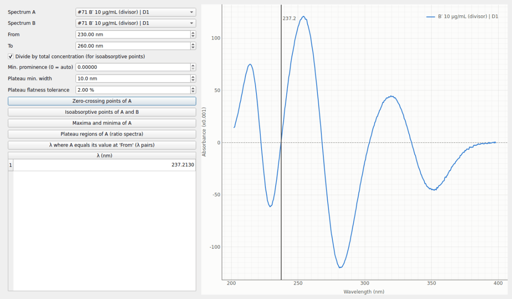

*How the wavelength was found — *Tools → Spectral finder*: spectrum A = the D1 spectrum of B′ (made once with *Process → Derivative*), range 230–260 nm → *Zero-crossing points of A*: 237.2 nm.*

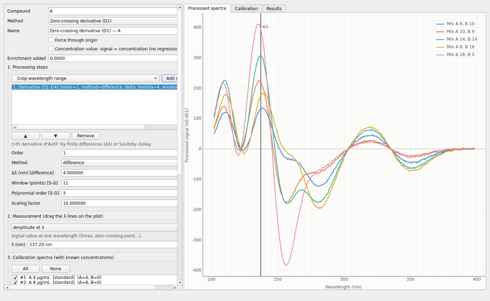

*Step 1 — the method set up in *Methods → Univariate calibration*: compound, template, processing steps (left) and the laboratory mixtures after processing with the measuring wavelength(s) marked (right).*

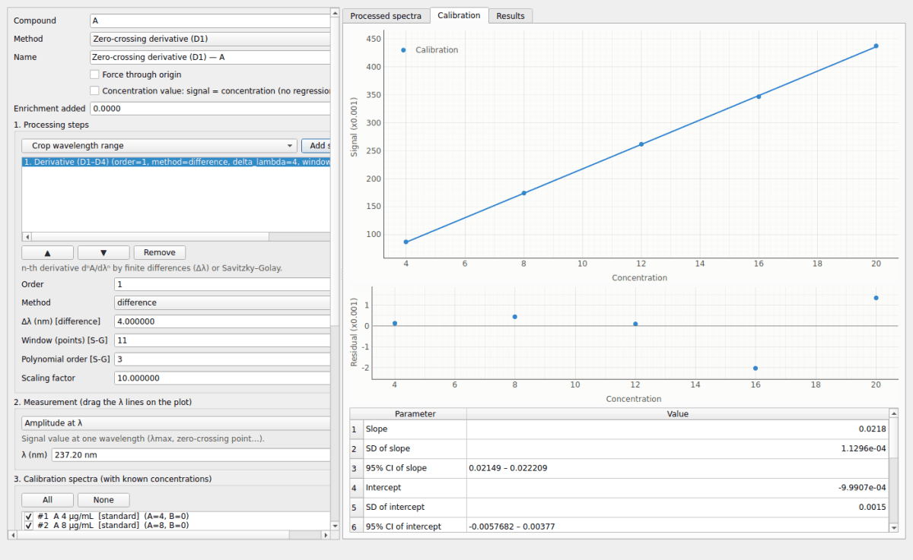

*Step 2 — *Calibrate*: the calibration line of the standards, its residuals and the regression statistics (slope, intercept, r, LOD, LOQ).*

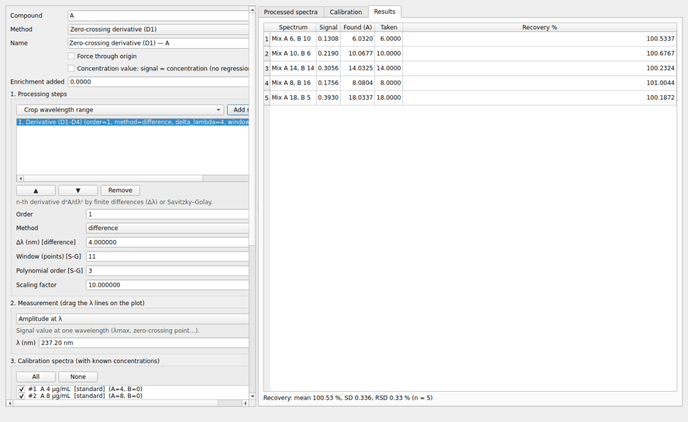

*Step 3 — *Determine*: found and taken concentrations and % recovery of each mixture, with mean and RSD.*

### Derivative peak-to-peak

**In plain words.** Measure the height from the lowest to the highest point of a derivative band — a bigger signal than a single point and immune to baseline shifts.

**Principle.** The difference between the maximum and minimum of the derivative in a range is proportional to C (larger signal, insensitive to baseline offsets).

**Use when.** The analyte's derivative band is free from the other compounds in that range.

**What you need.** Standards and mixtures; a derivative band free from the other compounds.

**How to apply in Spectro**

1. Template *Derivative peak-to-peak*; set the range around the derivative band.
2. Calibrate, determine.

**Checks and common mistakes.** Make the range wide enough to contain both the maximum and the minimum.

**Worked example**

📊 **Sample data:** [data/p2p.xlsx](data/p2p.xlsx) — import it (see *Getting started → 4*) and reproduce the numbers below.

* Compound: B; template: *Derivative peak-to-peak*
* Step: Derivative (D1–D4) (order=1, method=difference, delta_lambda=4, window=11, polyorder=3, scaling=10)
* Measurement: Peak-to-trough in range (max − min) — w1 = 310, w2 = 365
* Calibration: slope 0.0089361, intercept 0.00416, r = 0.99979 (n = 5)

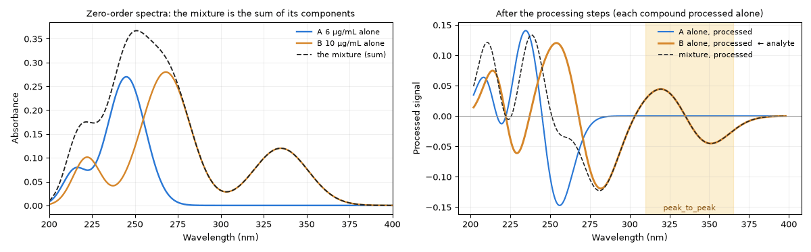

*Why it works — left: the spectra of the components and of the mixture (they overlap). Right: each component processed alone with the method's steps. At the marked wavelength(s) the processed A contribute nothing (≈ 0, or a constant that the measurement cancels), so the mixture's signal there belongs to B only.*

| Mixture | B found | B taken | Rec. % |
|---|---|---|---|
| Mix A 6, B 10 | 10.026 | 10 | 100.26 |
| Mix A 10, B 6 | 5.793 | 6 | 96.56 |
| Mix A 14, B 14 | 14.093 | 14 | 100.66 |
| Mix A 8, B 16 | 15.925 | 16 | 99.53 |
| Mix A 18, B 5 | 5.056 | 5 | 101.12 |

Result: B: mean recovery 99.63 %, RSD 1.82 %.

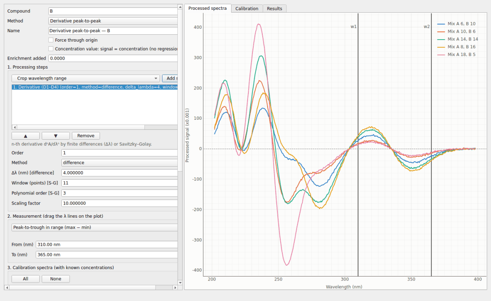

*Step 1 — the method set up in *Methods → Univariate calibration*: compound, template, processing steps (left) and the laboratory mixtures after processing with the measuring wavelength(s) marked (right).*

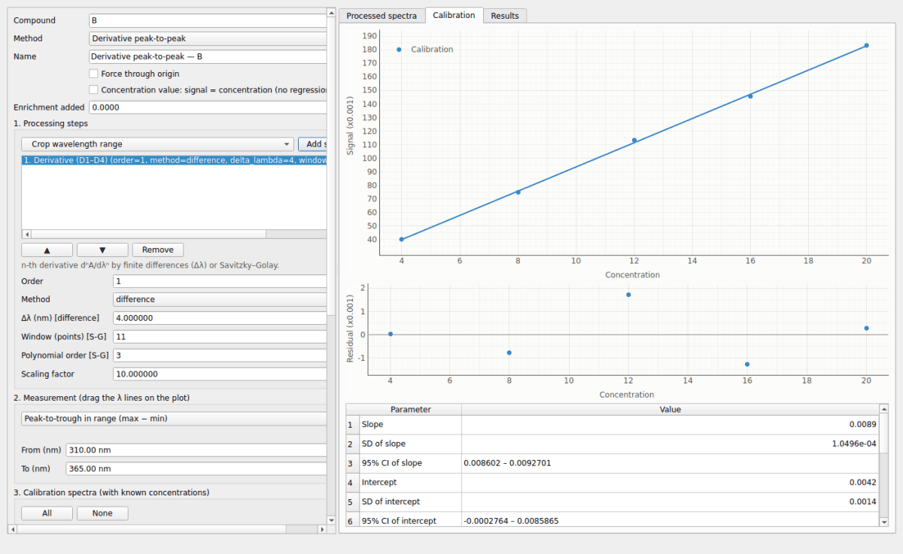

*Step 2 — *Calibrate*: the calibration line of the standards, its residuals and the regression statistics (slope, intercept, r, LOD, LOQ).*

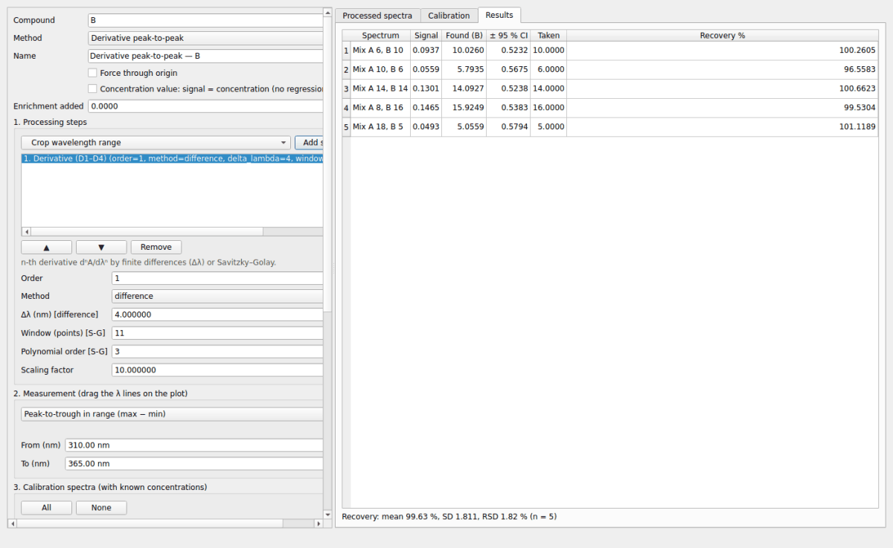

*Step 3 — *Determine*: found and taken concentrations and % recovery of each mixture, with mean and RSD.*

### Dual wavelength in derivative mode (D1 DWL)

**In plain words.** Dual wavelength applied to derivative spectra: two wavelengths where the interferent's derivative is equal.

**Principle.** ΔD1 = D1(λ1) − D1(λ2) at two wavelengths where Y's D1 is equal → depends on X only.

**Use when.** Y's derivative has two equal amplitudes; avoids divisors (no ratio spectra).

**What you need.** Analyte standards, one interferent standard, mixtures.

**How to apply in Spectro**

1. Finder → *Equal amplitude* on the D1 spectrum of pure Y.
2. Template *Dual wavelength in derivative mode*; enter λ1, λ2. Calibrate, determine.

**Checks and common mistakes.** Find the pair on the derivative of the interferent (process it first).

**Worked example**

📊 **Sample data:** [data/d1dwl.xlsx](data/d1dwl.xlsx) — import it (see *Getting started → 4*) and reproduce the numbers below.

* Compound: A; template: *Dual wavelength in derivative mode*
* Step: Derivative (D1–D4) (order=1, method=difference, delta_lambda=4, window=11, polyorder=3, scaling=10)
* Measurement: Difference P(λ1) − P(λ2) — w1 = 237, w2 = 268.2
* Calibration: slope 0.031601, intercept -0.00178, r = 0.99997 (n = 5)
* Finder: B's D1 is equal at 237 and 268.2 nm; of all such pairs this one gives A the largest difference.

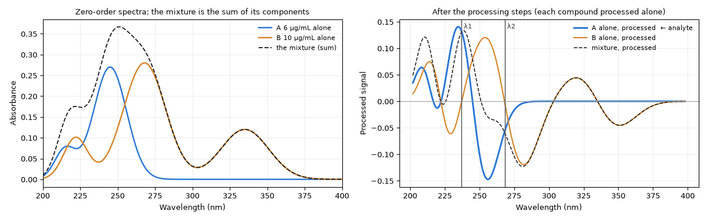

*Why it works — left: the spectra of the components and of the mixture (they overlap). Right: each component processed alone with the method's steps. At the marked wavelength(s) the processed B contribute nothing (≈ 0, or a constant that the measurement cancels), so the mixture's signal there belongs to A only.*

| Mixture | A found | A taken | Rec. % |
|---|---|---|---|
| Mix A 6, B 10 | 6.050 | 6 | 100.83 |
| Mix A 10, B 6 | 10.043 | 10 | 100.43 |
| Mix A 14, B 14 | 13.994 | 14 | 99.96 |
| Mix A 8, B 16 | 8.131 | 8 | 101.63 |
| Mix A 18, B 5 | 18.094 | 18 | 100.52 |

Result: A: mean recovery 100.68 %, RSD 0.62 %.

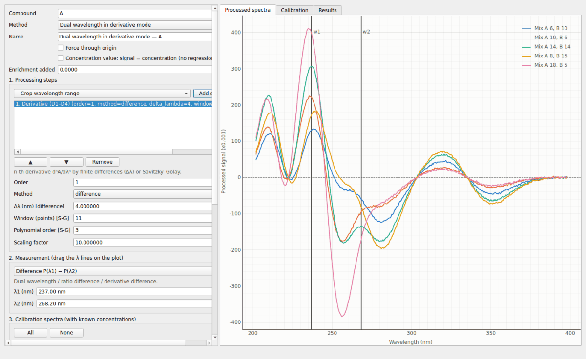

*Step 1 — the method set up in *Methods → Univariate calibration*: compound, template, processing steps (left) and the laboratory mixtures after processing with the measuring wavelength(s) marked (right).*

*Step 2 — *Calibrate*: the calibration line of the standards, its residuals and the regression statistics (slope, intercept, r, LOD, LOQ).*

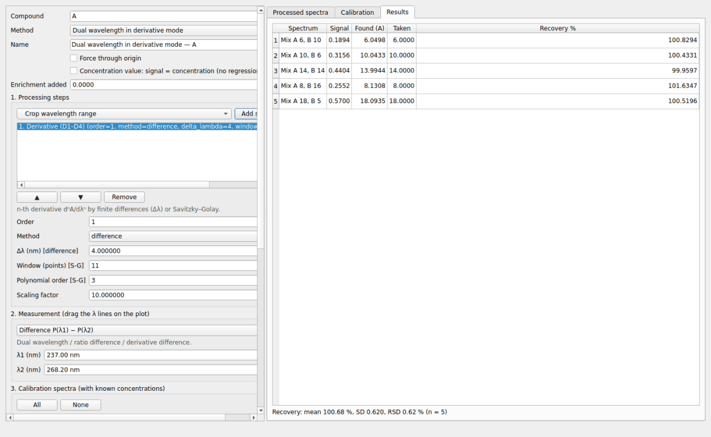

*Step 3 — *Determine*: found and taken concentrations and % recovery of each mixture, with mean and RSD.*

*Literature:* Lotfy et al., Spectrochim. Acta A 136 (2015) 937, doi:10.1016/j.saa.2014.09.117

## Ratio spectra — derivative and mean centering

Divide by the spectrum of an interferent (the divisor) — the interferent becomes a constant — then remove that constant by differentiation or mean centering.

### Derivative ratio (DD1 / DR1)

**In plain words.** Divide the mixture spectrum by the interferent's spectrum. The interferent becomes a flat line (a constant) and the derivative of a constant is zero, so the derivative of the ratio spectrum depends only on your analyte.

**Principle.** (X + Y)/Y′ = X/Y′ + constant; the first derivative removes the constant and leaves d(X/Y′)/dλ ∝ C_X, read at a maximum or minimum.

**Use when.** Binary mixtures; the classic ratio-spectra method.

**What you need.** Analyte standards, a divisor (one standard of the interferent), mixtures.

**How to apply in Spectro**

1. Template *Derivative ratio (DD1)*; choose the divisor Y′ in the Divide step (a standard of Y, or a unit-concentration spectrum — see *Normalize → concentration*).
2. Set Δλ and scaling in the Derivative step, put λ at a peak of the processed X spectra.
3. Calibrate on pure X (processed the same way), determine.

**Checks and common mistakes.** Use the same divisor for standards and samples. Avoid wavelengths where the divisor absorbs almost nothing (the ratio becomes noisy there).

**Worked example**

📊 **Sample data:** [data/dd1.xlsx](data/dd1.xlsx) — import it (see *Getting started → 4*) and reproduce the numbers below.

* Compound: A; template: *Derivative ratio (DD1)*
* Step: Divide by spectrum (ratio spectrum) (reference=B′, threshold=0.0001, divisor_derivative=0, divisor_delta_lambda=4)
* Step: Derivative (D1–D4) (order=1, method=difference, delta_lambda=4, window=11, polyorder=3, scaling=10)
* Measurement: Amplitude at λ — w1 = 254
* Calibration: slope -0.27838, intercept -0.00961, r = -1.00000 (n = 5)

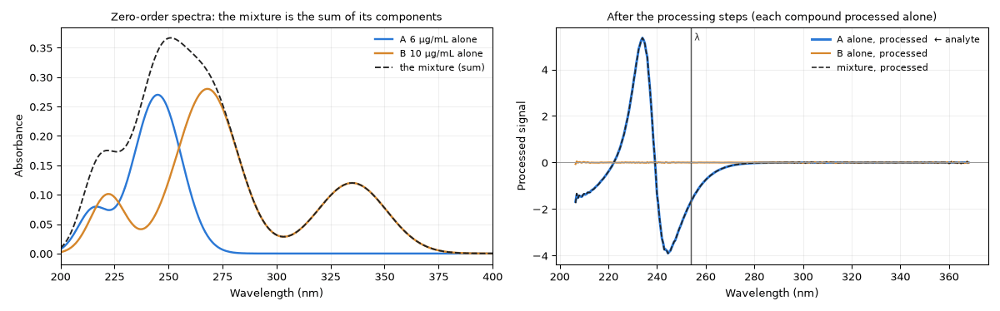

*Why it works — left: the spectra of the components and of the mixture (they overlap). Right: each component processed alone with the method's steps. At the marked wavelength(s) the processed B contribute nothing (≈ 0, or a constant that the measurement cancels), so the mixture's signal there belongs to A only.*

| Mixture | A found | A taken | Rec. % |
|---|---|---|---|
| Mix A 6, B 10 | 5.990 | 6 | 99.83 |
| Mix A 10, B 6 | 9.969 | 10 | 99.69 |
| Mix A 14, B 14 | 14.065 | 14 | 100.47 |
| Mix A 8, B 16 | 7.990 | 8 | 99.87 |
| Mix A 18, B 5 | 18.008 | 18 | 100.04 |

Result: A: mean recovery 99.98 %, RSD 0.30 %.

*Step 1 — the method set up in *Methods → Univariate calibration*: compound, template, processing steps (left) and the laboratory mixtures after processing with the measuring wavelength(s) marked (right).*

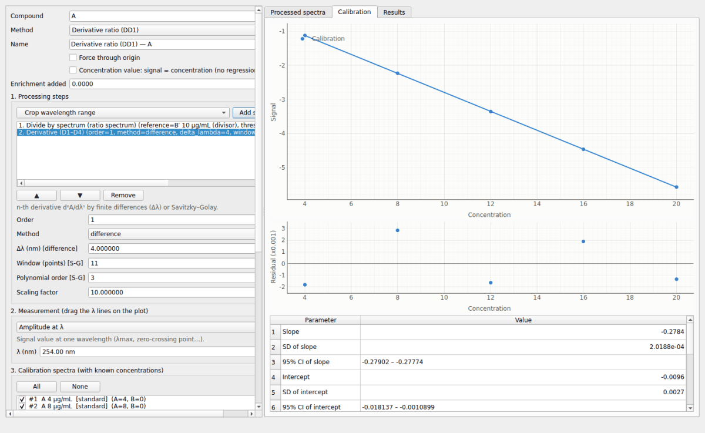

*Step 2 — *Calibrate*: the calibration line of the standards, its residuals and the regression statistics (slope, intercept, r, LOD, LOQ).*

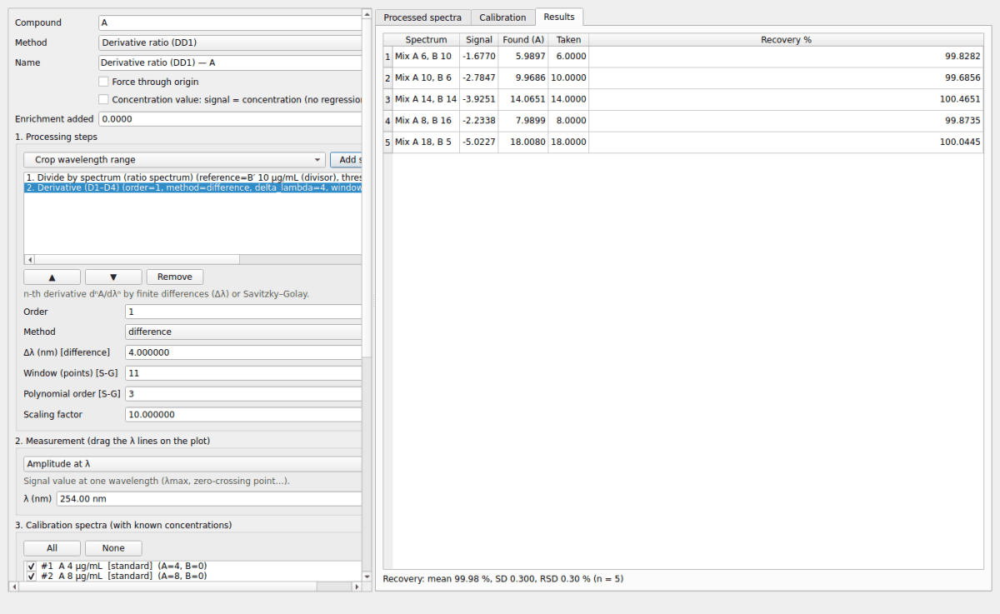

*Step 3 — *Determine*: found and taken concentrations and % recovery of each mixture, with mean and RSD.*

*Literature:* Eissa & Abou Al Alamein, Spectrochim. Acta A 193 (2018) 365, doi:10.1016/j.saa.2017.12.050

### Derivative ratio of derivative spectra (D1 DR)

**In plain words.** First take the derivative of the mixture, then divide by the derivative of the interferent, then differentiate again: the interferent cancels.

**Principle.** D1(mixture) ÷ D1(Y′) = D1X/D1Y′ + constant; differentiating again removes Y.

**Use when.** When the ordinary ratio spectra give no usable peaks for X.

**What you need.** Analyte standards, a divisor, mixtures.

**How to apply in Spectro**

1. Template *Derivative ratio of D1 spectra (D1 DR)*: Derivative → Divide (with *Differentiate divisor first* = 1) → Derivative.
2. Choose the divisor Y′, set λ at a peak away from the divisor's D1 zero-crossings.
3. Calibrate, determine.

**Checks and common mistakes.** Spikes appear where the divisor's derivative crosses zero — read the signal away from them.

**Worked example**

📊 **Sample data:** [data/d1dr.xlsx](data/d1dr.xlsx) — import it (see *Getting started → 4*) and reproduce the numbers below.

* Compound: A; template: *Derivative ratio of D1 spectra (D1 DR)*
* Step: Derivative (D1–D4) (order=1, method=difference, delta_lambda=4, window=11, polyorder=3, scaling=10)
* Step: Divide by spectrum (ratio spectrum) (reference=B′, threshold=0.0001, divisor_derivative=1, divisor_delta_lambda=4)
* Step: Derivative (D1–D4) (order=1, method=difference, delta_lambda=4, window=11, polyorder=3, scaling=10)
* Measurement: Amplitude at λ — w1 = 236.5
* Calibration: slope 52.773, intercept 0.913, r = 0.99999 (n = 5)
* 236.5 nm: best signal-to-noise of the processed A spectrum (spikes where B's D1 crosses zero avoided).

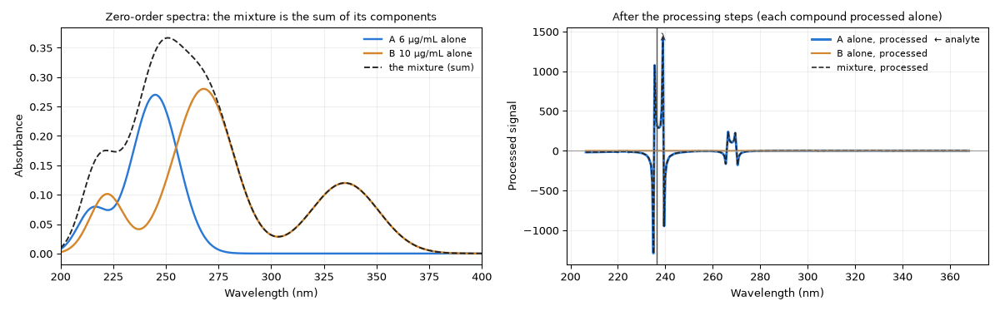

*Why it works — left: the spectra of the components and of the mixture (they overlap). Right: each component processed alone with the method's steps. At the marked wavelength(s) the processed B contribute nothing (≈ 0, or a constant that the measurement cancels), so the mixture's signal there belongs to A only.*

| Mixture | A found | A taken | Rec. % |
|---|---|---|---|
| Mix A 6, B 10 | 6.004 | 6 | 100.07 |
| Mix A 10, B 6 | 9.915 | 10 | 99.15 |
| Mix A 14, B 14 | 14.023 | 14 | 100.17 |
| Mix A 8, B 16 | 8.011 | 8 | 100.14 |
| Mix A 18, B 5 | 17.976 | 18 | 99.86 |

Result: A: mean recovery 99.88 %, RSD 0.42 %.

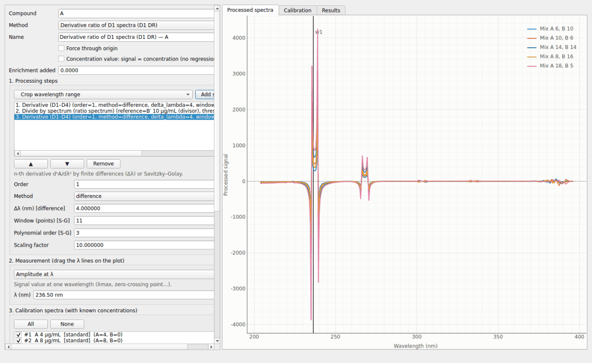

*Step 1 — the method set up in *Methods → Univariate calibration*: compound, template, processing steps (left) and the laboratory mixtures after processing with the measuring wavelength(s) marked (right).*

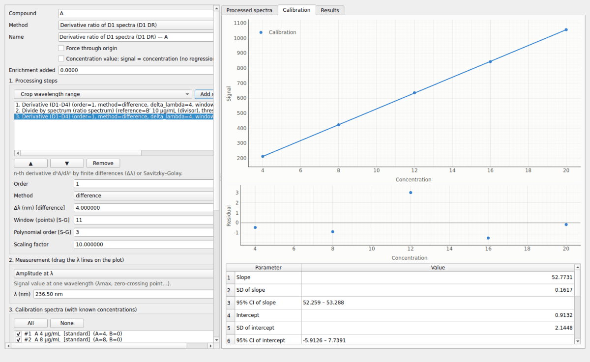

*Step 2 — *Calibrate*: the calibration line of the standards, its residuals and the regression statistics (slope, intercept, r, LOD, LOQ).*

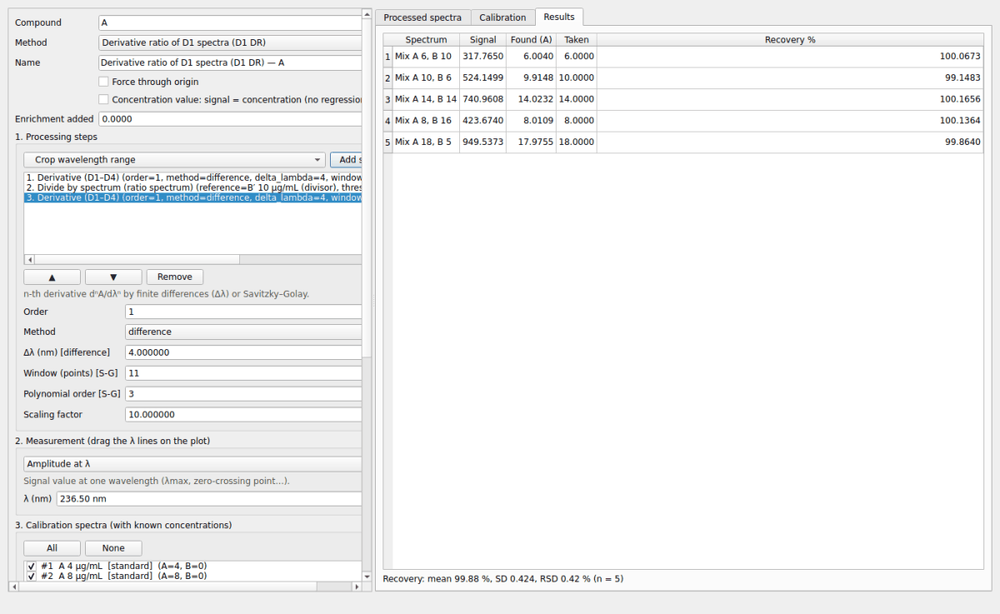

*Step 3 — *Determine*: found and taken concentrations and % recovery of each mixture, with mean and RSD.*

*Literature:* Lotfy et al., Spectrochim. Acta A 136 (2015) 937, doi:10.1016/j.saa.2014.09.117

### Mean centering of ratio spectra (MCR)

**In plain words.** Divide by the interferent (it becomes a constant), then subtract the average of the ratio spectrum — a constant disappears when you subtract its average.

**Principle.** The ratio spectrum X/Y′ + constant is mean centred over a range: the constant vanishes, MC(X/Y′) ∝ C_X.

**Use when.** Binary mixtures; no derivative, so less noise amplification.

**What you need.** Analyte standards, a divisor, mixtures.

**How to apply in Spectro**

1. Template *Mean centering of ratio spectra (MCR)*; choose Y′; set the mean-centring range inside the region where Y′ is not near zero.
2. Read at a maximum/minimum of the processed X spectra. Calibrate, determine.

**Checks and common mistakes.** The mean-centring range must be the same for every spectrum.

**Worked example**

📊 **Sample data:** [data/mcr.xlsx](data/mcr.xlsx) — import it (see *Getting started → 4*) and reproduce the numbers below.

* Compound: A; template: *Mean centering of ratio spectra (MCR)*
* Step: Divide by spectrum (ratio spectrum) (reference=B′, threshold=0.0001, divisor_derivative=0, divisor_delta_lambda=4)
* Step: Mean centering (of this vector) (start=220, end=300)
* Measurement: Amplitude at λ — w1 = 240
* Calibration: slope 0.68391, intercept 0.0115, r = 1.00000 (n = 5)

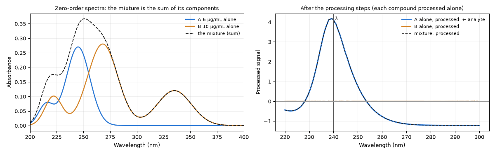

*Why it works — left: the spectra of the components and of the mixture (they overlap). Right: each component processed alone with the method's steps. At the marked wavelength(s) the processed B contribute nothing (≈ 0, or a constant that the measurement cancels), so the mixture's signal there belongs to A only.*

| Mixture | A found | A taken | Rec. % |
|---|---|---|---|
| Mix A 6, B 10 | 6.004 | 6 | 100.07 |
| Mix A 10, B 6 | 10.005 | 10 | 100.05 |
| Mix A 14, B 14 | 14.023 | 14 | 100.17 |
| Mix A 8, B 16 | 7.992 | 8 | 99.90 |
| Mix A 18, B 5 | 18.003 | 18 | 100.02 |

Result: A: mean recovery 100.04 %, RSD 0.10 %.

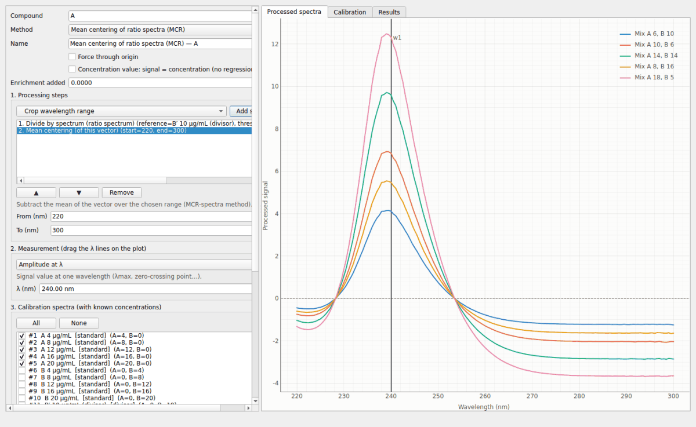

*Step 1 — the method set up in *Methods → Univariate calibration*: compound, template, processing steps (left) and the laboratory mixtures after processing with the measuring wavelength(s) marked (right).*

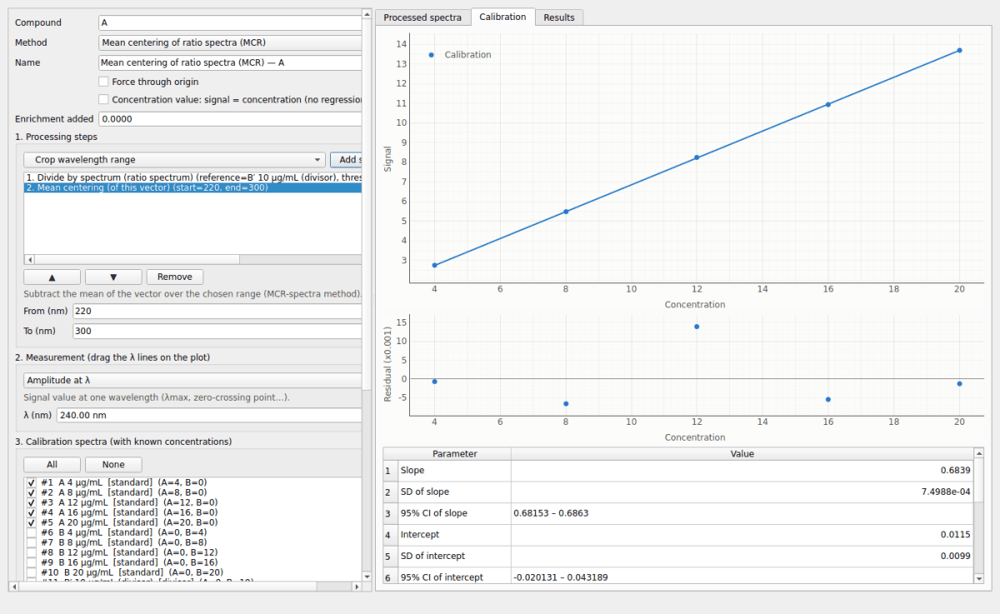

*Step 2 — *Calibrate*: the calibration line of the standards, its residuals and the regression statistics (slope, intercept, r, LOD, LOQ).*

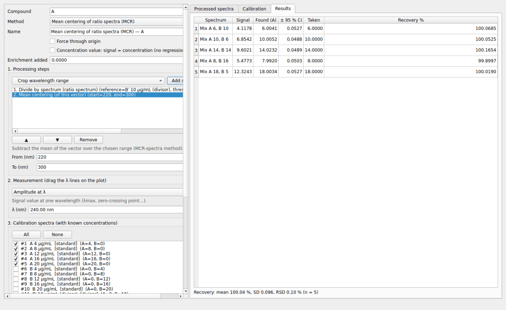

*Step 3 — *Determine*: found and taken concentrations and % recovery of each mixture, with mean and RSD.*

*Literature:* Eissa & Abou Al Alamein, Spectrochim. Acta A 193 (2018) 365, doi:10.1016/j.saa.2017.12.050

### Mean centering of ratio spectra — ternary

**In plain words.** Two divisions for three compounds: the first divisor turns Z into a constant (removed by mean centring), the second turns Y into a constant (removed again).

**Principle.** ÷ Z′ → MC → ÷ MC(Y′/Z′) → MC: after the first division Z is a constant (removed by MC); after dividing by the mean-centred ratio of Y, Y is a constant too (removed by the second MC). The result depends on X only.

**Use when.** Ternary mixtures; two divisors, one wavelength.

**What you need.** Standards of X, divisors of Y and Z, mixtures.

**How to apply in Spectro**

1. Template *Mean centering of ratio spectra (ternary)*: in the first Divide choose Z′, in *Divide by mean-centred ratio* choose Y′ (second component) and Z′ (same first divisor), same range in all mean-centring steps.
2. Read X at an extremum away from the spikes where MC(Y′/Z′) crosses zero. Calibrate, determine.

**Checks and common mistakes.** Use the same range in every mean-centring step.

**Worked example**

📊 **Sample data:** [data/mcr3.xlsx](data/mcr3.xlsx) — import it (see *Getting started → 4*) and reproduce the numbers below.

* Compound: X; template: *Mean centering of ratio spectra (ternary)*
* Step: Divide by spectrum (ratio spectrum) (reference=Z′, threshold=0.0001, divisor_derivative=0, divisor_delta_lambda=4)
* Step: Mean centering (of this vector) (start=220, end=300)
* Step: Divide by mean-centred ratio (ternary MCR) (reference=Y′, divisor=Z′, start=220, end=300, threshold=0.0001)
* Step: Mean centering (of this vector) (start=220, end=300)
* Measurement: Amplitude at λ — w1 = 264.5
* Calibration: slope 0.15779, intercept -0.00439, r = 0.99999 (n = 6)
* 264.5 nm: best signal-to-noise of the processed X spectrum.

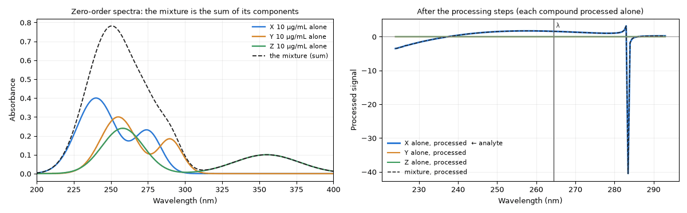

*Why it works — left: the spectra of the components and of the mixture (they overlap). Right: each component processed alone with the method's steps. At the marked wavelength(s) the processed Y, Z contribute nothing (≈ 0, or a constant that the measurement cancels), so the mixture's signal there belongs to X only.*

| Mixture | X found | X taken | Rec. % |
|---|---|---|---|
| Mix X 10, Y 10, Z 10 | 10.026 | 10 | 100.26 |
| Mix X 20, Y 10, Z 10 | 19.990 | 20 | 99.95 |
| Mix X 6, Y 6, Z 18 | 5.988 | 6 | 99.80 |
| Mix X 10, Y 20, Z 10 | 10.057 | 10 | 100.57 |
| Mix X 12, Y 8, Z 6 | 12.011 | 12 | 100.09 |

Result: X: mean recovery 100.13 %, RSD 0.29 %.

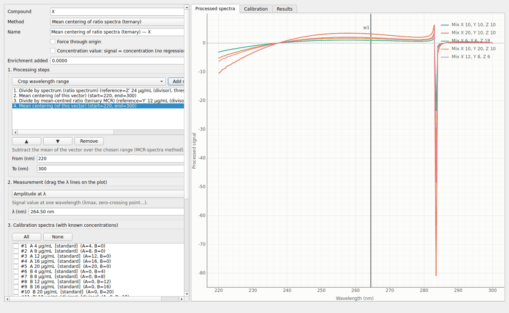

*Step 1 — the method set up in *Methods → Univariate calibration*: compound, template, processing steps (left) and the laboratory mixtures after processing with the measuring wavelength(s) marked (right).*

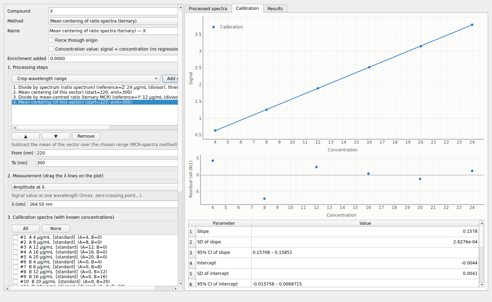

*Step 2 — *Calibrate*: the calibration line of the standards, its residuals and the regression statistics (slope, intercept, r, LOD, LOQ).*

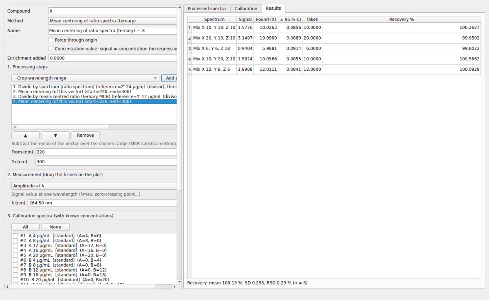

*Step 3 — *Determine*: found and taken concentrations and % recovery of each mixture, with mean and RSD.*

*Literature:* Abdelrahman et al., Spectrochim. Acta A 124 (2014) 389, doi:10.1016/j.saa.2014.01.020

### Successive derivative ratio (ternary)

**In plain words.** Ratio and derivative applied twice: first Y is removed (÷ Y′, derivative), then Z (÷ derivative of Z′/Y′, derivative).

**Principle.** (X+Y+Z)/Y′ → D1 removes Y; dividing by D1(Z′/Y′) makes Z a constant; a second D1 removes it.

**Use when.** Ternary mixtures where X has peaks in the final spectrum.

**What you need.** Standards of X, divisors Y′ and Z′, mixtures; the second divisor is made once in Process.

**How to apply in Spectro**

1. Create the second divisor once: Process → pipeline on a Z standard: Divide by Y′ → Derivative (same Δλ) → saved as a derived spectrum.
2. Template *Successive derivative ratio (ternary)*: first Divide = Y′, second Divide = that derived D1(Z′/Y′) spectrum.
3. Read X at a peak away from spikes. Calibrate, determine.

**Checks and common mistakes.** Read the signal away from spikes caused by zeros of the second divisor.

**Worked example**

📊 **Sample data:** [data/sdr.xlsx](data/sdr.xlsx) — import it (see *Getting started → 4*) and reproduce the numbers below.

* Compound: X; template: *Successive derivative ratio (ternary)*
* Step: Divide by spectrum (ratio spectrum) (reference=Y′, threshold=0.0001, divisor_derivative=0, divisor_delta_lambda=4)
* Step: Derivative (D1–D4) (order=1, method=difference, delta_lambda=4, window=11, polyorder=3, scaling=1)
* Step: Divide by spectrum (ratio spectrum) (reference=D1(Z′/Y′), threshold=0.0001, divisor_derivative=0, divisor_delta_lambda=4)
* Step: Derivative (D1–D4) (order=1, method=difference, delta_lambda=4, window=11, polyorder=3, scaling=1)
* Measurement: Amplitude at λ — w1 = 246
* Calibration: slope -1.229, intercept 0.0349, r = -0.99999 (n = 6)
* Second divisor: D1 of (Z′ ÷ Y′), made once with Process → pipeline and stored as a derived spectrum.
* 246.0 nm: best signal-to-noise of the processed X spectrum.

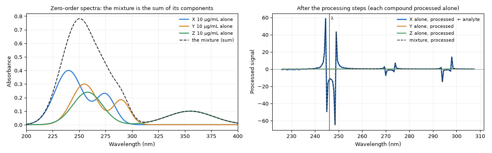

*Why it works — left: the spectra of the components and of the mixture (they overlap). Right: each component processed alone with the method's steps. At the marked wavelength(s) the processed Y, Z contribute nothing (≈ 0, or a constant that the measurement cancels), so the mixture's signal there belongs to X only.*

| Mixture | X found | X taken | Rec. % |
|---|---|---|---|
| Mix X 10, Y 10, Z 10 | 9.974 | 10 | 99.74 |
| Mix X 20, Y 10, Z 10 | 20.019 | 20 | 100.10 |
| Mix X 6, Y 6, Z 18 | 6.037 | 6 | 100.61 |
| Mix X 10, Y 20, Z 10 | 10.046 | 10 | 100.46 |
| Mix X 12, Y 8, Z 6 | 11.996 | 12 | 99.97 |

Result: X: mean recovery 100.17 %, RSD 0.36 %.

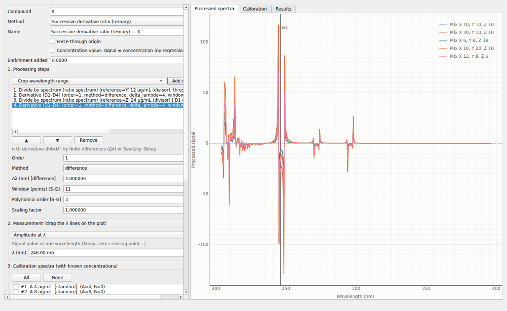

*Step 1 — the method set up in *Methods → Univariate calibration*: compound, template, processing steps (left) and the laboratory mixtures after processing with the measuring wavelength(s) marked (right).*

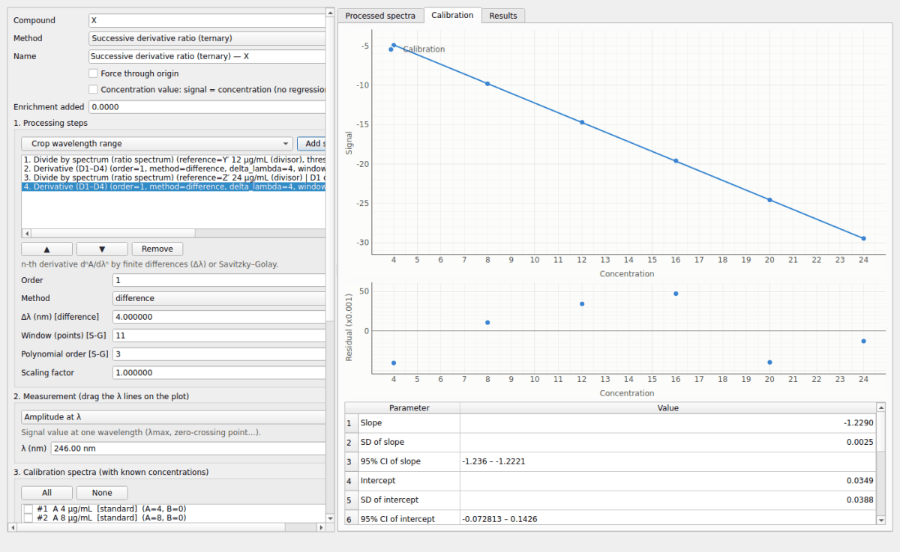

*Step 2 — *Calibrate*: the calibration line of the standards, its residuals and the regression statistics (slope, intercept, r, LOD, LOQ).*

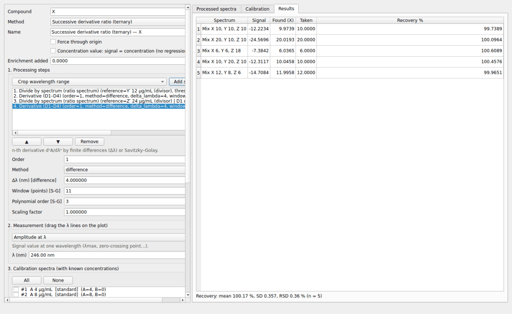

*Step 3 — *Determine*: found and taken concentrations and % recovery of each mixture, with mean and RSD.*

### Double divisor ratio derivative (ternary)

**In plain words.** Divide by the sum of the other two standards at once, then differentiate.

**Principle.** The mixture is divided by the sum of the other two standards (Y′ + Z′) and differentiated. Y and Z cancel only when they are present in the same proportion as in the divisor, so the method is approximate.

**Use when.** Ternary mixtures in a fixed ratio (e.g. one dosage form); check recoveries on laboratory mixtures of varying ratio.

**What you need.** Standards of X, divisors Y′ and Z′, mixtures.

**How to apply in Spectro**

1. Template *Double divisor ratio derivative (ternary)*; choose Y′ and Z′ (equal concentrations, as in the papers) in *Divide by sum*.
2. Read X at a D1 extremum, calibrate, determine.

**Checks and common mistakes.** Exact only when Y : Z in the sample equals Y′ : Z′; test mixtures of other ratios before trusting it.

**Worked example**

📊 **Sample data:** [data/dd.xlsx](data/dd.xlsx) — import it (see *Getting started → 4*) and reproduce the numbers below.

* Compound: X; template: *Double divisor ratio derivative (ternary)*
* Step: Divide by sum of two spectra (double divisor) (reference=Y′, reference2=Z′, factor2=1, threshold=0.0001)
* Step: Derivative (D1–D4) (order=1, method=difference, delta_lambda=4, window=11, polyorder=3, scaling=10)
* Measurement: Amplitude at λ — w1 = 247
* Calibration: slope -0.046924, intercept 0.000321, r = -0.99996 (n = 6)
* 247.0 nm: largest X signal relative to the residual Y and Z signals (from the pure spectra).
* Approximate: Y and Z cancel only in the proportion of the divisor (here 12 : 24). Compare the recoveries of mixtures with different Y : Z ratios.

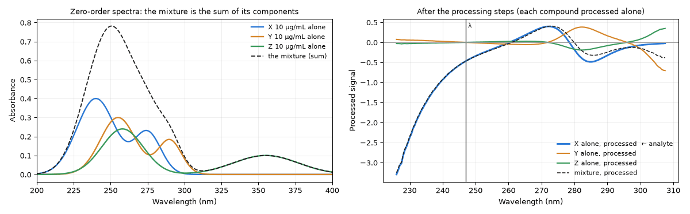

*Why it works — left: the spectra of the components and of the mixture (they overlap). Right: each component processed alone with the method's steps. At the marked wavelength(s) the processed Y, Z contribute nothing (≈ 0, or a constant that the measurement cancels), so the mixture's signal there belongs to X only.*

| Mixture | X found | X taken | Rec. % |
|---|---|---|---|
| Mix X 10, Y 10, Z 10 | 10.138 | 10 | 101.38 |
| Mix X 20, Y 10, Z 10 | 20.059 | 20 | 100.30 |
| Mix X 6, Y 6, Z 18 | 5.966 | 6 | 99.43 |
| Mix X 10, Y 20, Z 10 | 10.069 | 10 | 100.69 |
| Mix X 12, Y 8, Z 6 | 12.033 | 12 | 100.27 |

Result: X: mean recovery 100.41 %, RSD 0.71 %.

*Step 1 — the method set up in *Methods → Univariate calibration*: compound, template, processing steps (left) and the laboratory mixtures after processing with the measuring wavelength(s) marked (right).*

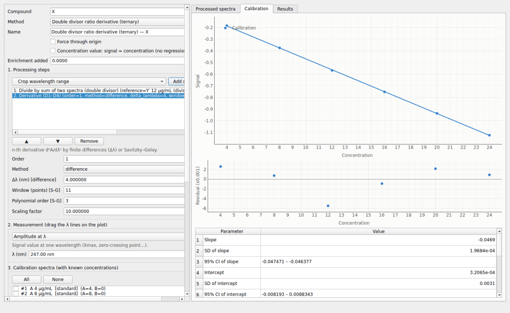

*Step 2 — *Calibrate*: the calibration line of the standards, its residuals and the regression statistics (slope, intercept, r, LOD, LOQ).*

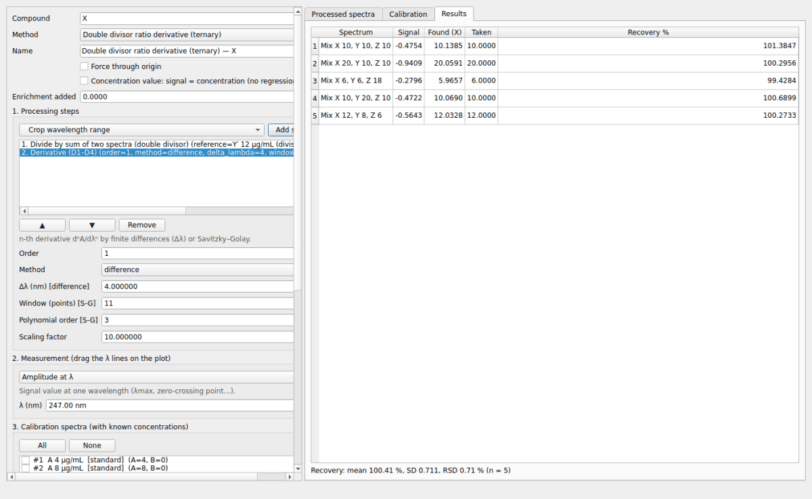

*Step 3 — *Determine*: found and taken concentrations and % recovery of each mixture, with mean and RSD.*

*Literature:* Abdelrahman et al., Spectrochim. Acta A 124 (2014) 389, doi:10.1016/j.saa.2014.01.020

## Ratio spectra — amplitude methods

Divide by a divisor and use amplitudes of the ratio spectrum: differences that cancel the constant, the plateau that gives the divisor compound, or amplitudes at an isoabsorptive point / common λ.

### Ratio difference (RD)

**In plain words.** Divide by the interferent (it becomes a constant). The difference between two points of the ratio spectrum removes the constant — no derivative needed.

**Principle.** ΔP = P(λ1) − P(λ2) of the ratio spectrum X/Y′ + constant: the constant cancels, ΔP ∝ C_X.

**Use when.** Binary mixtures; two wavelengths with a large difference for X/Y′.

**What you need.** Analyte standards, a divisor, mixtures.

**How to apply in Spectro**

1. Template *Ratio difference (RD)*; choose Y′ (a standard or a unit-concentration spectrum).
2. Drag λ1 and λ2 to a peak and a trough of the processed X spectra. Calibrate, determine.

**Checks and common mistakes.** Choose λ1 at a peak and λ2 at a trough of the analyte's ratio spectrum.

**Worked example**

📊 **Sample data:** [data/rd.xlsx](data/rd.xlsx) — import it (see *Getting started → 4*) and reproduce the numbers below.

* Compound: A; template: *Ratio difference (RD)*
* Step: Divide by spectrum (ratio spectrum) (reference=B′, threshold=0.0001, divisor_derivative=0, divisor_delta_lambda=4)
* Measurement: Difference P(λ1) − P(λ2) — w1 = 245, w2 = 275
* Calibration: slope 0.59908, intercept 0.00758, r = 1.00000 (n = 5)

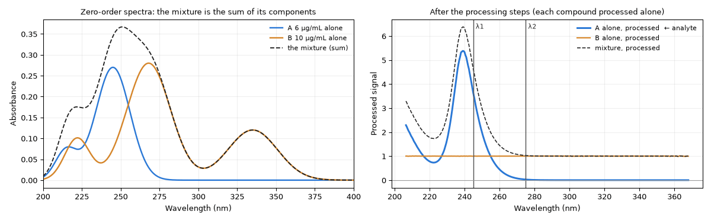

*Why it works — left: the spectra of the components and of the mixture (they overlap). Right: each component processed alone with the method's steps. At the marked wavelength(s) the processed B contribute nothing (≈ 0, or a constant that the measurement cancels), so the mixture's signal there belongs to A only.*

| Mixture | A found | A taken | Rec. % |
|---|---|---|---|
| Mix A 6, B 10 | 5.995 | 6 | 99.91 |
| Mix A 10, B 6 | 10.008 | 10 | 100.08 |
| Mix A 14, B 14 | 13.996 | 14 | 99.97 |
| Mix A 8, B 16 | 8.002 | 8 | 100.02 |
| Mix A 18, B 5 | 17.993 | 18 | 99.96 |

Result: A: mean recovery 99.99 %, RSD 0.06 %.

*Step 1 — the method set up in *Methods → Univariate calibration*: compound, template, processing steps (left) and the laboratory mixtures after processing with the measuring wavelength(s) marked (right).*

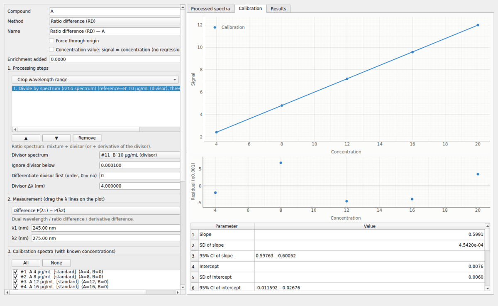

*Step 2 — *Calibrate*: the calibration line of the standards, its residuals and the regression statistics (slope, intercept, r, LOD, LOQ).*

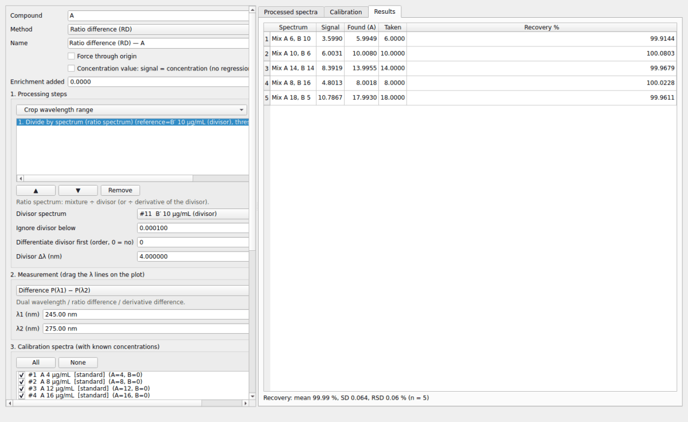

*Step 3 — *Determine*: found and taken concentrations and % recovery of each mixture, with mean and RSD.*

*Literature:* Eissa & Abou Al Alamein, Spectrochim. Acta A 193 (2018) 365, doi:10.1016/j.saa.2017.12.050; Lotfy et al., Spectrochim. Acta A 136 (2015) 937, doi:10.1016/j.saa.2014.09.117

### Dual amplitude difference (ternary)

**In plain words.** For three compounds: divide by Z (constant) and choose two points where Y's ratio spectrum is equal: their difference cancels both Y and Z.

**Principle.** Divide by Z′ (Z becomes a constant). Choose λ1, λ2 where Y/Z′ has equal amplitudes: P(λ1) − P(λ2) cancels Y and Z together and depends on X only (an equality factor F from Y corrects a residual difference).

**Use when.** Ternary mixtures.

**What you need.** Standards of X, divisors Z′ and Y′, mixtures.

**How to apply in Spectro**

1. Finder → *Equal amplitude* on the ratio spectrum Y′/Z′ (process a Y standard by Divide by Z′ first).
2. Template *Dual amplitude difference (ternary)*: divisor Z′, λ1 and λ2, interferent Y′ for F.
3. Calibrate on pure X, determine.

**Checks and common mistakes.** The two wavelengths must give equal Y/Z′ amplitudes (finder).

**Worked example**

📊 **Sample data:** [data/dad.xlsx](data/dad.xlsx) — import it (see *Getting started → 4*) and reproduce the numbers below.

* Compound: X; template: *Dual amplitude difference (ternary)*
* Step: Divide by spectrum (ratio spectrum) (reference=Z′, threshold=0.0001, divisor_derivative=0, divisor_delta_lambda=4)
* Measurement: Induced dual wavelength P(λ1) − F·P(λ2) — w1 = 240, w2 = 253.4, reference = Y′
* Calibration: slope 0.11324, intercept 0.00213, r = 1.00000 (n = 6)
* Finder: Y/Z′ equal at 240 and 253.4 nm.

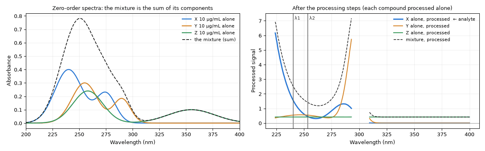

*Why it works — left: the spectra of the components and of the mixture (they overlap). Right: each component processed alone with the method's steps. At the marked wavelength(s) the processed Y, Z contribute nothing (≈ 0, or a constant that the measurement cancels), so the mixture's signal there belongs to X only.*

| Mixture | X found | X taken | Rec. % |
|---|---|---|---|
| Mix X 10, Y 10, Z 10 | 9.976 | 10 | 99.76 |
| Mix X 20, Y 10, Z 10 | 20.002 | 20 | 100.01 |
| Mix X 6, Y 6, Z 18 | 5.982 | 6 | 99.69 |
| Mix X 10, Y 20, Z 10 | 9.968 | 10 | 99.68 |
| Mix X 12, Y 8, Z 6 | 11.997 | 12 | 99.97 |

Result: X: mean recovery 99.82 %, RSD 0.16 %.

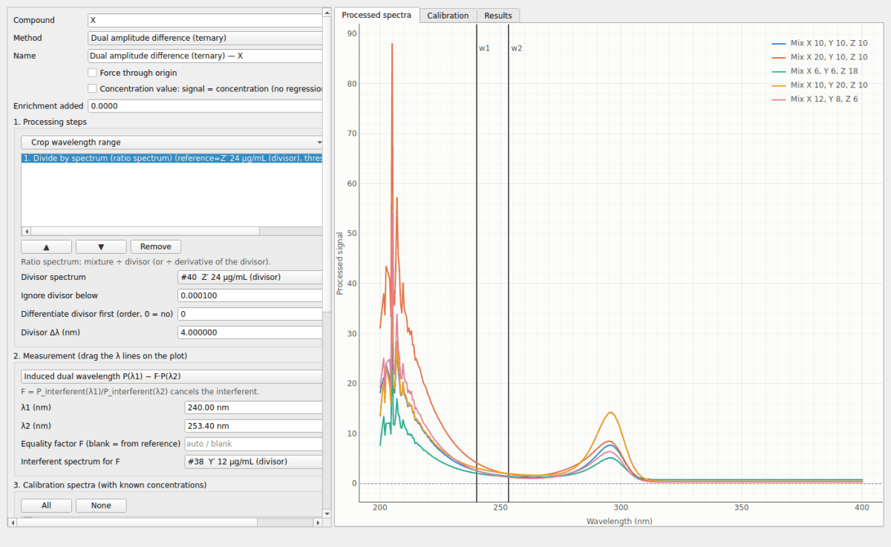

*Step 1 — the method set up in *Methods → Univariate calibration*: compound, template, processing steps (left) and the laboratory mixtures after processing with the measuring wavelength(s) marked (right).*

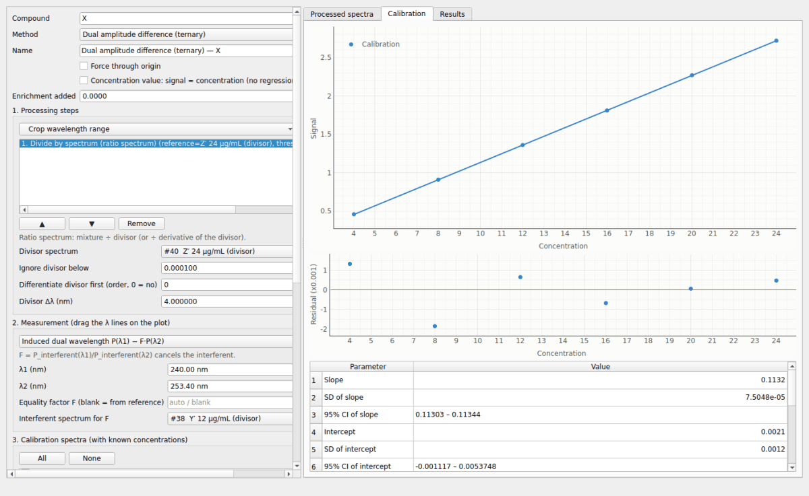

*Step 2 — *Calibrate*: the calibration line of the standards, its residuals and the regression statistics (slope, intercept, r, LOD, LOQ).*

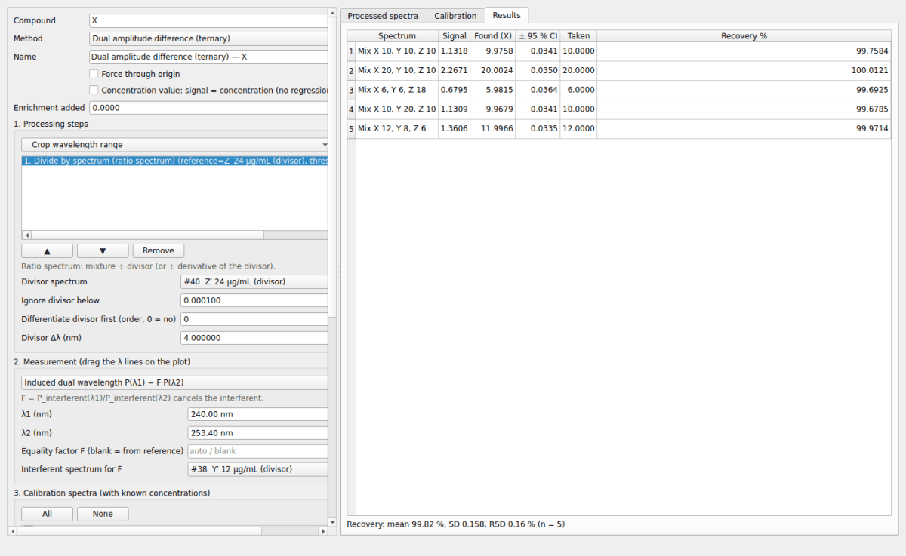

*Step 3 — *Determine*: found and taken concentrations and % recovery of each mixture, with mean and RSD.*

### Constant value (ratio plateau)

**In plain words.** Where only the extended compound Y absorbs, mixture ÷ Y′ is a flat line whose height is the concentration ratio C_Y / C_Y′.

**Principle.** Where only Y absorbs, the ratio spectrum (X + Y)/Y′ is a flat line (plateau) equal to C_Y/C_Y′.

**Use when.** Y extends alone (the extended component).

**What you need.** Standards of Y, the divisor Y′, mixtures.

**How to apply in Spectro**

1. Tools → Spectral finder → *Plateaus* on a mixture ÷ Y′ to find the flat region.
2. Template *Ratio plateau / constant value (Y)*; divisor Y′; set the plateau range.
3. Calibrate on pure Y standards, determine.

**Checks and common mistakes.** The plateau must be flat in every mixture; if it slopes, another compound absorbs there.

**Worked example**

📊 **Sample data:** [data/cv.xlsx](data/cv.xlsx) — import it (see *Getting started → 4*) and reproduce the numbers below.

* Compound: B; template: *Ratio plateau / constant value (Y)*
* Step: Divide by spectrum (ratio spectrum) (reference=B′, threshold=0.0001, divisor_derivative=0, divisor_delta_lambda=4)
* Measurement: Mean in range (plateau) — w1 = 310, w2 = 350
* Calibration: slope 0.10005, intercept -0.000896, r = 1.00000 (n = 5)

*Why it works — left: the spectra of the components and of the mixture (they overlap). Right: each component processed alone with the method's steps. At the marked wavelength(s) the processed A contribute nothing (≈ 0, or a constant that the measurement cancels), so the mixture's signal there belongs to B only.*

| Mixture | B found | B taken | Rec. % |
|---|---|---|---|
| Mix A 6, B 10 | 10.012 | 10 | 100.12 |
| Mix A 10, B 6 | 6.006 | 6 | 100.10 |
| Mix A 14, B 14 | 14.018 | 14 | 100.13 |
| Mix A 8, B 16 | 16.000 | 16 | 100.00 |
| Mix A 18, B 5 | 5.002 | 5 | 100.04 |

Result: B: mean recovery 100.08 %, RSD 0.06 %.

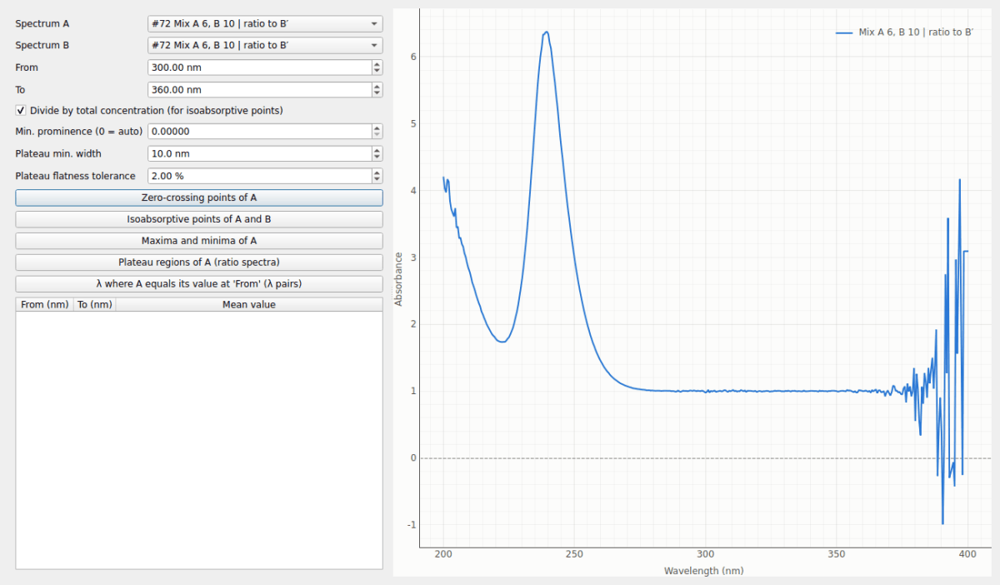

*How the wavelength was found — *Tools → Spectral finder*: spectrum A = a mixture divided by B′ (*Process → Divide by spectrum*), range 300–360 nm → *Plateau regions of A*: the flat region used for the constant.*

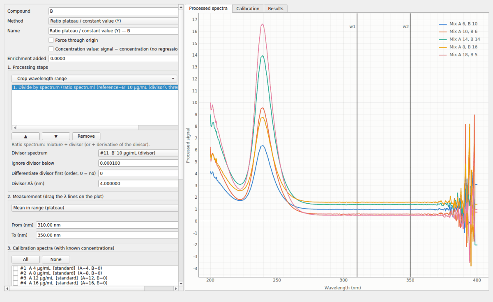

*Step 1 — the method set up in *Methods → Univariate calibration*: compound, template, processing steps (left) and the laboratory mixtures after processing with the measuring wavelength(s) marked (right).*

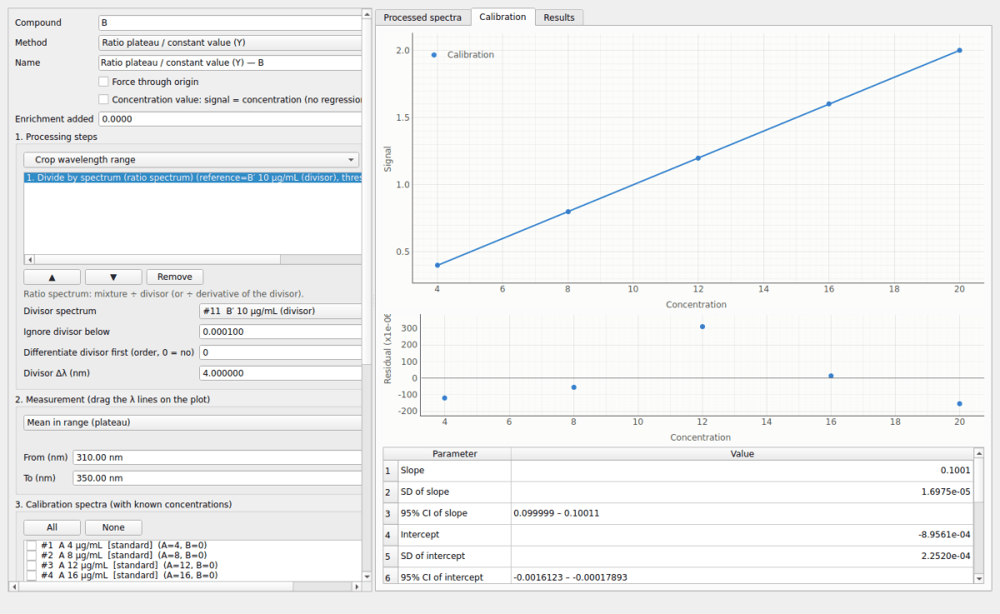

*Step 2 — *Calibrate*: the calibration line of the standards, its residuals and the regression statistics (slope, intercept, r, LOD, LOQ).*

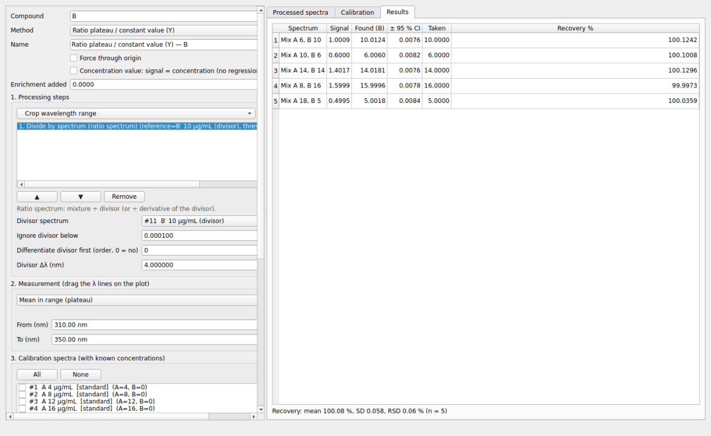

*Step 3 — *Determine*: found and taken concentrations and % recovery of each mixture, with mean and RSD.*

*Literature:* Lotfy et al., Spectrochim. Acta A 136 (2015) 937, doi:10.1016/j.saa.2014.09.117; Fahmy et al., Spectrochim. Acta A 261 (2021) 119999, doi:10.1016/j.saa.2021.119999

### Concentration value (no regression)

**In plain words.** Constant value with a divisor of exactly 1 µg/mL: the flat line's height IS the concentration — no calibration line needed.

**Principle.** With a unit-concentration (normalized) divisor the plateau value IS the concentration of Y — no calibration line is needed.

**Use when.** Same conditions as constant value.

**What you need.** A divisor normalised to 1 µg/mL (made in Spectro), mixtures.

**How to apply in Spectro**

1. Make the normalized divisor once: Process → *Normalize* (mode *concentration*) on a pure Y standard.
2. Template *Concentration value*; choose that unit spectrum; the option *Concentration value: signal = concentration* is ticked.
3. *Calibrate* (still reports the calibration line as a check), *Determine*.

**Checks and common mistakes.** Still run the calibration once: slope ≈ 1 and intercept ≈ 0 confirm it.

**Worked example**

📊 **Sample data:** [data/concval.xlsx](data/concval.xlsx) — import it (see *Getting started → 4*) and reproduce the numbers below.

* Compound: B; template: *Concentration value (unit divisor plateau, no regression)*
* Step: Divide by spectrum (ratio spectrum) (reference=B unit, threshold=0.0001, divisor_derivative=0, divisor_delta_lambda=4)
* Measurement: Mean in range (plateau) — w1 = 310, w2 = 350
* Calibration: slope 1.0005, intercept -0.00896, r = 1.00000 (n = 5)
* The plateau value is reported directly as µg/mL.

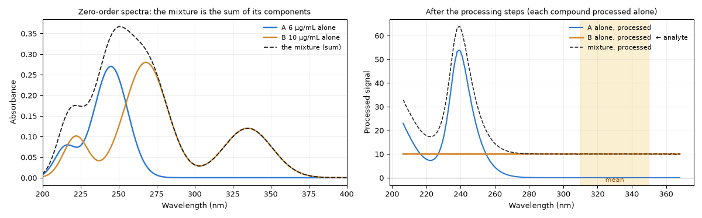

*Why it works — left: the spectra of the components and of the mixture (they overlap). Right: each component processed alone with the method's steps. At the marked wavelength(s) the processed A contribute nothing (≈ 0, or a constant that the measurement cancels), so the mixture's signal there belongs to B only.*

| Mixture | B found | B taken | Rec. % |
|---|---|---|---|
| Mix A 6, B 10 | 10.009 | 10 | 100.09 |
| Mix A 10, B 6 | 6.000 | 6 | 100.00 |
| Mix A 14, B 14 | 14.017 | 14 | 100.12 |
| Mix A 8, B 16 | 15.999 | 16 | 99.99 |
| Mix A 18, B 5 | 4.995 | 5 | 99.91 |

Result: B: mean recovery 100.02 %, RSD 0.08 %.

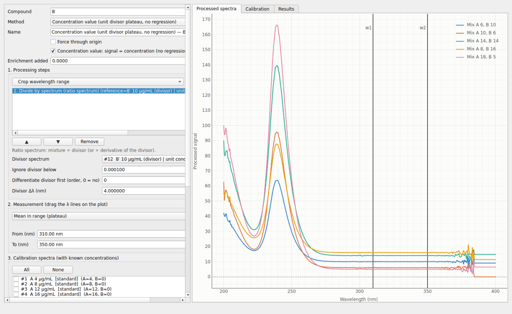

*Step 1 — the method set up in *Methods → Univariate calibration*: compound, template, processing steps (left) and the laboratory mixtures after processing with the measuring wavelength(s) marked (right).*

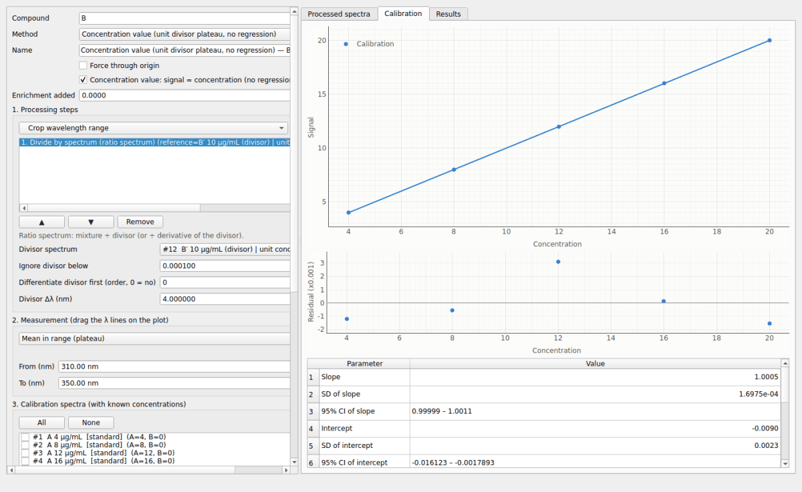

*Step 2 — *Calibrate*: the calibration line of the standards, its residuals and the regression statistics (slope, intercept, r, LOD, LOQ).*

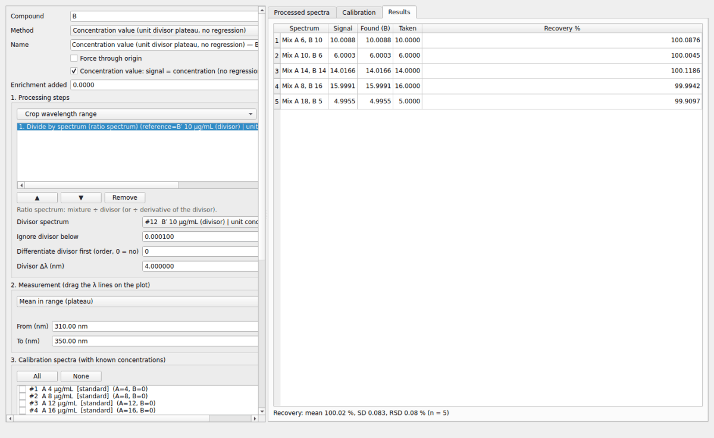

*Step 3 — *Determine*: found and taken concentrations and % recovery of each mixture, with mean and RSD.*

*Literature:* Fahmy et al., Spectrochim. Acta A 261 (2021) 119999, doi:10.1016/j.saa.2021.119999

### Amplitude modulation (AM)

**In plain words.** With a 1 µg/mL divisor of Y, the ratio spectrum at the isoabsorptive point equals C_X + C_Y and its plateau equals C_Y; X = total − Y.

**Principle.** With a unit-concentration divisor Y′ the ratio spectrum at the isoabsorptive point equals C_X + C_Y and the plateau equals C_Y; C_X = total − C_Y. A unified regression at the iso point corrects small deviations.

**Use when.** Binary mixture with an isoabsorptive point; Y extended.

**What you need.** Standards of X and Y, a unit-concentration Y divisor, mixtures.

**How to apply in Spectro**

1. Make the unit Y spectrum (Normalize → concentration).
2. Binary two-signal methods → *Ratio: amplitude modulation*: X, Y, iso, plateau, divisor = unit Y, divisor concentration = 1.
3. Check standards of both compounds (unified calibration) and mixtures → *Calculate*.

**Checks and common mistakes.** Needs an isoabsorptive point AND a plateau region of Y.

**Worked example**

📊 **Sample data:** [data/am.xlsx](data/am.xlsx) — import it (see *Getting started → 4*) and reproduce the numbers below.

* Divisor: unit-concentration B (Normalize → concentration); iso 258.2 nm; plateau 310–350 nm
* iso: 258.2

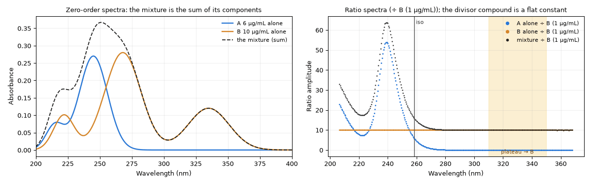

*Why it works — divided by B at 1 µg/mL, B becomes a flat line equal to its concentration; at the isoabsorptive point the ratio equals A + B. Plateau → B, iso − plateau → A.*

| Mixture | A found | A taken | Rec. % | B found | B taken | Rec. % |
|---|---|---|---|---|---|---|
| Mix A 6, B 10 | 6.007 | 6 | 100.11 | 10.009 | 10 | 100.09 |
| Mix A 10, B 6 | 9.983 | 10 | 99.83 | 6.000 | 6 | 100.00 |
| Mix A 14, B 14 | 13.983 | 14 | 99.88 | 14.017 | 14 | 100.12 |
| Mix A 8, B 16 | 7.986 | 8 | 99.82 | 15.999 | 16 | 99.99 |
| Mix A 18, B 5 | 18.006 | 18 | 100.03 | 4.995 | 5 | 99.91 |

Result: A: mean recovery 99.94 %, RSD 0.13 %; B: mean recovery 100.02 %, RSD 0.08 %.

*The method in *Methods → Binary two-signal methods → Ratio: amplitude modulation*: settings (left), the standards and mixtures used (checked), and the results with recoveries (bottom).*

*Literature:* Zaghary et al., J. Anal. Chem. 75 (2020) 742, doi:10.1134/S1061934820060180; Lotfy et al., Spectrochim. Acta A 136 (2015) 937, doi:10.1016/j.saa.2014.09.117

### Induced amplitude modulation (IAM)

**In plain words.** Amplitude modulation without an isoabsorptive point: the X contribution at any wavelength is converted with the ratio of absorptivities.

**Principle.** Amplitude modulation without an isoabsorptive point: P(λ) − C_Y = r·C_X with r = (a_X/a_Y)(λ) from pure X.

**Use when.** Y extended; no isoabsorptive point needed.

**What you need.** Standards of X and Y, mixtures.

**How to apply in Spectro**

1. Binary two-signal methods → *Ratio: induced amplitude modulation*; λ for X, plateau.
2. Check X standards, Y standards (the unit divisor is averaged from them), mixtures.

**Checks and common mistakes.** Y must have a plateau region.

**Worked example**

📊 **Sample data:** [data/iam.xlsx](data/iam.xlsx) — import it (see *Getting started → 4*) and reproduce the numbers below.

* wavelength: 245
* factor: 6.059

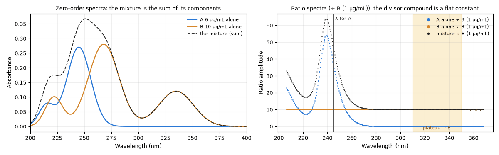

*Why it works — divided by B at 1 µg/mL, B is a flat line equal to C_B (plateau); at 245 nm the ratio is C_B + r·C_A, with r = a_A/a_B from the A standards.*

| Mixture | A found | A taken | Rec. % | B found | B taken | Rec. % |
|---|---|---|---|---|---|---|
| Mix A 6, B 10 | 6.003 | 6 | 100.05 | 10.014 | 10 | 100.14 |
| Mix A 10, B 6 | 10.008 | 10 | 100.08 | 6.003 | 6 | 100.06 |
| Mix A 14, B 14 | 13.984 | 14 | 99.89 | 14.024 | 14 | 100.17 |
| Mix A 8, B 16 | 8.011 | 8 | 100.14 | 16.008 | 16 | 100.05 |
| Mix A 18, B 5 | 17.986 | 18 | 99.92 | 4.998 | 5 | 99.96 |

Result: A: mean recovery 100.01 %, RSD 0.11 %; B: mean recovery 100.08 %, RSD 0.08 %.

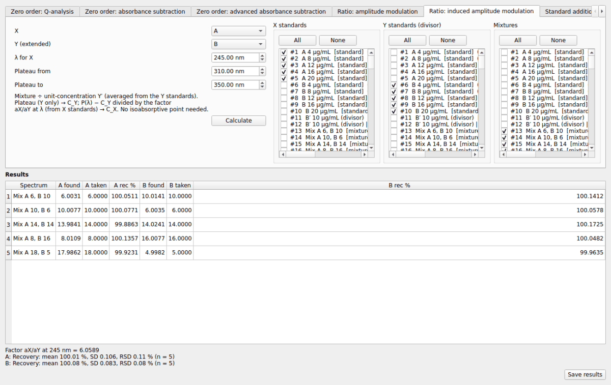

*The method in *Methods → Binary two-signal methods → Ratio: induced amplitude modulation*: settings (left), the standards and mixtures used (checked), and the results with recoveries (bottom).*

### Constant value via amplitude difference (CV-AD)

**In plain words.** Divide by Y′: X's ratio difference between two wavelengths tells how big X's share is at one of them; what remains there is Y.

**Principle.** Divide by Y′. The ratio difference of X between λ1 and λ2 gives X's postulated amplitude at λ2 (from a line ΔP vs P(λ2) of pure X); the recorded amplitude minus it is the constant C_Y/C_Y′.

**Use when.** Binary (or ternary where the third compound does not absorb there); no plateau needed.

**What you need.** Standards of X and Y, a divisor Y′, mixtures.

**How to apply in Spectro**

1. Methods → Progressive resolution → *Ratio: amplitude centering*.
2. Compounds X and Y; divisor Y′; divisor compound Y; common λc = λ2; amplitude difference row: X, λ1, λ2; amplitude subtraction for Y.
3. Check standards and mixtures → *Calculate*.

**Checks and common mistakes.** The amplitude-difference line (shown after calculating) should have r ≈ 1.

**Worked example**

📊 **Sample data:** [data/cvad.xlsx](data/cvad.xlsx) — import it (see *Getting started → 4*) and reproduce the numbers below.

* ÷ B, λc 251.0 nm; A: P261.0 − P251.0; B by subtraction

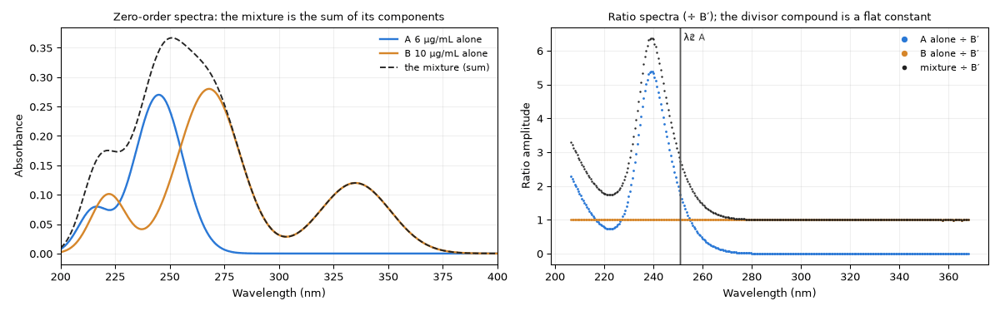

*Why it works — in the ratio spectrum the divisor compound (B) is a flat constant. Every compound is read at the same λc: from the plateau, from an amplitude difference at a pair where the others are equal (they cancel), or as what is left after subtracting the others.*

| Mixture | A found | A taken | Rec. % | B found | B taken | Rec. % |
|---|---|---|---|---|---|---|
| Mix A 6, B 10 | 5.996 | 6 | 99.94 | 10.017 | 10 | 100.17 |
| Mix A 10, B 6 | 9.953 | 10 | 99.53 | 6.089 | 6 | 101.49 |
| Mix A 14, B 14 | 13.993 | 14 | 99.95 | 14.017 | 14 | 100.12 |
| Mix A 8, B 16 | 8.008 | 8 | 100.10 | 16.032 | 16 | 100.20 |
| Mix A 18, B 5 | 17.988 | 18 | 99.93 | 4.992 | 5 | 99.84 |

Result: A: mean recovery 99.89 %, RSD 0.21 %; B: mean recovery 100.36 %, RSD 0.64 %.

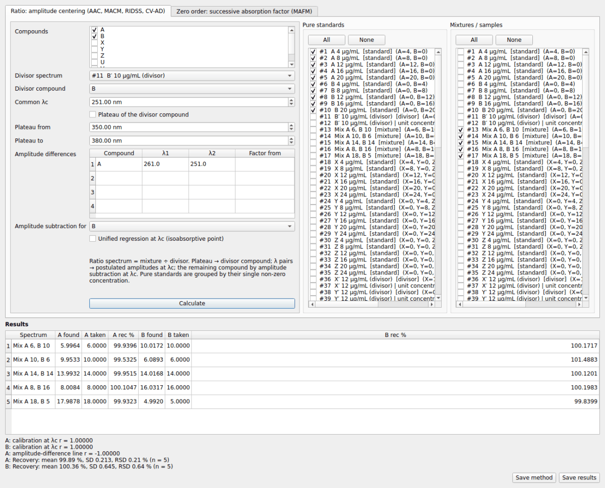

**Methods → Progressive resolution → Ratio: amplitude centering (AAC, MACM, RIDSS, CV-AD)*: the settings, the standards and mixtures used, and the results with recoveries. *Save method* stores it for reuse.*

*Literature:* Lotfy et al., Spectrochim. Acta A 136 (2015) 937, doi:10.1016/j.saa.2014.09.117

### Advanced amplitude centering — partial overlap (AAC)

**In plain words.** One divisor, one wavelength, three compounds: the plateau gives Z, an amplitude difference gives X, and Y is what is left.

**Principle.** One divisor Z′ and one wavelength λc for all compounds: the plateau gives Z; after subtracting it, P(λ1) − F_Y·P(λ2) depends on X only (equality factor of Y) and gives X's postulated amplitude at λc; Y = recorded − Z − X at λc.

**Use when.** Ternary; Z extended alone (plateau).

**What you need.** Standards of X, Y and Z, a divisor Z′, mixtures.

**How to apply in Spectro**

1. Progressive resolution → *Ratio: amplitude centering*: divisor Z′, divisor compound Z, *Plateau* ticked with its range, λc.
2. Amplitude difference row: X, λc, λ2, factor from Y. Amplitude subtraction for Y.
3. *Calculate*; *Save method* to reuse it. The optimizer proposes these settings automatically.

**Checks and common mistakes.** The plateau must be in the region where only Z absorbs.

**Worked example**

📊 **Sample data:** [data/aac.xlsx](data/aac.xlsx) — import it (see *Getting started → 4*) and reproduce the numbers below.

* ÷ Z, λc 275.0 nm; Z from plateau 340–380 nm; X: P275.0 − F(Y)·P240.0; Y by subtraction

*Why it works — in the ratio spectrum the divisor compound (Z) is a flat constant. Every compound is read at the same λc: from the plateau, from an amplitude difference at a pair where the others are equal (they cancel), or as what is left after subtracting the others.*

| Mixture | X found | X taken | Rec. % | Y found | Y taken | Rec. % | Z found | Z taken | Rec. % |
|---|---|---|---|---|---|---|---|---|---|
| Mix X 10, Y 10, Z 10 | 9.914 | 10 | 99.14 | 10.225 | 10 | 102.25 | 9.981 | 10 | 99.81 |
| Mix X 20, Y 10, Z 10 | 19.997 | 20 | 99.98 | 10.016 | 10 | 100.16 | 9.985 | 10 | 99.85 |
| Mix X 6, Y 6, Z 18 | 5.916 | 6 | 98.60 | 6.205 | 6 | 103.42 | 17.994 | 18 | 99.97 |
| Mix X 10, Y 20, Z 10 | 9.893 | 10 | 98.93 | 20.283 | 20 | 101.42 | 9.987 | 10 | 99.87 |
| Mix X 12, Y 8, Z 6 | 12.001 | 12 | 100.01 | 7.989 | 8 | 99.86 | 5.974 | 6 | 99.56 |

Result: X: mean recovery 99.33 %, RSD 0.64 %; Y: mean recovery 101.42 %, RSD 1.46 %; Z: mean recovery 99.81 %, RSD 0.15 %.

**Methods → Progressive resolution → Ratio: amplitude centering (AAC, MACM, RIDSS, CV-AD)*: the settings, the standards and mixtures used, and the results with recoveries. *Save method* stores it for reuse.*

*Literature:* Saleh et al., Int. J. Pharm. Pharm. Sci. 9 (2017) 43, doi:10.22159/ijpps.2017v9i5.16960

### Amplitude centering — complete overlap (AAC / MACM)

**In plain words.** Like AAC but without a plateau: two different amplitude differences give X and Y, and Z is what is left at the common wavelength.

**Principle.** No plateau: X from a λ pair where Y/Z′ is equal, Y from a λ pair where X/Z′ is equal (Z/Z′ is constant and cancels in both); Z by subtraction at the common λc.

**Use when.** Ternary with severe overlap; one divisor.

**What you need.** Standards of all three, one divisor, mixtures.

**How to apply in Spectro**

1. Any of the three compounds can be the divisor (called Z here); the method optimizer tries each one and proposes λc and the λ pairs.
2. By hand: Finder → *Equal amplitude* on Y/Z′ and on X/Z′ at the chosen λc.
3. Amplitude centering: divisor Z′, divisor compound Z, no plateau; rows X (λc, partner of Y) and Y (λc, partner of X); subtraction for Z.
4. *Calculate*.

**Checks and common mistakes.** Let the method optimizer propose λc and the λ pairs: hand-picked pairs on steep slopes are sensitive to small wavelength errors.

**Worked example**

📊 **Sample data:** [data/macm.xlsx](data/macm.xlsx) — import it (see *Getting started → 4*) and reproduce the numbers below.

* ÷ Y, λc 255.5 nm; X: P255.5 − P278.3; Z: P255.5 − P285.1; Y by subtraction
* Settings proposed by Tools → Method optimizer (λc and the partner wavelengths where the other compound's ratio amplitudes are equal).

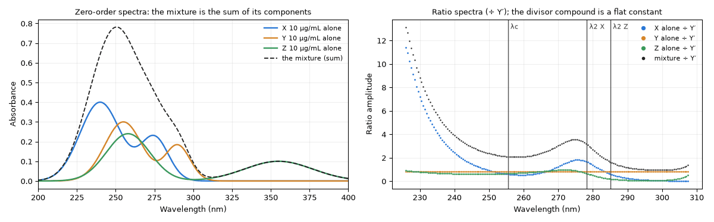

*Why it works — in the ratio spectrum the divisor compound (Y) is a flat constant. Every compound is read at the same λc: from the plateau, from an amplitude difference at a pair where the others are equal (they cancel), or as what is left after subtracting the others.*

| Mixture | X found | X taken | Rec. % | Y found | Y taken | Rec. % | Z found | Z taken | Rec. % |
|---|---|---|---|---|---|---|---|---|---|
| Mix X 10, Y 10, Z 10 | 9.952 | 10 | 99.52 | 10.052 | 10 | 100.52 | 9.985 | 10 | 99.85 |
| Mix X 20, Y 10, Z 10 | 19.961 | 20 | 99.80 | 10.119 | 10 | 101.19 | 9.863 | 10 | 98.63 |
| Mix X 6, Y 6, Z 18 | 5.912 | 6 | 98.53 | 6.093 | 6 | 101.56 | 17.995 | 18 | 99.97 |
| Mix X 10, Y 20, Z 10 | 9.959 | 10 | 99.59 | 20.016 | 20 | 100.08 | 10.054 | 10 | 100.54 |
| Mix X 12, Y 8, Z 6 | 11.993 | 12 | 99.94 | 8.023 | 8 | 100.28 | 5.978 | 6 | 99.63 |

Result: X: mean recovery 99.48 %, RSD 0.56 %; Y: mean recovery 100.73 %, RSD 0.62 %; Z: mean recovery 99.73 %, RSD 0.70 %.

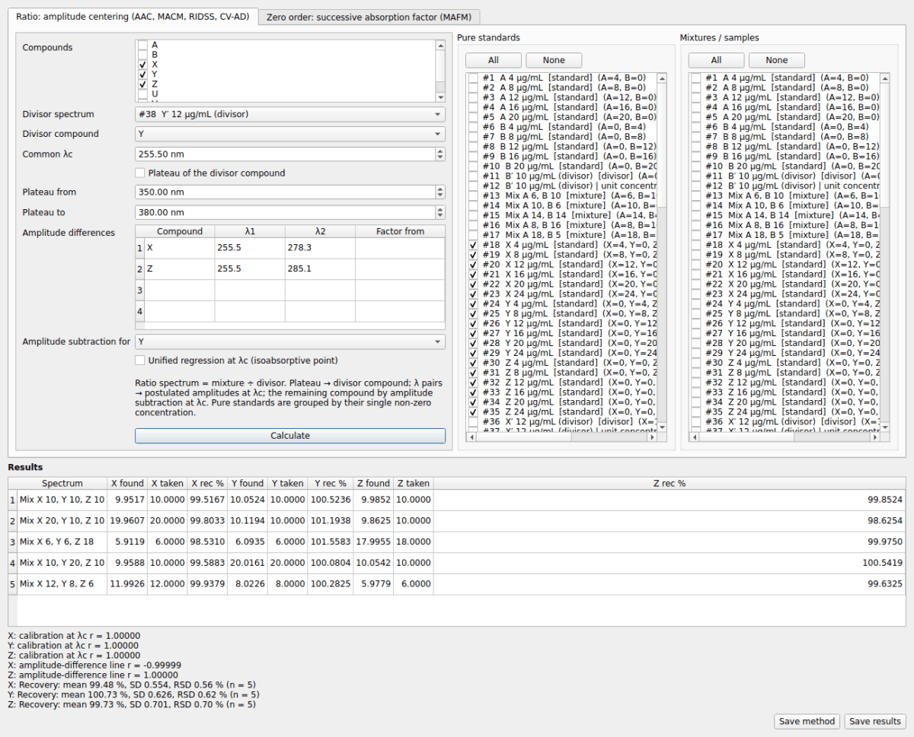

**Methods → Progressive resolution → Ratio: amplitude centering (AAC, MACM, RIDSS, CV-AD)*: the settings, the standards and mixtures used, and the results with recoveries. *Save method* stores it for reuse.*

*Literature:* Saleh et al., Int. J. Pharm. Pharm. Sci. 9 (2017) 43, doi:10.22159/ijpps.2017v9i5.16960; Abdelwahab & Mohamed, Chem. Pharm. Bull. 65 (2017) 558

### Ratio difference–isoabsorptive (RIDSS)

**In plain words.** Z from the plateau, Y from a ratio difference, and X + Y together at their isoabsorptive point — so X = total − Y.

**Principle.** Z from the plateau; Y from a ratio difference at a pair where X/Z′ is equal; at the isoabsorptive point of X and Y the amplitude after removing Z is C_X + C_Y (unified regression), so X = total − Y.

**Use when.** Ternary; Z extended; X and Y have an isoabsorptive point.

**What you need.** Standards of X, Y, Z, a divisor Z′, mixtures.

**How to apply in Spectro**

1. Finder → *Isoabsorptive points* (X and Y standards) for λc, *Equal amplitude* on X/Z′ for the partner.
2. Amplitude centering: plateau, row Y (λc, partner), subtraction for X, *Unified regression* ticked.

**Checks and common mistakes.** Tick 'unified regression' only when λc is the isoabsorptive point of X and Y.

**Worked example**

📊 **Sample data:** [data/ridss.xlsx](data/ridss.xlsx) — import it (see *Getting started → 4*) and reproduce the numbers below.

* ÷ Z, λc 251.1 nm; Z from plateau 340–380 nm; Y: P251.1 − P270.3; X by subtraction
* Isoabsorptive point of X and Y: 251.1 nm; X/Z′ equal at 270.3 nm

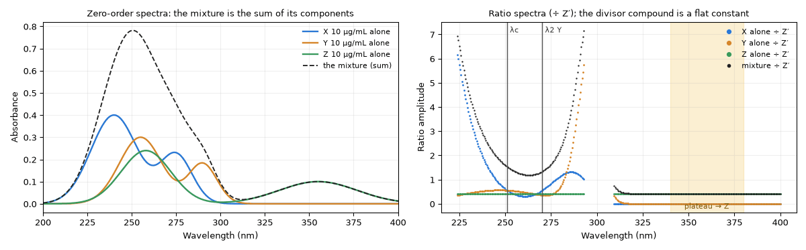

*Why it works — in the ratio spectrum the divisor compound (Z) is a flat constant. Every compound is read at the same λc: from the plateau, from an amplitude difference at a pair where the others are equal (they cancel), or as what is left after subtracting the others.*

| Mixture | X found | X taken | Rec. % | Y found | Y taken | Rec. % | Z found | Z taken | Rec. % |
|---|---|---|---|---|---|---|---|---|---|
| Mix X 10, Y 10, Z 10 | 10.010 | 10 | 100.10 | 9.997 | 10 | 99.97 | 10.006 | 10 | 100.06 |
| Mix X 20, Y 10, Z 10 | 19.957 | 20 | 99.79 | 10.049 | 10 | 100.49 | 10.011 | 10 | 100.11 |
| Mix X 6, Y 6, Z 18 | 5.997 | 6 | 99.95 | 6.003 | 6 | 100.04 | 17.999 | 18 | 99.99 |
| Mix X 10, Y 20, Z 10 | 10.050 | 10 | 100.50 | 19.930 | 20 | 99.65 | 10.012 | 10 | 100.12 |
| Mix X 12, Y 8, Z 6 | 11.997 | 12 | 99.97 | 7.994 | 8 | 99.92 | 6.010 | 6 | 100.16 |

Result: X: mean recovery 100.06 %, RSD 0.27 %; Y: mean recovery 100.02 %, RSD 0.30 %; Z: mean recovery 100.09 %, RSD 0.07 %.

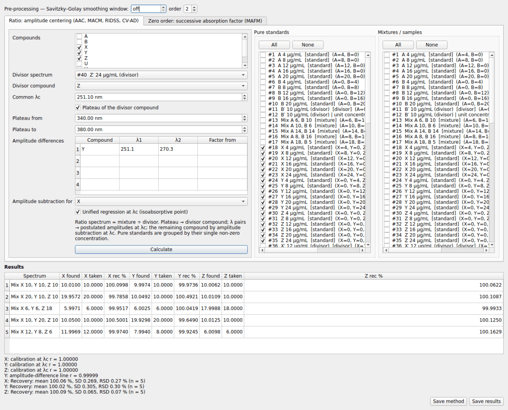

**Methods → Progressive resolution → Ratio: amplitude centering (AAC, MACM, RIDSS, CV-AD)*: the settings, the standards and mixtures used, and the results with recoveries. *Save method* stores it for reuse.*

*Literature:* Abdelrahman et al., Anal. Methods 6 (2014) 509, doi:10.1039/c3ay41564c

## Spectrum resolution (recover each component's spectrum)

Recover the zero-order (or derivative) spectrum of each component from the mixture, then measure each at its own λmax as if it were pure.

### Ratio subtraction (RS) / spectrum subtraction of the extended component

**In plain words.** Remove the extended compound Y from the mixture: its amount is read from the plateau and that much of Y′ is subtracted. What remains looks exactly like the spectrum of pure X, which you then read at its λmax.

**Principle.** (X + Y)/Y′ − constant (plateau) = X/Y′; × Y′ gives X's zero-order spectrum, read at X's λmax. Spectro computes it as mixture − constant·Y′ (identical, exact everywhere).

**Use when.** Y extended alone (plateau).

**What you need.** Standards of X, a divisor Y′, mixtures.

**How to apply in Spectro**

1. Template *Ratio subtraction / spectrum subtraction (X)*; divisor Y′, plateau range.
2. The processed mixtures now look like pure X: read at X's λmax. Calibrate, determine.

**Checks and common mistakes.** The recovered spectra should overlay the pure X spectra (look at the plot).

**Worked example**

📊 **Sample data:** [data/rs.xlsx](data/rs.xlsx) — import it (see *Getting started → 4*) and reproduce the numbers below.

* Compound: A; template: *Ratio subtraction / spectrum subtraction (X)*
* Step: Ratio subtraction (recover X) (divisor=B′, start=310, end=350, divisor_derivative=0, divisor_delta_lambda=4)
* Measurement: Amplitude at λ — w1 = 245
* Calibration: slope 0.044954, intercept 0.000645, r = 1.00000 (n = 5)

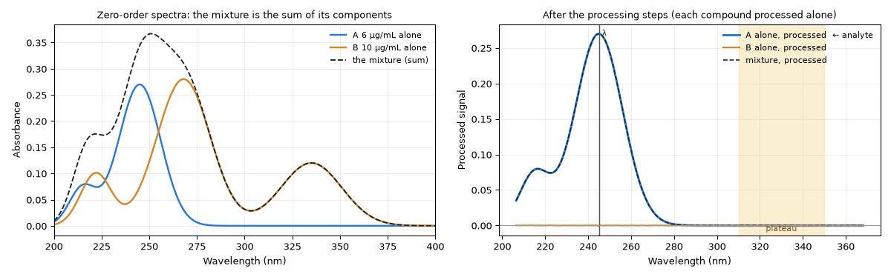

*Why it works — left: the spectra of the components and of the mixture (they overlap). Right: each component processed alone with the method's steps. At the marked wavelength(s) the processed B contribute nothing (≈ 0, or a constant that the measurement cancels), so the mixture's signal there belongs to A only.*

| Mixture | A found | A taken | Rec. % |
|---|---|---|---|
| Mix A 6, B 10 | 5.995 | 6 | 99.92 |
| Mix A 10, B 6 | 10.007 | 10 | 100.07 |
| Mix A 14, B 14 | 13.987 | 14 | 99.91 |
| Mix A 8, B 16 | 8.004 | 8 | 100.05 |
| Mix A 18, B 5 | 17.999 | 18 | 99.99 |

Result: A: mean recovery 99.99 %, RSD 0.07 %.

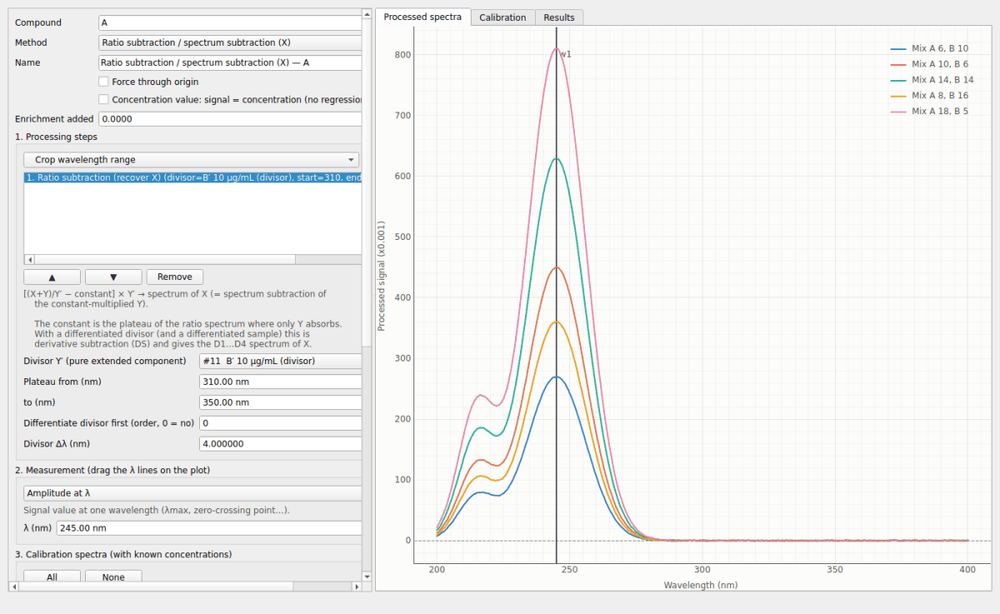

*Step 1 — the method set up in *Methods → Univariate calibration*: compound, template, processing steps (left) and the laboratory mixtures after processing with the measuring wavelength(s) marked (right).*

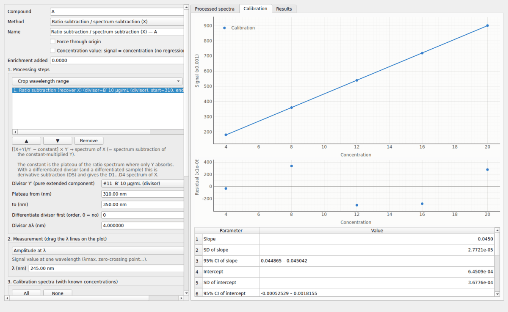

*Step 2 — *Calibrate*: the calibration line of the standards, its residuals and the regression statistics (slope, intercept, r, LOD, LOQ).*

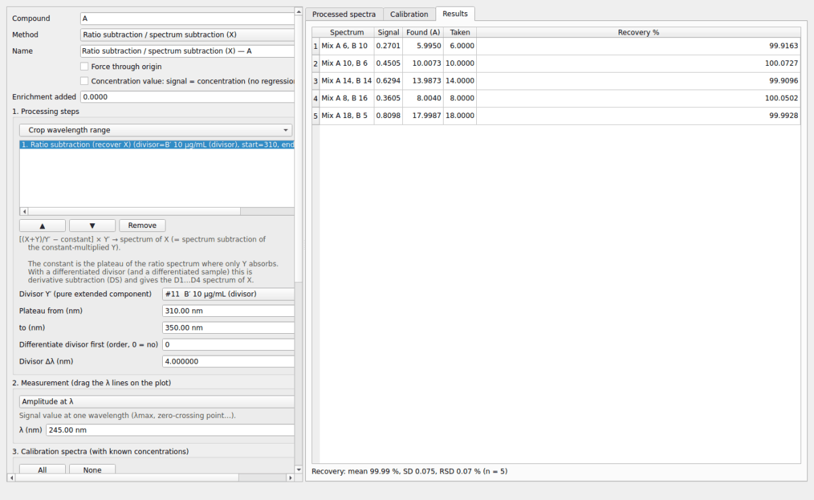

*Step 3 — *Determine*: found and taken concentrations and % recovery of each mixture, with mean and RSD.*

*Literature:* Zaghary et al., J. Anal. Chem. 75 (2020) 742, doi:10.1134/S1061934820060180; Lotfy et al., Spectrochim. Acta A 136 (2015) 937, doi:10.1016/j.saa.2014.09.117

### Constant multiplication (CM) / SS-CM

**In plain words.** The plateau height × Y′ rebuilds Y's own spectrum in the mixture; read Y at its λmax.

**Principle.** The plateau constant × Y′ is Y's zero-order spectrum in the mixture (CM); subtracting it from the mixture gives X (spectrum subtraction, SS). Both spectra are then read at their λmax.

**Use when.** Y extended alone.

**What you need.** Standards of Y, a divisor Y′, mixtures.

**How to apply in Spectro**

1. Template *Constant multiplication / SS-CM (extended Y)*; divisor Y′, plateau.
2. Read Y at its λmax. For X use the ratio subtraction template (same divisor/plateau).

**Checks and common mistakes.** The rebuilt spectra are copies of Y′ scaled — check they match the mixture in the plateau region.

**Worked example**

📊 **Sample data:** [data/cm.xlsx](data/cm.xlsx) — import it (see *Getting started → 4*) and reproduce the numbers below.

* Compound: B; template: *Constant multiplication / SS-CM (extended Y)*
* Step: Constant multiplication (recover Y) (divisor=B′, start=310, end=350, divisor_derivative=0, divisor_delta_lambda=4)
* Measurement: Amplitude at λ — w1 = 268
* Calibration: slope 0.028034, intercept -0.000251, r = 1.00000 (n = 5)

*Why it works — left: the spectra of the components and of the mixture (they overlap). Right: each component processed alone with the method's steps. At the marked wavelength(s) the processed A contribute nothing (≈ 0, or a constant that the measurement cancels), so the mixture's signal there belongs to B only.*

| Mixture | B found | B taken | Rec. % |
|---|---|---|---|
| Mix A 6, B 10 | 10.012 | 10 | 100.12 |
| Mix A 10, B 6 | 6.006 | 6 | 100.10 |
| Mix A 14, B 14 | 14.018 | 14 | 100.13 |
| Mix A 8, B 16 | 16.000 | 16 | 100.00 |
| Mix A 18, B 5 | 5.002 | 5 | 100.04 |

Result: B: mean recovery 100.08 %, RSD 0.06 %.

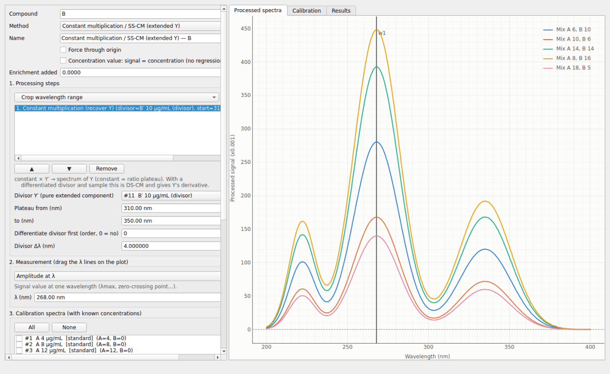

*Step 1 — the method set up in *Methods → Univariate calibration*: compound, template, processing steps (left) and the laboratory mixtures after processing with the measuring wavelength(s) marked (right).*

*Step 2 — *Calibrate*: the calibration line of the standards, its residuals and the regression statistics (slope, intercept, r, LOD, LOQ).*

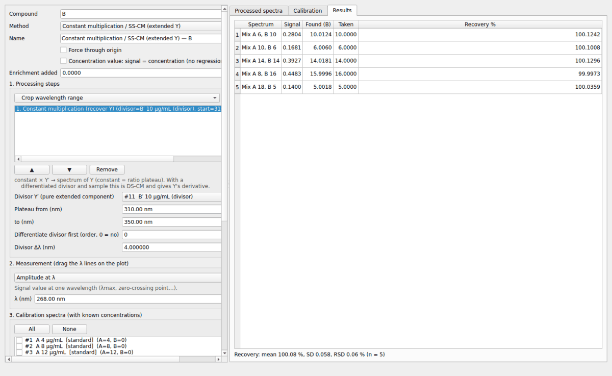

*Step 3 — *Determine*: found and taken concentrations and % recovery of each mixture, with mean and RSD.*

*Literature:* Zaghary et al., J. Anal. Chem. 75 (2020) 742, doi:10.1134/S1061934820060180; Fahmy et al., Spectrochim. Acta A 261 (2021) 119999, doi:10.1016/j.saa.2021.119999

### Extended ratio subtraction (ERS)

**In plain words.** After ratio subtraction gives X, X is matched to its pure spectrum and subtracted from the mixture: Y's full spectrum remains.

**Principle.** After ratio subtraction recovers X, X's amount is matched to its pure spectrum X′ and subtracted from the mixture → Y's spectrum, read at Y's λmax (also where Y has no region of its own).

**Use when.** Y extended; Y measured at its band maximum.

**What you need.** Standards of Y, a divisor Y′, a pure X spectrum, mixtures.

**How to apply in Spectro**

1. Template *Extended ratio subtraction (Y)*; divisor Y′, pure X′, plateau. Read Y at λmax.

**Checks and common mistakes.** Useful when Y must be read at a band overlapped by X.

**Worked example**

📊 **Sample data:** [data/ers.xlsx](data/ers.xlsx) — import it (see *Getting started → 4*) and reproduce the numbers below.

* Compound: B; template: *Extended ratio subtraction (Y)*
* Step: Extended ratio subtraction (recover Y) (divisor=B′, reference=A 12, start=310, end=350)
* Measurement: Amplitude at λ — w1 = 268
* Calibration: slope 0.027975, intercept 0.000503, r = 1.00000 (n = 5)

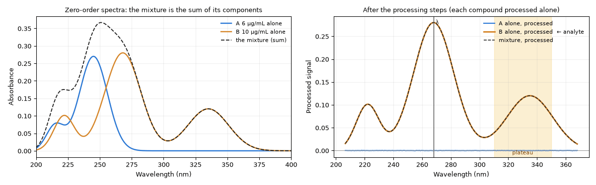

*Why it works — left: the spectra of the components and of the mixture (they overlap). Right: each component processed alone with the method's steps. At the marked wavelength(s) the processed A contribute nothing (≈ 0, or a constant that the measurement cancels), so the mixture's signal there belongs to B only.*

| Mixture | B found | B taken | Rec. % |
|---|---|---|---|
| Mix A 6, B 10 | 10.003 | 10 | 100.03 |
| Mix A 10, B 6 | 6.005 | 6 | 100.09 |
| Mix A 14, B 14 | 13.994 | 14 | 99.96 |
| Mix A 8, B 16 | 16.017 | 16 | 100.11 |
| Mix A 18, B 5 | 4.964 | 5 | 99.28 |

Result: B: mean recovery 99.89 %, RSD 0.35 %.

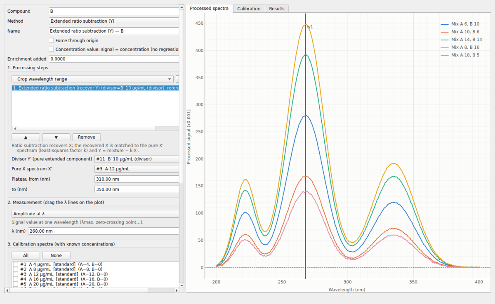

*Step 1 — the method set up in *Methods → Univariate calibration*: compound, template, processing steps (left) and the laboratory mixtures after processing with the measuring wavelength(s) marked (right).*

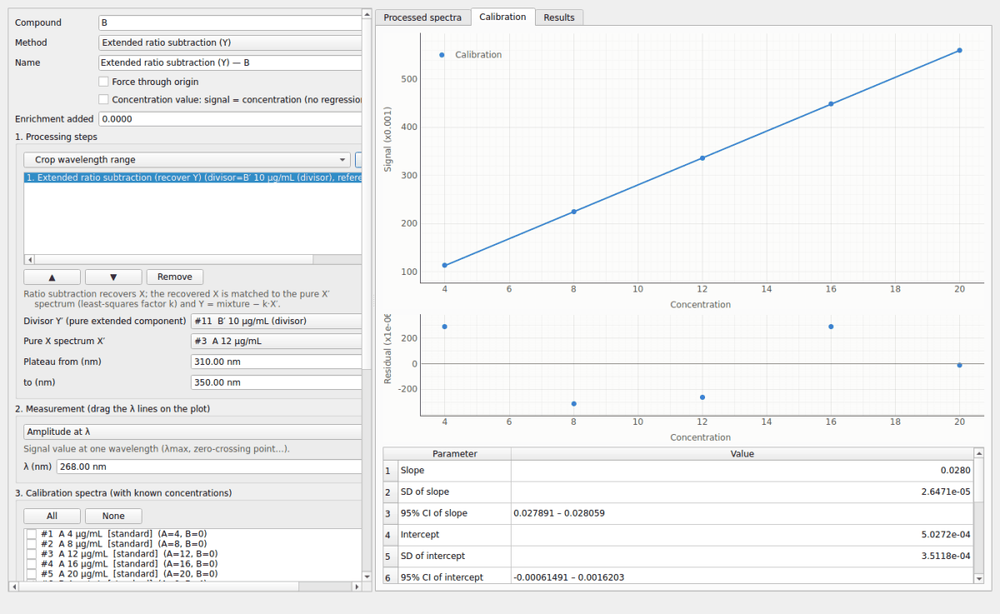

*Step 2 — *Calibrate*: the calibration line of the standards, its residuals and the regression statistics (slope, intercept, r, LOD, LOQ).*

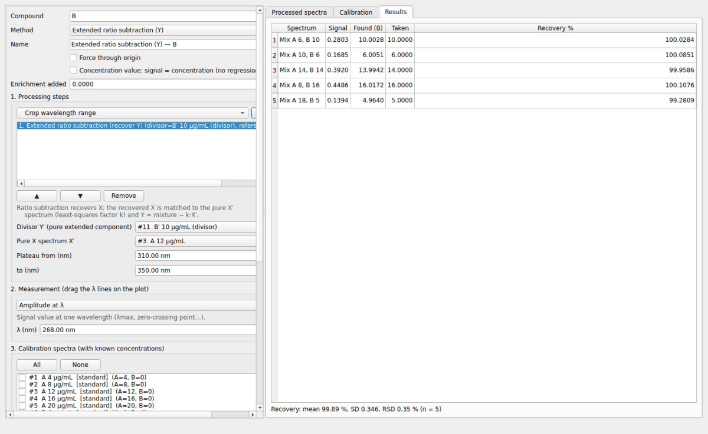

*Step 3 — *Determine*: found and taken concentrations and % recovery of each mixture, with mean and RSD.*

*Literature:* Lotfy et al., Spectrochim. Acta A 136 (2015) 937, doi:10.1016/j.saa.2014.09.117; Emam et al., Spectrochim. Acta A (2018), doi:10.1016/j.saa.2017.11.034

### Successive ratio subtraction (SRS, ternary)

**In plain words.** Remove the compounds one by one: first the most extended (U) with its plateau, then the next (V) with its own plateau; W's pure spectrum remains.

**Principle.** Ratio subtraction with the most extended component's divisor removes it; a second ratio subtraction with the next component's divisor (its own plateau) removes that one; the third component's spectrum remains.

**Use when.** Successive extension (U alone at long λ, V alone after U is removed).

**What you need.** Standards of W, divisors U′ and V′, mixtures.

**How to apply in Spectro**

1. Template *Successive ratio subtraction (ternary SRS, Z)*: first step divisor U′ with U's plateau, second step divisor V′ with V's plateau.
2. Read W at its λmax. Calibrate, determine.

**Checks and common mistakes.** Each plateau must be where only that compound remains.

**Worked example**

📊 **Sample data:** [data/srs.xlsx](data/srs.xlsx) — import it (see *Getting started → 4*) and reproduce the numbers below.

* Compound: W; template: *Successive ratio subtraction (ternary SRS, Z)*
* Step: Ratio subtraction (recover X) (divisor=U′, start=330, end=345, divisor_derivative=0, divisor_delta_lambda=4)
* Step: Ratio subtraction (recover X) (divisor=V′, start=278, end=290, divisor_derivative=0, divisor_delta_lambda=4)
* Measurement: Amplitude at λ — w1 = 246
* Calibration: slope 0.044938, intercept 0.000642, r = 1.00000 (n = 5)

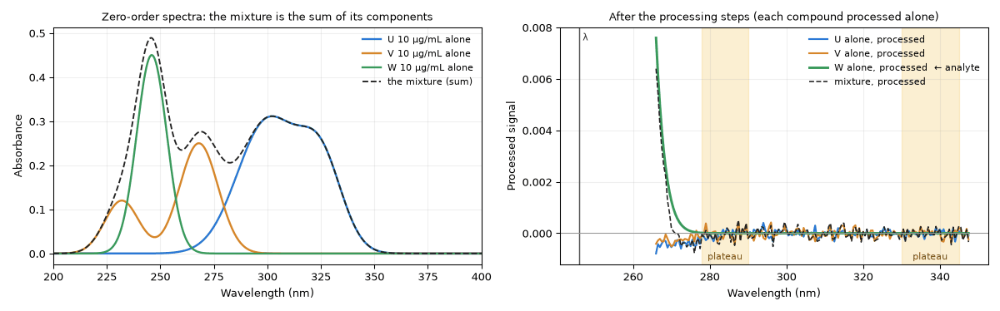

*Why it works — left: the spectra of the components and of the mixture (they overlap). Right: each component processed alone with the method's steps. At the marked wavelength(s) the processed U, V contribute nothing (≈ 0, or a constant that the measurement cancels), so the mixture's signal there belongs to W only.*

| Mixture | W found | W taken | Rec. % |
|---|---|---|---|
| Mix U 10, V 10, W 10 | 10.013 | 10 | 100.13 |
| Mix U 16, V 4, W 4 | 4.002 | 4 | 100.04 |
| Mix U 4, V 14, W 8 | 7.987 | 8 | 99.83 |
| Mix U 8, V 8, W 16 | 16.015 | 16 | 100.09 |
| Mix U 12, V 6, W 12 | 12.002 | 12 | 100.01 |

Result: W: mean recovery 100.02 %, RSD 0.12 %.

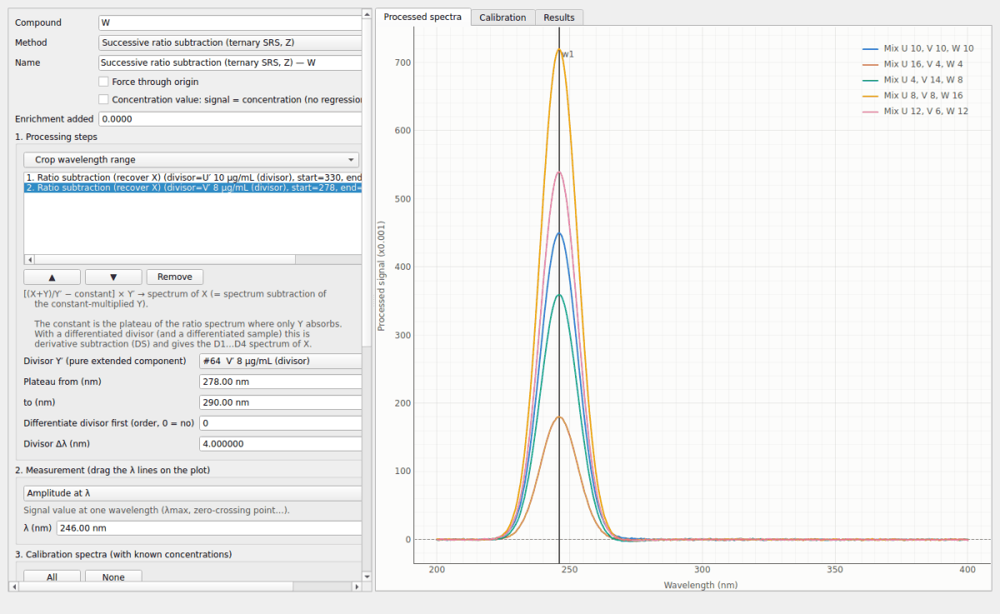

*Step 1 — the method set up in *Methods → Univariate calibration*: compound, template, processing steps (left) and the laboratory mixtures after processing with the measuring wavelength(s) marked (right).*

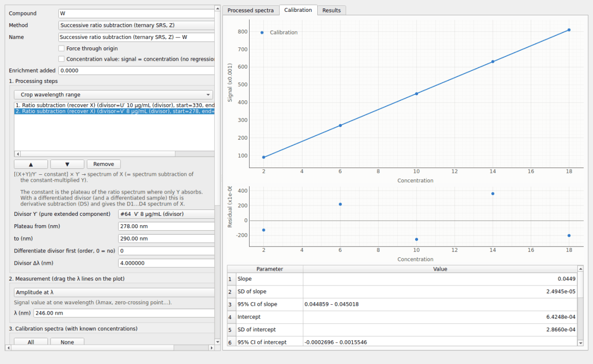

*Step 2 — *Calibrate*: the calibration line of the standards, its residuals and the regression statistics (slope, intercept, r, LOD, LOQ).*

*Step 3 — *Determine*: found and taken concentrations and % recovery of each mixture, with mean and RSD.*

*Literature:* Emam et al., Spectrochim. Acta A (2018), doi:10.1016/j.saa.2017.11.034

### Successive spectrum subtraction (ternary)

**In plain words.** Same as SRS but the first removal uses a single wavelength (spectrum subtraction) instead of a ratio plateau.

**Principle.** Spectrum subtraction (factor k from a wavelength where the first component absorbs alone) removes it; ratio subtraction then removes the second.

**Use when.** Successive extension.

**What you need.** Standards of W, references U′ and V′, mixtures.

**How to apply in Spectro**

1. Template *Successive spectrum subtraction (ternary)*: Spectrum subtraction with U′ at a λ where only U absorbs, then Ratio subtraction with V′ and V's plateau.
2. Read W at its λmax.

**Checks and common mistakes.** Use a wavelength (or range) where only U absorbs.

**Worked example**

📊 **Sample data:** [data/sss.xlsx](data/sss.xlsx) — import it (see *Getting started → 4*) and reproduce the numbers below.

* Compound: W; template: *Successive spectrum subtraction (ternary)*
* Step: Spectrum subtraction (reference=U′, wavelength=330, derivative_order=0, delta_lambda=4, wavelength_end=345)
* Step: Ratio subtraction (recover X) (divisor=V′, start=278, end=290, divisor_derivative=0, divisor_delta_lambda=4)
* Measurement: Amplitude at λ — w1 = 246
* Calibration: slope 0.044938, intercept 0.000642, r = 1.00000 (n = 5)

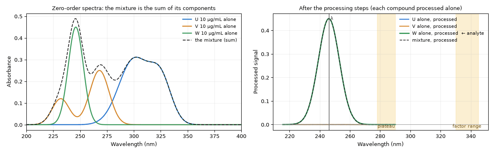

*Why it works — left: the spectra of the components and of the mixture (they overlap). Right: each component processed alone with the method's steps. At the marked wavelength(s) the processed U, V contribute nothing (≈ 0, or a constant that the measurement cancels), so the mixture's signal there belongs to W only.*

| Mixture | W found | W taken | Rec. % |
|---|---|---|---|
| Mix U 10, V 10, W 10 | 10.013 | 10 | 100.13 |
| Mix U 16, V 4, W 4 | 4.002 | 4 | 100.04 |
| Mix U 4, V 14, W 8 | 7.987 | 8 | 99.83 |
| Mix U 8, V 8, W 16 | 16.015 | 16 | 100.09 |
| Mix U 12, V 6, W 12 | 12.002 | 12 | 100.01 |

Result: W: mean recovery 100.02 %, RSD 0.12 %.

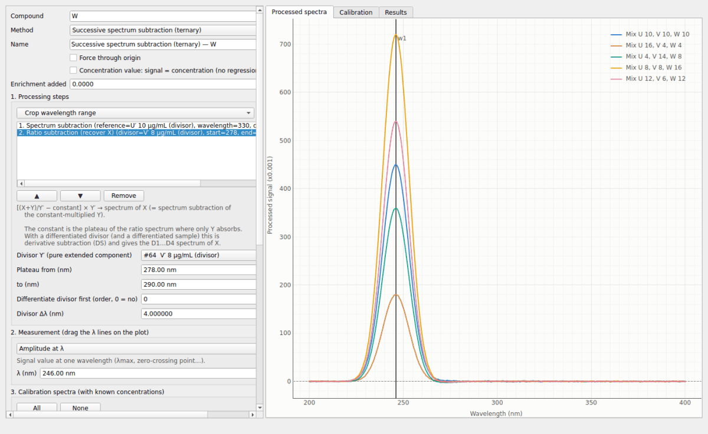

*Step 1 — the method set up in *Methods → Univariate calibration*: compound, template, processing steps (left) and the laboratory mixtures after processing with the measuring wavelength(s) marked (right).*

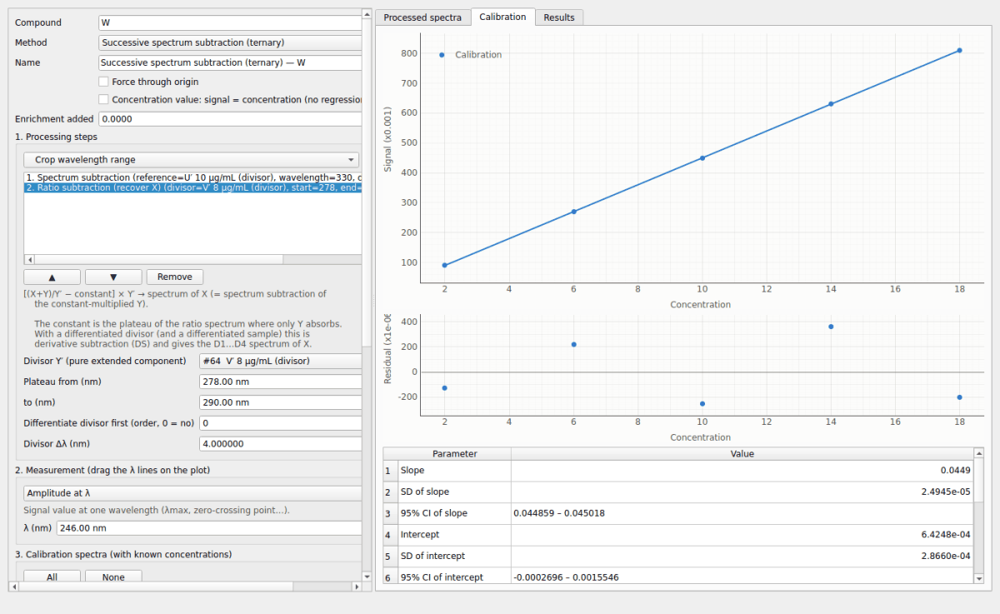

*Step 2 — *Calibrate*: the calibration line of the standards, its residuals and the regression statistics (slope, intercept, r, LOD, LOQ).*

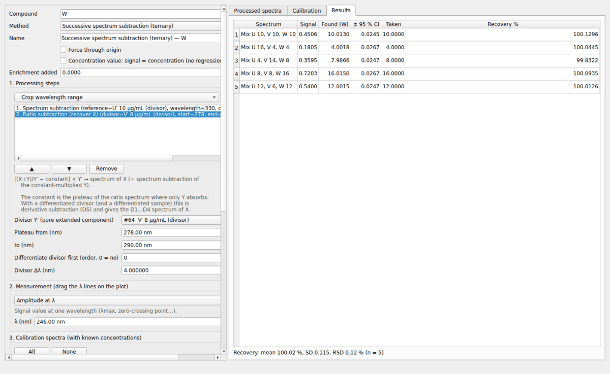

*Step 3 — *Determine*: found and taken concentrations and % recovery of each mixture, with mean and RSD.*

### Spectrum subtraction (SS)

**In plain words.** Scale the pure Y spectrum to match the mixture where only Y absorbs, then subtract it.

**Principle.** k = A_mixture(λ)/A_Y′(λ) at a wavelength (or plateau range) where only Y absorbs; mixture − k·Y′ = X.

**Use when.** Y absorbs alone at some wavelength.

**What you need.** Standards of X, a reference Y′, mixtures.

**How to apply in Spectro**

1. Template *Spectrum subtraction*: reference Y′, wavelength (and optionally *…to* for a range), derivative order 0. Read X at λmax.

**Checks and common mistakes.** A range (λ … to) averages noise better than a single wavelength.

**Worked example**

📊 **Sample data:** [data/ss.xlsx](data/ss.xlsx) — import it (see *Getting started → 4*) and reproduce the numbers below.

* Compound: A; template: *Spectrum subtraction*
* Step: Spectrum subtraction (reference=B′, wavelength=320, derivative_order=0, delta_lambda=4, wavelength_end=350)
* Measurement: Amplitude at λ — w1 = 245
* Calibration: slope 0.044956, intercept 0.000609, r = 1.00000 (n = 5)

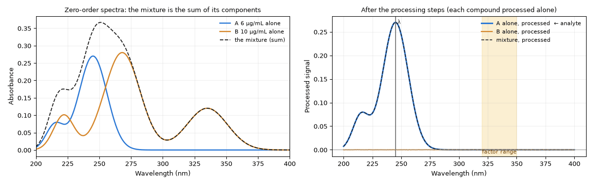

*Why it works — left: the spectra of the components and of the mixture (they overlap). Right: each component processed alone with the method's steps. At the marked wavelength(s) the processed B contribute nothing (≈ 0, or a constant that the measurement cancels), so the mixture's signal there belongs to A only.*

| Mixture | A found | A taken | Rec. % |
|---|---|---|---|
| Mix A 6, B 10 | 5.996 | 6 | 99.94 |
| Mix A 10, B 6 | 10.009 | 10 | 100.09 |
| Mix A 14, B 14 | 13.988 | 14 | 99.92 |
| Mix A 8, B 16 | 8.005 | 8 | 100.06 |
| Mix A 18, B 5 | 18.000 | 18 | 100.00 |

Result: A: mean recovery 100.00 %, RSD 0.07 %.

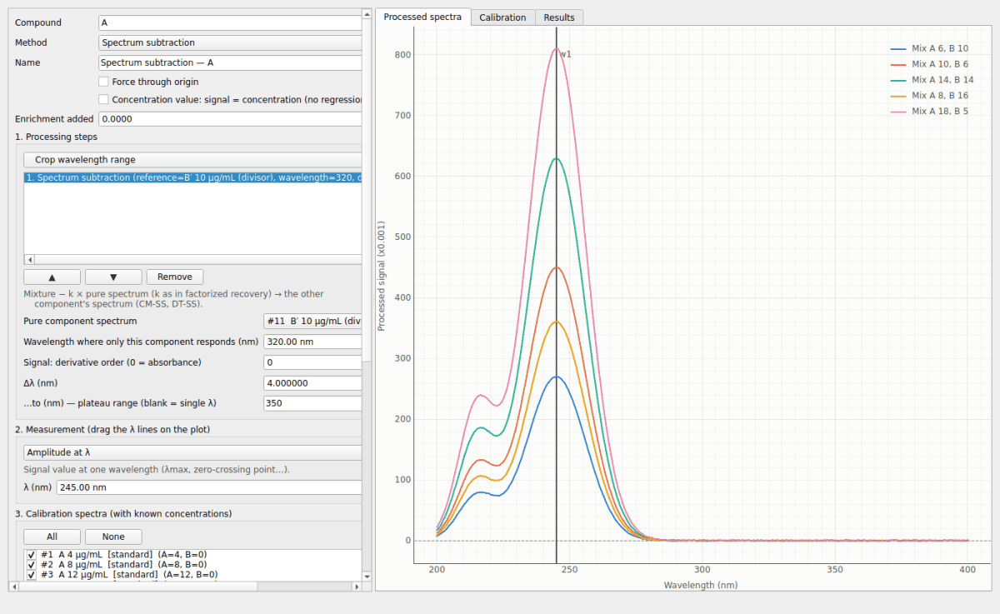

*Step 1 — the method set up in *Methods → Univariate calibration*: compound, template, processing steps (left) and the laboratory mixtures after processing with the measuring wavelength(s) marked (right).*

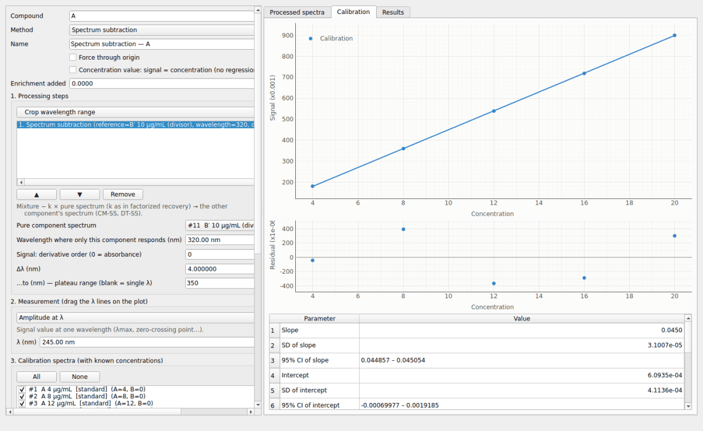

*Step 2 — *Calibrate*: the calibration line of the standards, its residuals and the regression statistics (slope, intercept, r, LOD, LOQ).*

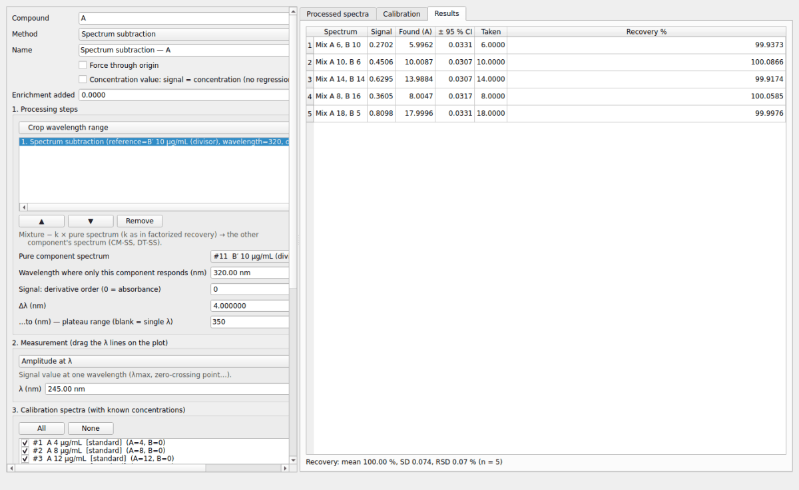

*Step 3 — *Determine*: found and taken concentrations and % recovery of each mixture, with mean and RSD.*

### Factorized zero-order method (FZM)

**In plain words.** Use a derivative zero-crossing to find how much X is in the mixture, then scale X's pure spectrum by that amount: you get X's whole zero-order spectrum.

**Principle.** k from the D1 amplitude at a zero-crossing of the other component: k = D1_mixture(λ)/D1_X′(λ); k·X′ is X's zero-order spectrum, read at its λmax.

**Use when.** The other component's derivative crosses zero where X's is large.

**What you need.** Standards of X, a pure X reference, mixtures.

**How to apply in Spectro**

1. Template *Factorized zero-order (FZM)*: reference X′, wavelength = zero-crossing of Y's D1, derivative order 1. Read X at λmax.

**Checks and common mistakes.** Gives the same number as zero-crossing D1, plus the recovered spectrum.

**Worked example**

📊 **Sample data:** [data/fzm.xlsx](data/fzm.xlsx) — import it (see *Getting started → 4*) and reproduce the numbers below.

* Compound: A; template: *Factorized zero-order (FZM)*
* Step: Factorized spectrum / derivative transformation (reference=A 12, wavelength=237.2, derivative_order=1, delta_lambda=4)
* Measurement: Amplitude at λ — w1 = 245
* Calibration: slope 0.045138, intercept -0.00206, r = 0.99996 (n = 5)
* λ = 237.2 nm, zero-crossing of B's D1 (finder).

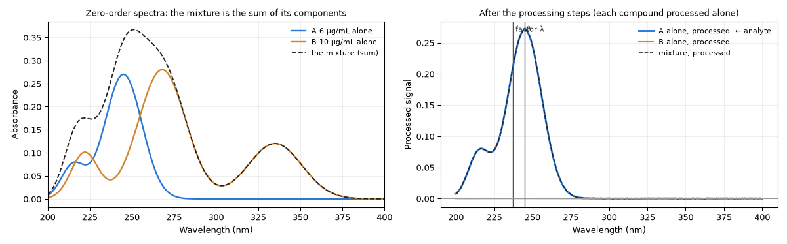

*Why it works — left: the spectra of the components and of the mixture (they overlap). Right: each component processed alone with the method's steps. At the marked wavelength(s) the processed B contribute nothing (≈ 0, or a constant that the measurement cancels), so the mixture's signal there belongs to A only.*

| Mixture | A found | A taken | Rec. % |
|---|---|---|---|
| Mix A 6, B 10 | 6.032 | 6 | 100.53 |
| Mix A 10, B 6 | 10.068 | 10 | 100.68 |
| Mix A 14, B 14 | 14.033 | 14 | 100.23 |
| Mix A 8, B 16 | 8.080 | 8 | 101.00 |
| Mix A 18, B 5 | 18.034 | 18 | 100.19 |

Result: A: mean recovery 100.53 %, RSD 0.33 %.

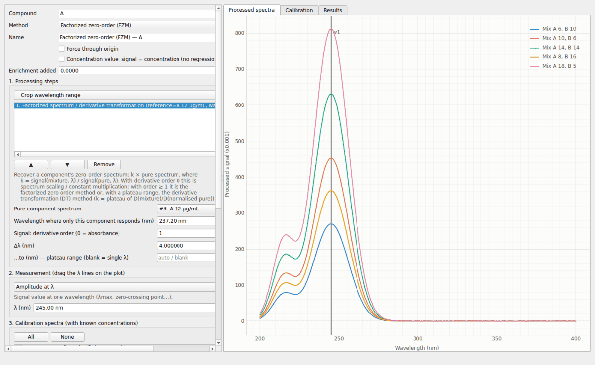

*Step 1 — the method set up in *Methods → Univariate calibration*: compound, template, processing steps (left) and the laboratory mixtures after processing with the measuring wavelength(s) marked (right).*

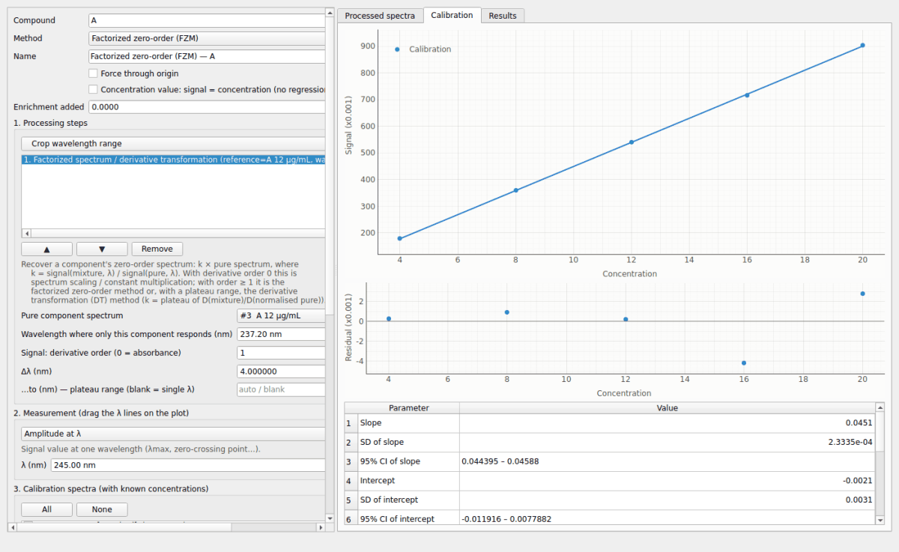

*Step 2 — *Calibrate*: the calibration line of the standards, its residuals and the regression statistics (slope, intercept, r, LOD, LOQ).*

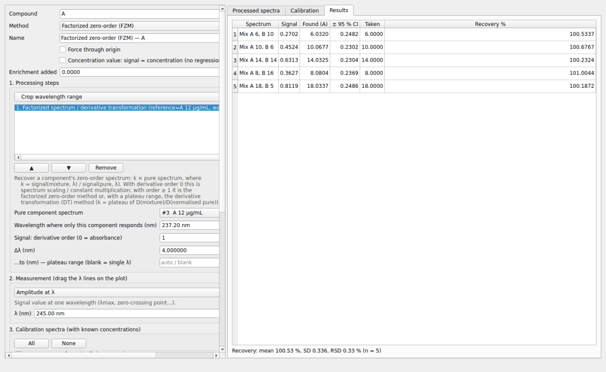

*Step 3 — *Determine*: found and taken concentrations and % recovery of each mixture, with mean and RSD.*

### Constant center (CC)

**In plain words.** In mixture ÷ Y′, X's ratio spectrum has a known shape; comparing two points reveals the hidden constant of Y without needing a plateau.

**Principle.** For X the ratio r = P_X(λ1)/P_X(λ2) of X/Y′ is constant, so the constant of Y is k = P2 − (P1 − P2)/(r − 1); (P − k)·Y′ = X, k·Y′ = Y.

**Use when.** No plateau needed; X's ratio spectrum has different amplitudes at λ1 and λ2.

**What you need.** Standards of X, a divisor Y′, a pure X reference, mixtures.

**How to apply in Spectro**

1. Template *Constant center*: divisor Y′, pure X′, λ1, λ2, recover X (or Y).
2. Read the recovered component at its λmax.

**Checks and common mistakes.** λ1 and λ2 must give clearly different X ratio amplitudes.

**Worked example**

📊 **Sample data:** [data/cc.xlsx](data/cc.xlsx) — import it (see *Getting started → 4*) and reproduce the numbers below.

* Compound: A; template: *Constant center*
* Step: Constant center (recover X or Y) (divisor=B′, reference=A 12, w1=240, w2=255, target=X)
* Measurement: Amplitude at λ — w1 = 245
* Calibration: slope 0.044957, intercept 0.00063, r = 1.00000 (n = 5)

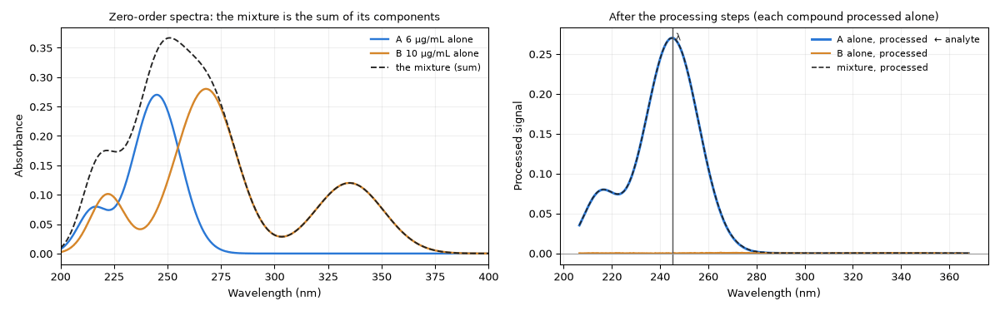

*Why it works — left: the spectra of the components and of the mixture (they overlap). Right: each component processed alone with the method's steps. At the marked wavelength(s) the processed B contribute nothing (≈ 0, or a constant that the measurement cancels), so the mixture's signal there belongs to A only.*

| Mixture | A found | A taken | Rec. % |
|---|---|---|---|
| Mix A 6, B 10 | 6.000 | 6 | 100.00 |
| Mix A 10, B 6 | 10.007 | 10 | 100.07 |
| Mix A 14, B 14 | 13.995 | 14 | 99.97 |
| Mix A 8, B 16 | 8.002 | 8 | 100.03 |
| Mix A 18, B 5 | 17.999 | 18 | 100.00 |

Result: A: mean recovery 100.01 %, RSD 0.04 %.

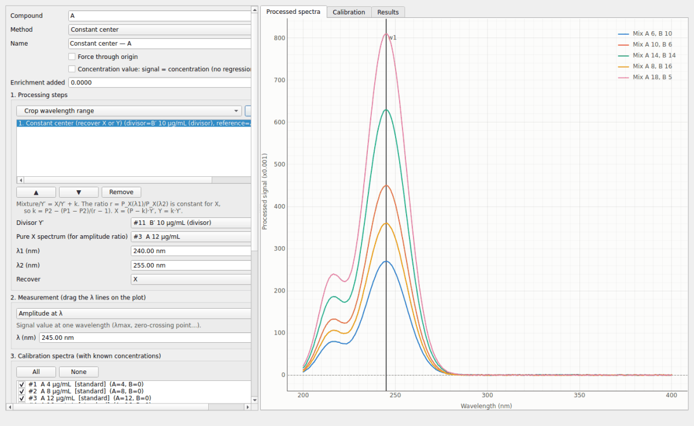

*Step 1 — the method set up in *Methods → Univariate calibration*: compound, template, processing steps (left) and the laboratory mixtures after processing with the measuring wavelength(s) marked (right).*

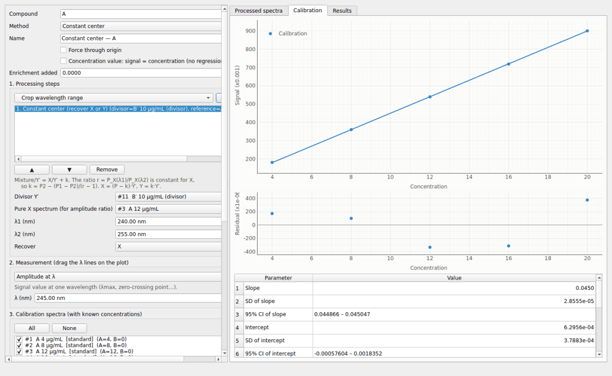

*Step 2 — *Calibrate*: the calibration line of the standards, its residuals and the regression statistics (slope, intercept, r, LOD, LOQ).*

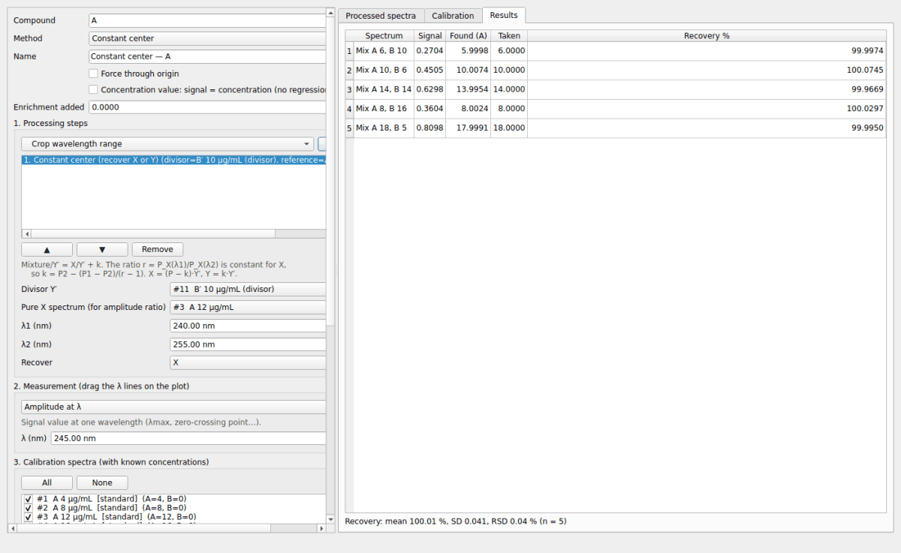

*Step 3 — *Determine*: found and taken concentrations and % recovery of each mixture, with mean and RSD.*

*Literature:* Lotfy et al., Spectrochim. Acta A 136 (2015) 937, doi:10.1016/j.saa.2014.09.117

### Derivative transformation (DT, DT-SS)

**In plain words.** In derivative spectra the interferent is flat (zero) in a region where Y still changes; the ratio there gives Y's amount, which rebuilds Y's zero-order spectrum.

**Principle.** In the D1 spectra the interferent is flat (D1 = 0) over a region where Y's D1 is not: the mean of D1(mixture)/D1(Y′) there is k; k·Y′ (zero order) is Y's spectrum; mixture − k·Y′ (DT-SS) is the other's.

**Use when.** The interferent is flat (or zero) over a region where Y still changes.

**What you need.** Standards of Y, a reference Y′, mixtures.

**How to apply in Spectro**

1. Template *Derivative transformation (DT, recover zero order)*: reference Y′, wavelength and *…to* = the plateau of the D1 ratio, derivative order 1.
2. Read Y at its λmax (zero order).

**Checks and common mistakes.** Choose the region where the interferent's derivative is zero.

**Worked example**

📊 **Sample data:** [data/dt.xlsx](data/dt.xlsx) — import it (see *Getting started → 4*) and reproduce the numbers below.

* Compound: B; template: *Derivative transformation (DT, recover zero order)*
* Step: Factorized spectrum / derivative transformation (reference=B′, wavelength=305, derivative_order=1, delta_lambda=4, wavelength_end=320)
* Measurement: Amplitude at λ — w1 = 268
* Calibration: slope 0.028195, intercept -0.000743, r = 0.99993 (n = 5)
* A's D1 is zero above 300 nm, B's is not: 305–320 nm.

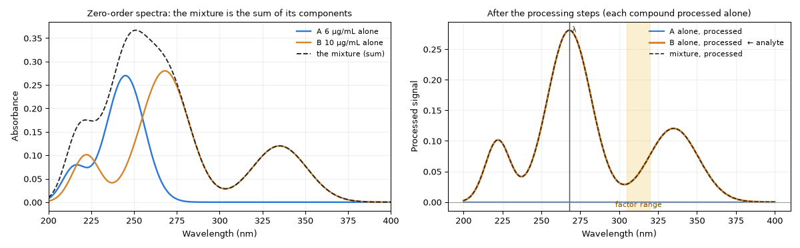

*Why it works — left: the spectra of the components and of the mixture (they overlap). Right: each component processed alone with the method's steps. At the marked wavelength(s) the processed A contribute nothing (≈ 0, or a constant that the measurement cancels), so the mixture's signal there belongs to B only.*

| Mixture | B found | B taken | Rec. % |
|---|---|---|---|
| Mix A 6, B 10 | 10.002 | 10 | 100.02 |
| Mix A 10, B 6 | 6.080 | 6 | 101.33 |
| Mix A 14, B 14 | 13.906 | 14 | 99.33 |
| Mix A 8, B 16 | 15.941 | 16 | 99.63 |
| Mix A 18, B 5 | 5.004 | 5 | 100.08 |

Result: B: mean recovery 100.08 %, RSD 0.76 %.

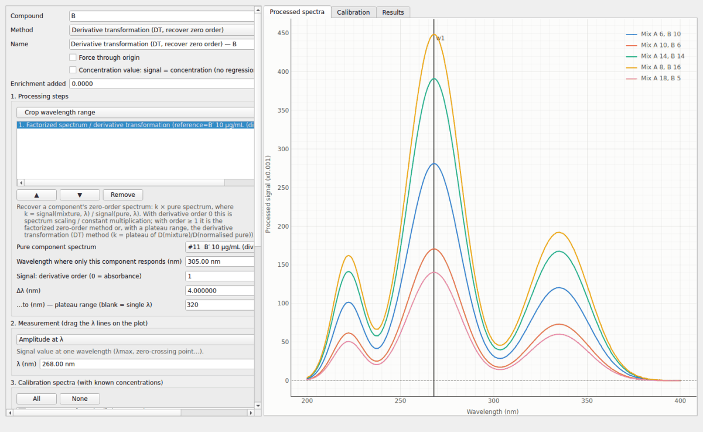

*Step 1 — the method set up in *Methods → Univariate calibration*: compound, template, processing steps (left) and the laboratory mixtures after processing with the measuring wavelength(s) marked (right).*

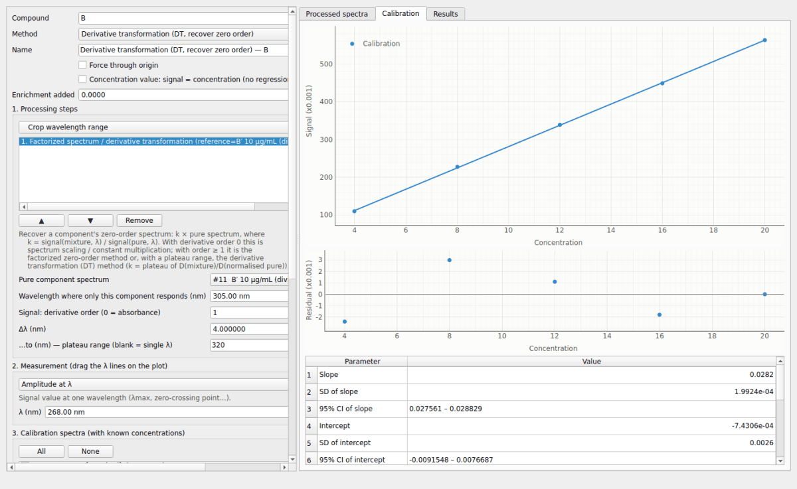

*Step 2 — *Calibrate*: the calibration line of the standards, its residuals and the regression statistics (slope, intercept, r, LOD, LOQ).*

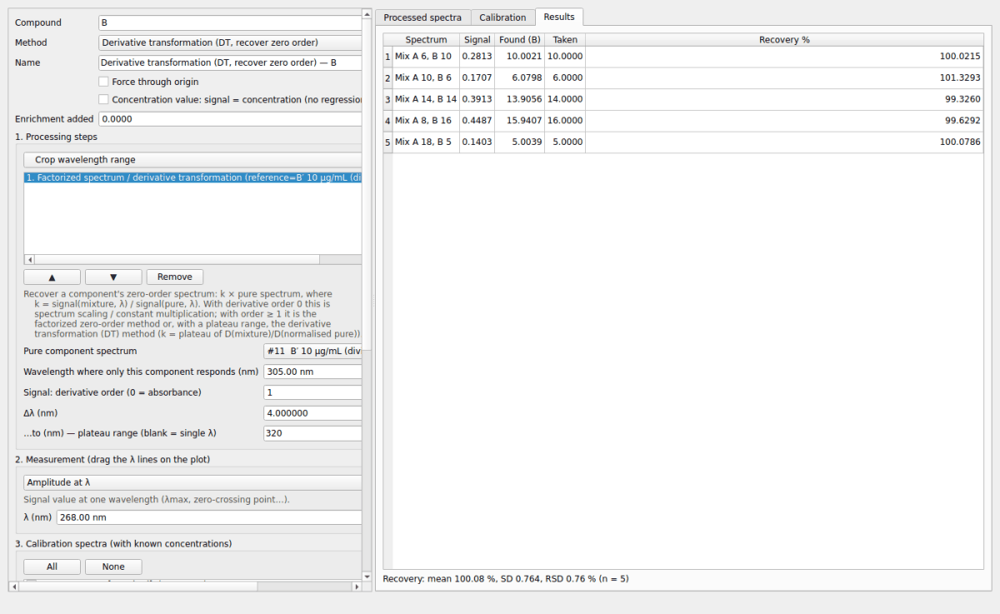

*Step 3 — *Determine*: found and taken concentrations and % recovery of each mixture, with mean and RSD.*

*Literature:* Fahmy et al., Spectrochim. Acta A 261 (2021) 119999, doi:10.1016/j.saa.2021.119999

### Derivative subtraction (DS) and DS-CM

**In plain words.** Ratio subtraction and constant multiplication done on derivative spectra — useful when the zero-order plateau is too small or noisy.

**Principle.** Ratio subtraction / constant multiplication in the D1 domain: D1 of the mixture ÷ D1 of Y′ has a plateau where only Y's D1 is non-zero; DS gives X's D1 spectrum, DS-CM gives Y's.

**Use when.** Useful when the zero-order plateau is noisy (small extension).

**What you need.** Standards, a divisor, mixtures.

**How to apply in Spectro**

1. Template *Derivative subtraction (DS, X in D1)* or *…(DS-CM, Y in D1)*: Derivative, then Ratio subtraction / Constant multiplication with *Differentiate divisor first* = 1 and the D1 plateau.
2. Read the component's D1 at a peak. Calibrate, determine.

**Checks and common mistakes.** The divisor is differentiated automatically ('Differentiate divisor first').

**Worked example**

📊 **Sample data:** [data/ds.xlsx](data/ds.xlsx) — import it (see *Getting started → 4*) and reproduce the numbers below.

* Compound: B; template: *Derivative subtraction–constant multiplication (DS-CM, Y in D1)*
* Step: Derivative (D1–D4) (order=1, method=difference, delta_lambda=4, window=11, polyorder=3, scaling=10)
* Step: Constant multiplication (recover Y) (divisor=B′, start=305, end=320, divisor_derivative=1, divisor_delta_lambda=4)
* Measurement: Amplitude at λ — w1 = 312
* Calibration: slope 0.003352, intercept -8.83e-05, r = 0.99993 (n = 5)
* DS-CM shown (B's D1 spectrum recovered); the DS template gives A's D1 spectrum the same way.

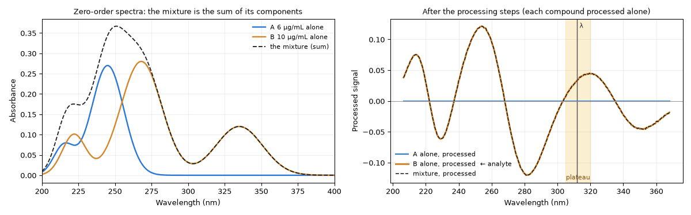

*Why it works — left: the spectra of the components and of the mixture (they overlap). Right: each component processed alone with the method's steps. At the marked wavelength(s) the processed A contribute nothing (≈ 0, or a constant that the measurement cancels), so the mixture's signal there belongs to B only.*

| Mixture | B found | B taken | Rec. % |
|---|---|---|---|
| Mix A 6, B 10 | 10.002 | 10 | 100.02 |
| Mix A 10, B 6 | 6.080 | 6 | 101.33 |
| Mix A 14, B 14 | 13.906 | 14 | 99.33 |
| Mix A 8, B 16 | 15.941 | 16 | 99.63 |
| Mix A 18, B 5 | 5.004 | 5 | 100.08 |

Result: B: mean recovery 100.08 %, RSD 0.76 %.

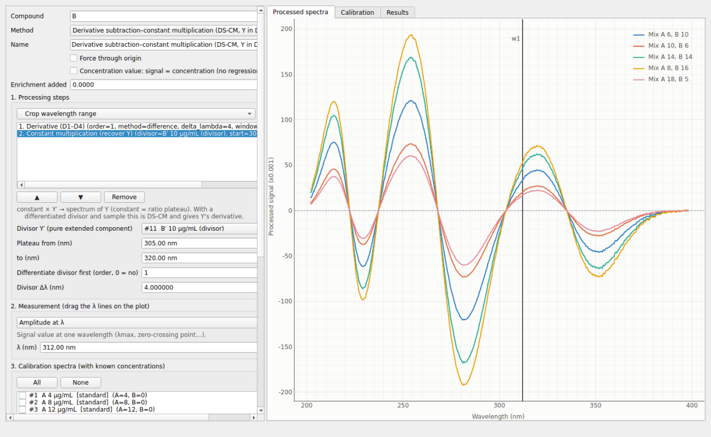

*Step 1 — the method set up in *Methods → Univariate calibration*: compound, template, processing steps (left) and the laboratory mixtures after processing with the measuring wavelength(s) marked (right).*

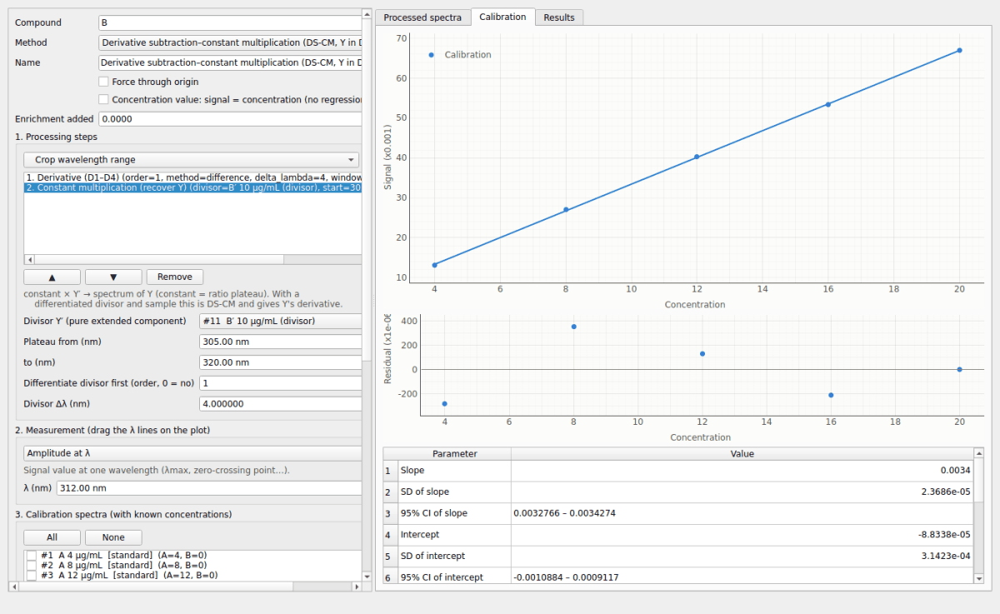

*Step 2 — *Calibrate*: the calibration line of the standards, its residuals and the regression statistics (slope, intercept, r, LOD, LOQ).*

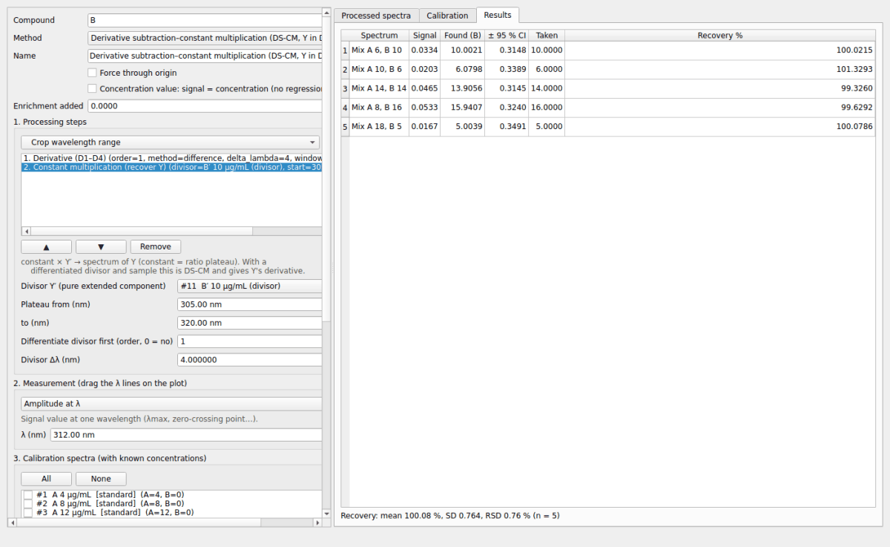

*Step 3 — *Determine*: found and taken concentrations and % recovery of each mixture, with mean and RSD.*

*Literature:* Zaghary et al., J. Anal. Chem. 75 (2020) 742, doi:10.1134/S1061934820060180; Lotfy et al., Spectrochim. Acta A 136 (2015) 937, doi:10.1016/j.saa.2014.09.117

## Multivariate calibration (chemometrics)

Calibrate on whole spectra of mixtures (or pure spectra) and predict all compounds at once.

### Chemometrics: CLS, ILS, PCR, PLS, MCR-ALS, ANN, SVR

**In plain words.** Instead of choosing wavelengths, a statistical model learns from many mixtures of known composition how the whole spectrum depends on each concentration.

**Principle.** Calibration on whole spectra. CLS uses pure spectra (K matrix); ILS/PCR/PLS regress concentrations on spectra of a mixture training set; MCR-ALS resolves pure profiles; ANN and SVR model non-linearity.

**Use when.** Severe overlap, three or more compounds, or when univariate methods fail. Needs a designed training set (Tools → Calibration design, e.g. Brereton 5-level).

**What you need.** A training set of 15–25 mixtures (a calibration design), validation mixtures.

**How to apply in Spectro**

1. Tools → Calibration design to plan the training mixtures; import them with role *calibration*.
2. Methods → Chemometrics: model type, wavelength range, preprocessing.
3. *Cross-validate* (number of components is suggested), *Fit + predict* the validation mixtures; check T²/Q outliers; *Save method*.

**Checks and common mistakes.** Cross-validate to choose the number of components; check RMSEP and recoveries of mixtures NOT used for training; look at the T²/Q outlier plot.

**Worked example**

📊 **Sample data:** [data/chemo.xlsx](data/chemo.xlsx) — import it (see *Getting started → 4*) and reproduce the numbers below.

* Training set: 25-mixture Brereton design (Tools → Calibration design), 220–390 nm; validation: the 5 laboratory mixtures

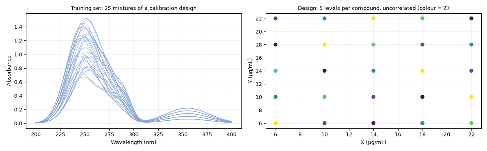

*Why it works — the model learns from many mixtures whose composition varies independently for each compound how the WHOLE spectrum changes with each concentration; it then predicts all compounds of a new spectrum at once.*

| Model | X recovery % | Y recovery % | Z recovery % |
|---|---|---|---|
| CLS | 100.00 ± 0.01 | 100.01 ± 0.08 | 100.00 ± 0.03 |
| ILS | 100.01 ± 0.08 | 99.97 ± 0.23 | 100.00 ± 0.11 |
| PCR (3 components) | 100.00 ± 0.01 | 100.01 ± 0.08 | 100.00 ± 0.03 |
| PLS2 (3 components) | 100.00 ± 0.01 | 100.01 ± 0.08 | 100.00 ± 0.03 |
| MCR-ALS | 99.98 ± 0.05 | 100.00 ± 0.17 | 100.03 ± 0.04 |
| ANN | 99.90 ± 0.57 | 99.91 ± 0.61 | 99.85 ± 0.43 |
| SVR | 100.07 ± 0.35 | 100.17 ± 0.44 | 100.29 ± 0.38 |

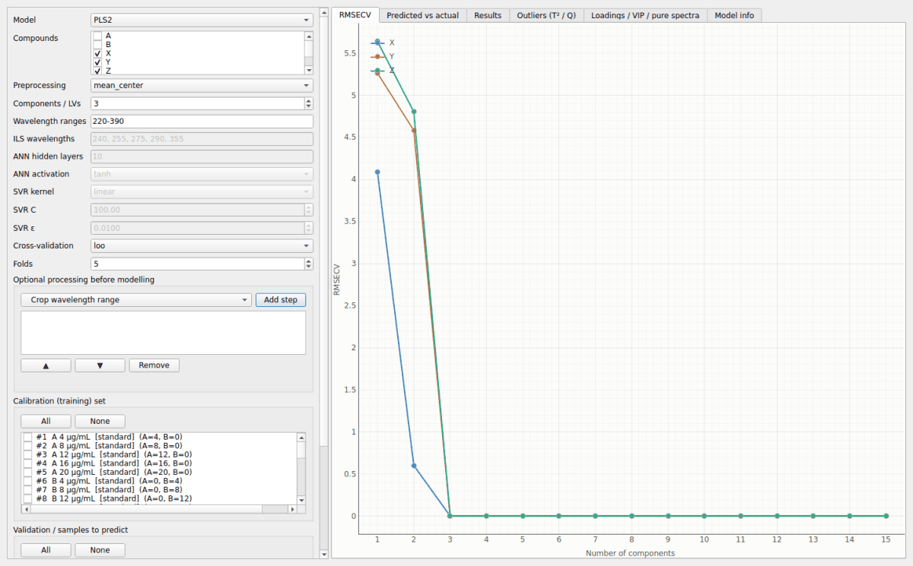

*Step 1 — *Cross-validate* (PLS2): RMSECV against the number of components for each compound; the suggested number is set automatically.*

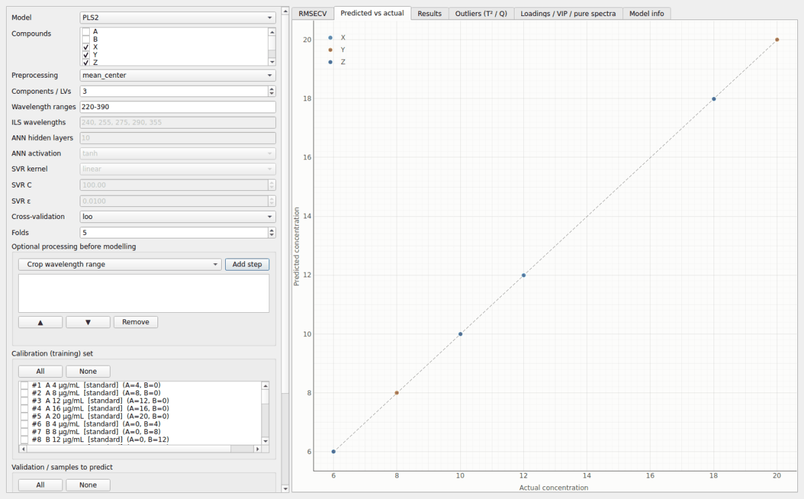

*Step 2 — *Fit + predict*: predicted vs actual concentrations of the validation mixtures, with RMSEP and recoveries.*

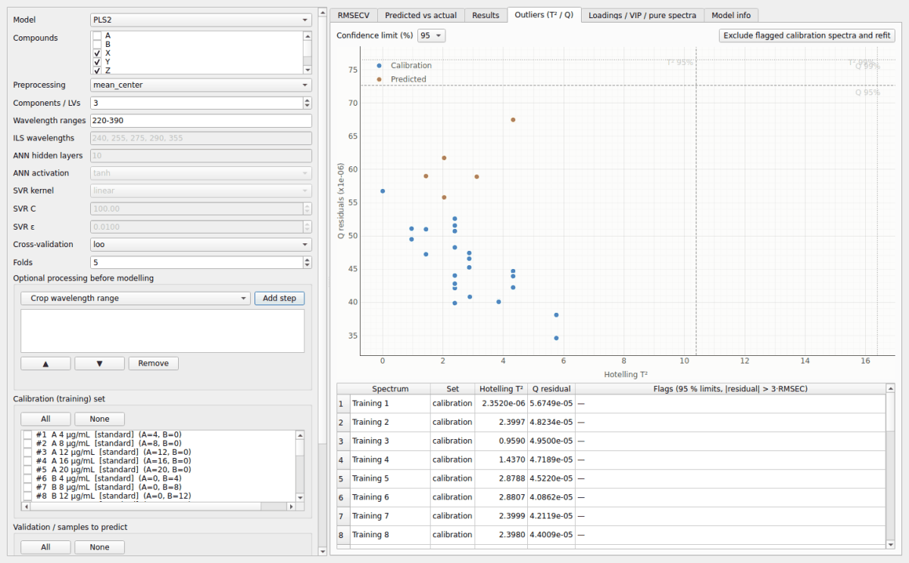

*Step 3 — outlier check: Hotelling T² vs Q residuals with 95/99 % limits; flagged spectra can be excluded with one click.*

*Literature:* Saleh et al., Int. J. Pharm. Pharm. Sci. 9 (2017) 43, doi:10.22159/ijpps.2017v9i5.16960

## Standard addition and sample enrichment

Add known amounts of analyte to the sample (physically or by adding a stored spectrum) to check or correct for the matrix, or to lift a minor component into its linear range.

### Standard addition (recovery in the matrix)

**In plain words.** Add known amounts of the pure analyte to the real sample and check you find exactly that much more — this proves excipients do not interfere.

**Principle.** Known amounts of pure analyte are added to the sample; the found − unspiked amount divided by the added amount is the recovery; the x-intercept of found vs added is the sample content.

**Use when.** Check accuracy in a real matrix (excipients) with any calibrated method.

**What you need.** The sample alone and the sample with 2–3 additions; a calibrated method.

**How to apply in Spectro**

1. Univariate calibration with a calibrated method; import the unspiked and spiked samples with the analyte concentration = amount ADDED (0 for the unspiked).
2. Check them in *Spectra to determine* → *Standard addition…*.

**Checks and common mistakes.** Recoveries of the added amounts should be 98–102 %.

**Worked example**

📊 **Sample data:** [data/stdadd.xlsx](data/stdadd.xlsx) — import it (see *Getting started → 4*) and reproduce the numbers below.

* Method: ratio difference for A (÷ B′, 245 − 275 nm)
* A in the sample: 5.982 µg/mL (true 6); extrapolated 5.979

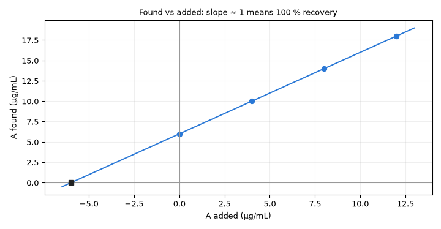

*Why it works — each addition should raise the found amount by exactly the amount added (slope 1); the line crosses zero at minus the amount already in the sample.*

| Spectrum | A added | Found | Recovered | Recovery % |
|---|---|---|---|---|
| Sample + 0 A | 0 | 5.982 |  |  |
| Sample + 4 A | 4 | 9.995 | 4.013 | 100.33 |
| Sample + 8 A | 8 | 13.994 | 8.012 | 100.15 |
| Sample + 12 A | 12 | 17.997 | 12.015 | 100.12 |

Result: Mean recovery of the additions 100.20 %.

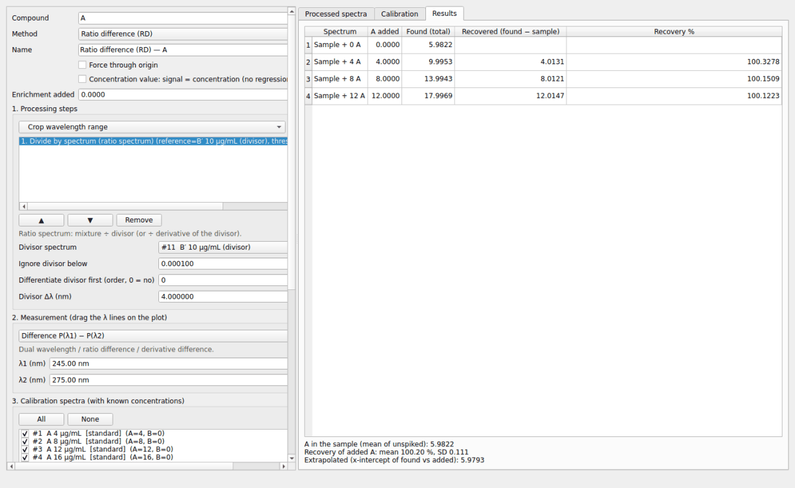

**Standard addition…* in the Univariate dialog with a calibrated method: each spiked sample, the amount recovered and its recovery.*

### H-point standard addition (HPSAM)

**In plain words.** Plot the response vs amount added at two wavelengths where the interferent is equal: the two lines cross at a point whose position gives the analyte concentration, free of the interferent.

**Principle.** Standard additions of X measured at λ1 and λ2 where Y has equal absorbance; the two addition lines meet at H(−C_X, A_Y): the analyte concentration free of the interferent and the matrix.

**Use when.** Binary; Y has two wavelengths with equal absorbance.

**What you need.** The sample with 3–4 standard additions of the analyte.

**How to apply in Spectro**

1. Binary two-signal methods → *Standard addition: H-point*: analyte, λ1, λ2.
2. Check the sample and its additions (X concentration = amount added) → *Calculate*.

**Checks and common mistakes.** The two lines must have clearly different slopes.

**Worked example**

📊 **Sample data:** [data/hpsam.xlsx](data/hpsam.xlsx) — import it (see *Getting started → 4*) and reproduce the numbers below.

* Sample: A 6 µg/mL + B 12 µg/mL; additions of A: 0, 4, 8, 12 µg/mL
* λ1 = 245 nm, λ2 = 215.8 nm (B equal, finder)

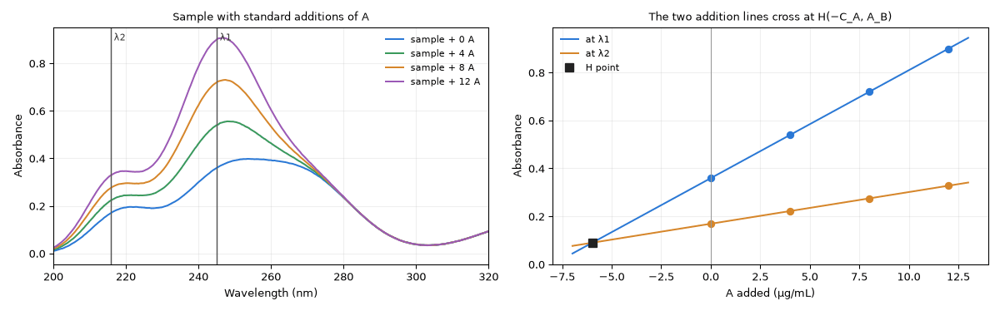

*Why it works — B absorbs the same at λ1 and λ2, so it shifts both lines by the same amount; the lines therefore cross at the x-value −C_A, whatever B's concentration.*

| Quantity | Value |
|---|---|
| A found (−C_H) | 5.980 µg/mL (true 6) |
| Recovery | 99.66 % |
| A_H (interferent B signal) | 0.0899 |

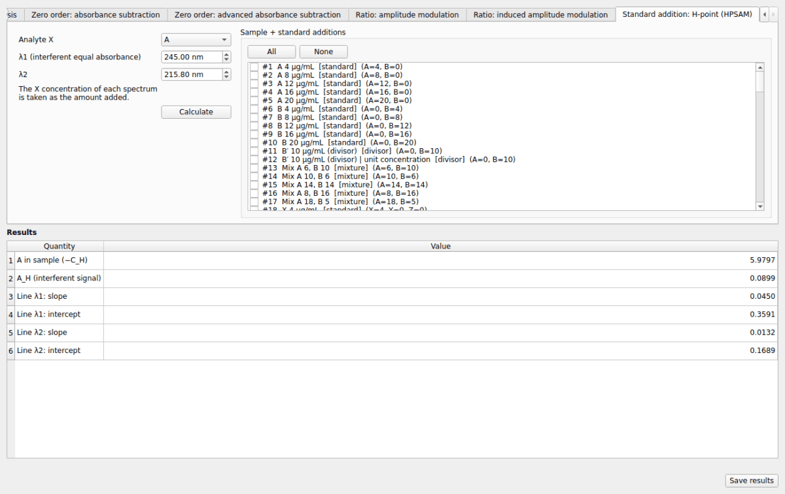

**Binary two-signal methods → Standard addition: H-point*: analyte, λ1, λ2 and the sample with its additions (A concentration = amount added).*

### Sample enrichment: spiking and spectrum addition

**In plain words.** When one component is far below its linear range, add a known amount of it, measure, and subtract the amount added.

**Principle.** A minor component below its linear range is raised by adding a known amount of pure standard (spiking) or by adding the stored spectrum of a standard (spectrum addition); the added amount is subtracted from the result.

**Use when.** Dosage forms with a very unequal ratio (e.g. 20 : 1).

**What you need.** Standards, the sample spiked with a known amount of the minor component.

**How to apply in Spectro**

1. Spiking: Univariate calibration → *Enrichment added* = amount added → the results get a *Found − added* column.
2. Spectrum addition: Process → *Add spectrum* (a stored standard) on the sample, then determine and subtract the added amount.

**Checks and common mistakes.** Report the content after subtracting the added amount.

**Worked example**

📊 **Sample data:** [data/enrich.xlsx](data/enrich.xlsx) — import it (see *Getting started → 4*) and reproduce the numbers below.

* Compound: B; template: *Constant multiplication / SS-CM (extended Y)*
* Step: Constant multiplication (recover Y) (divisor=B′, start=310, end=350, divisor_derivative=0, divisor_delta_lambda=4)
* Measurement: Amplitude at λ — w1 = 268
* Calibration: slope 0.028034, intercept -0.000251, r = 1.00000 (n = 5)
* Sample A 20 + B 1 µg/mL (ratio 20 : 1, B below its range) spiked with 5 µg/mL B; 'Found − added' is the B content (true 1 µg/mL).

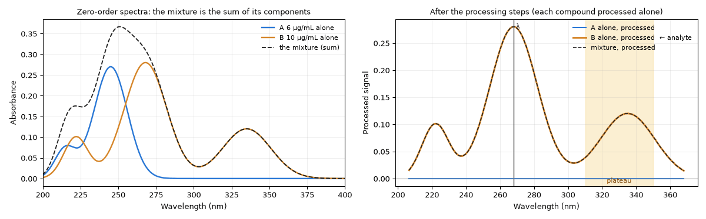

*Why it works — left: the spectra of the components and of the mixture (they overlap). Right: each component processed alone with the method's steps. At the marked wavelength(s) the processed A contribute nothing (≈ 0, or a constant that the measurement cancels), so the mixture's signal there belongs to B only.*

| Mixture | B found | B taken | Rec. % | Found − added |
|---|---|---|---|---|
| Tablet 20:1 + 5 B (1) | 6.009 | 6 | 100.14 | 1.009 |
| Tablet 20:1 + 5 B (2) | 6.010 | 6 | 100.16 | 1.010 |
| Tablet 20:1 + 5 B (3) | 6.015 | 6 | 100.25 | 1.015 |

Result: B: mean recovery 100.18 %, RSD 0.05 %.

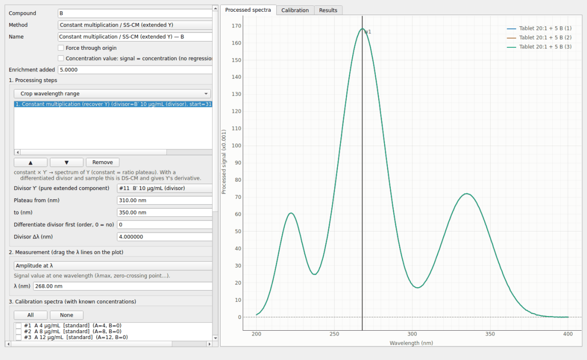

*Step 1 — the method set up in *Methods → Univariate calibration*: compound, template, processing steps (left) and the laboratory mixtures after processing with the measuring wavelength(s) marked (right).*

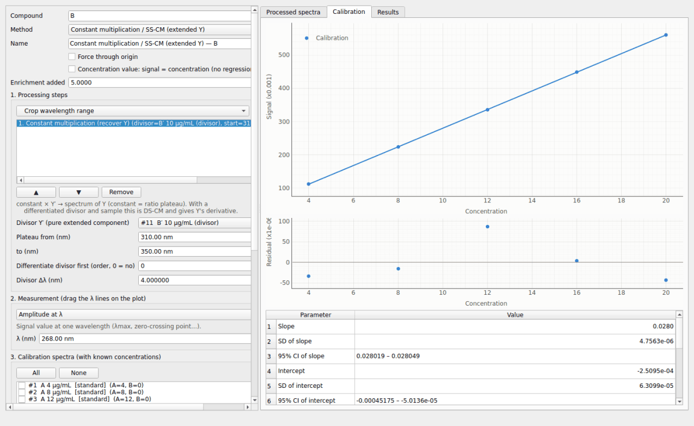

*Step 2 — *Calibrate*: the calibration line of the standards, its residuals and the regression statistics (slope, intercept, r, LOD, LOQ).*

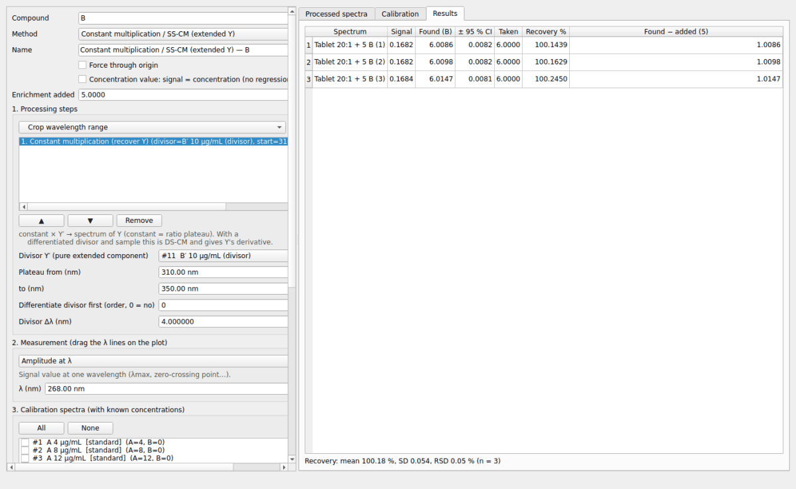

*Step 3 — *Determine*: found and taken concentrations and % recovery of each mixture, with mean and RSD.*

*Literature:* Zaghary et al., J. Anal. Chem. 75 (2020) 742, doi:10.1134/S1061934820060180; Lotfy et al., Spectrochim. Acta A 136 (2015) 937, doi:10.1016/j.saa.2014.09.117; Fahmy et al., Spectrochim. Acta A 261 (2021) 119999, doi:10.1016/j.saa.2021.119999
