# Spectro — workflows

Generated by `python tools/workflow_screenshots.py` on the demo project (simulated spectra with realistic noise).

## 1. Import from any instrument, Excel or CSV

**Benefit:** one dialog reads text/CSV (any delimiter, decimal comma), Excel, JCAMP-DX and SPC exports; layout and names are detected and concentrations are filled from sample names — no manual re-typing.

*How:* File → Import spectra…

## 2. Organize trials, standards, mixtures and samples

**Benefit:** every spectrum lives in one project file with its trial, role and concentrations; selecting spectra plots them instantly with a λ/A readout.

*How:* Project tree + plot

## 3. Every operation logged per spectrum

**Benefit:** the History tab lists each import, edit, processing step and calculation that touched this spectrum, with user, time and reason.

*How:* Select a spectrum → History tab

## 4. Tamper-evident audit trail

**Benefit:** append-only, hash-chained log (ALCOA+ / Part 11 style): full parameters, input/output data hashes and before/after values; any tampering is detected by Verify integrity.

*How:* Audit → Audit trail

## 5. Processing pipelines with live preview

**Benefit:** chain smoothing, baseline, derivatives, ratio spectra and spectrum resolution; results are new derived spectra — raw data is never changed and every result can be recomputed and verified.

*How:* Process → Processing pipeline…

## 6. Stacked, difference and normalized views

**Benefit:** compare many spectra at a glance; difference view shows exactly how each spectrum departs from a reference.

*How:* View selector above the plot

## 7. Method optimizer — binary mixture

**Benefit:** ranks every processing strategy (zero order, derivatives, dual wavelength, ratio methods, subtraction methods, Vierordt, bivariate, CLS, PLS) by predicted interference, noise and ±λ robustness, verified on simulated and laboratory mixtures — finds the best method in seconds instead of weeks.

*How:* Tools → Method optimizer

## 8. Method optimizer — ternary mixture

**Benefit:** for three overlapping drugs it shows which strategies still work (multicomponent models, dual amplitude difference…) and which fail (zero-crossing), with the expected error of each.

*How:* Tools → Method optimizer (3 compounds)

## 9. Univariate methods — 22 templates

**Benefit:** pick a published method (ratio difference, derivative ratio, dual amplitude difference, ratio subtraction…), see the processed spectra and drag the λ markers to the best position.

*How:* Methods → Univariate calibration

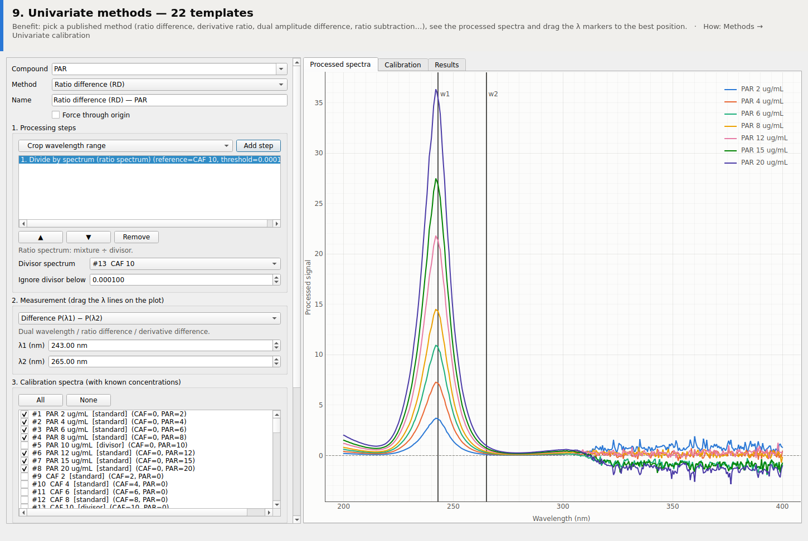

## 10. Calibration with full ICH statistics

**Benefit:** slope/intercept with SD and 95 % CI, r, Sy/x, LOD/LOQ and residual plot are computed automatically.

*How:* Calibrate

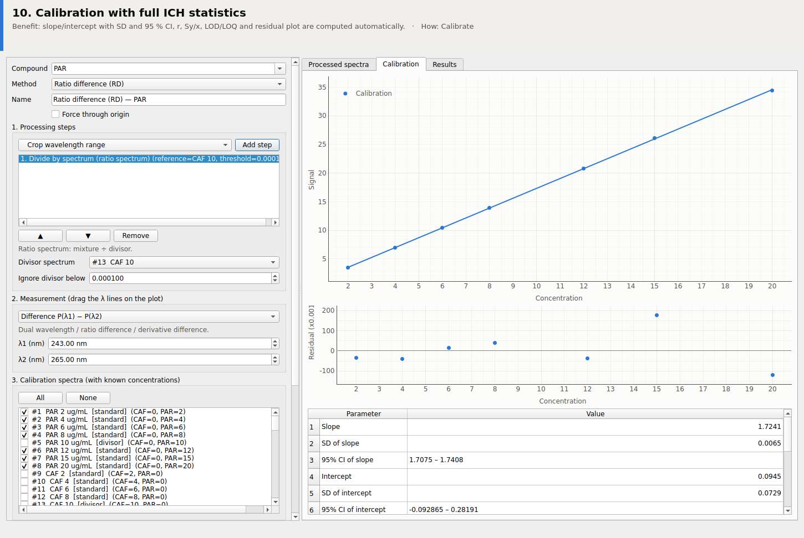

## 11. Assay of mixtures and tablets

**Benefit:** found, taken and % recovery (or % label claim) with mean, SD and RSD — ready to paste into a paper or export to Excel.

*How:* Determine

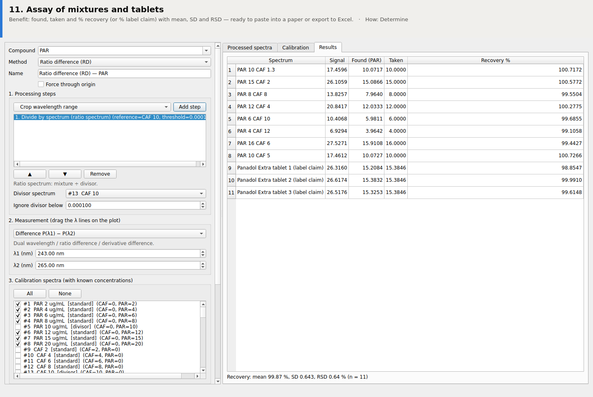

## 12. Standard addition inside the method

**Benefit:** checks accuracy in the real matrix: recovery of each spike and the extrapolated content, with the same calibrated method.

*How:* Standard addition… (spiked samples)

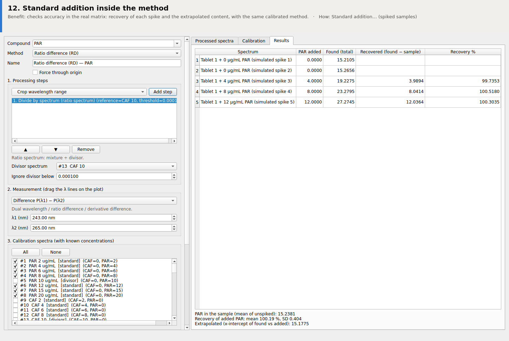

## 13. Robustness study in one click

**Benefit:** each parameter (λ, Δλ, plateau, window…) is varied by ±Δ, re-calibrated and re-assayed; the % deviation shows whether the method is robust (ICH Q2).

*How:* Robustness…

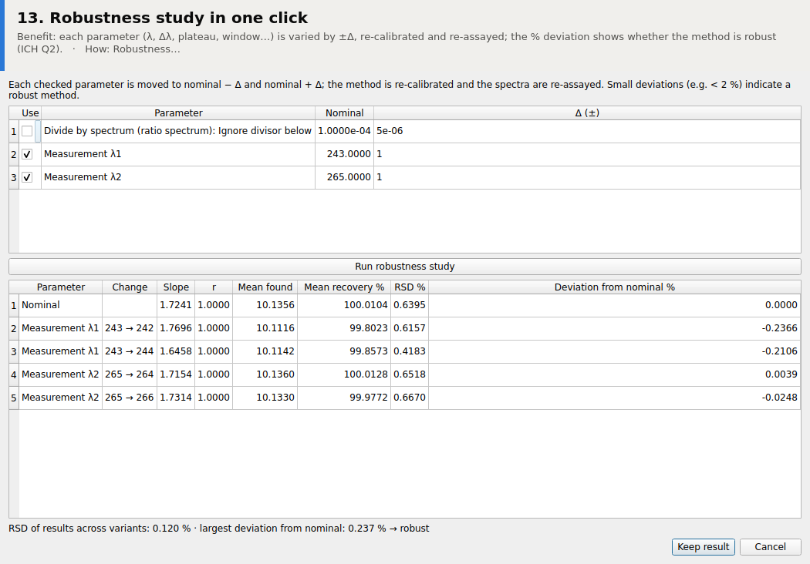

## 14. Simultaneous equations (Vierordt / bivariate / AUC)

**Benefit:** classic multi-wavelength methods with the coefficient matrix, its condition number and recoveries for every compound.

*How:* Methods → Equation methods

## 15. Chemometrics: cross-validation

**Benefit:** CLS, ILS, PCR, PLS, MCR-ALS, ANN and SVR with RMSECV curves and automatic choice of the number of components.

*How:* Methods → Chemometrics

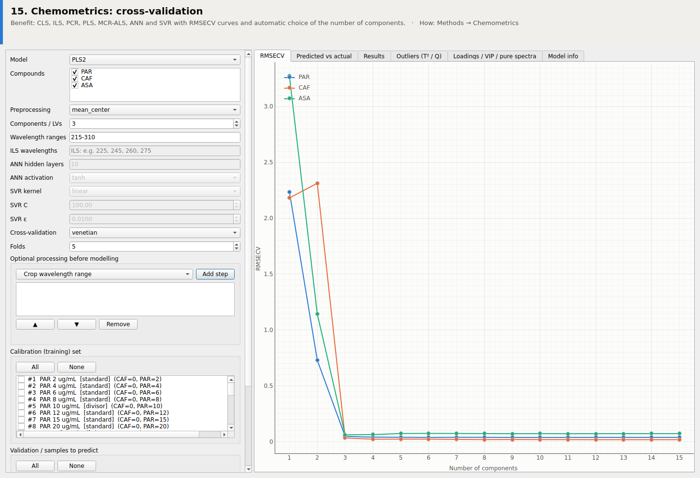

## 16. Chemometrics: prediction of validation mixtures and tablets

**Benefit:** predicted-vs-actual plot, RMSEP and recoveries per compound.

*How:* Fit + predict

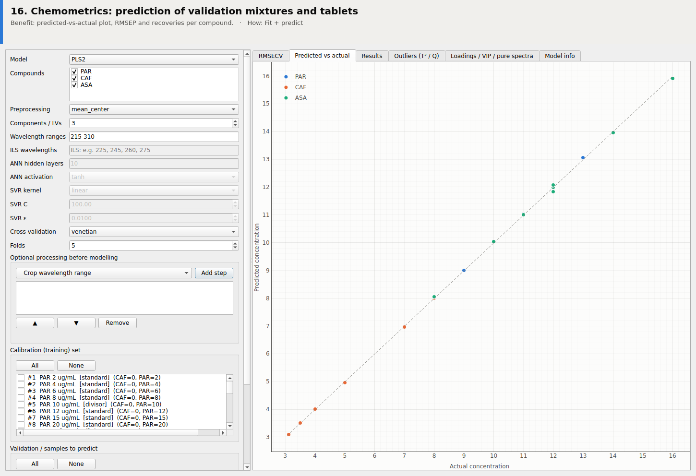

## 17. Outlier detection with T² / Q limits

**Benefit:** 95/99 % limits flag unusual calibration or sample spectra; one click excludes flagged spectra and refits. Fitted models are saved and exportable.

*How:* Outliers tab

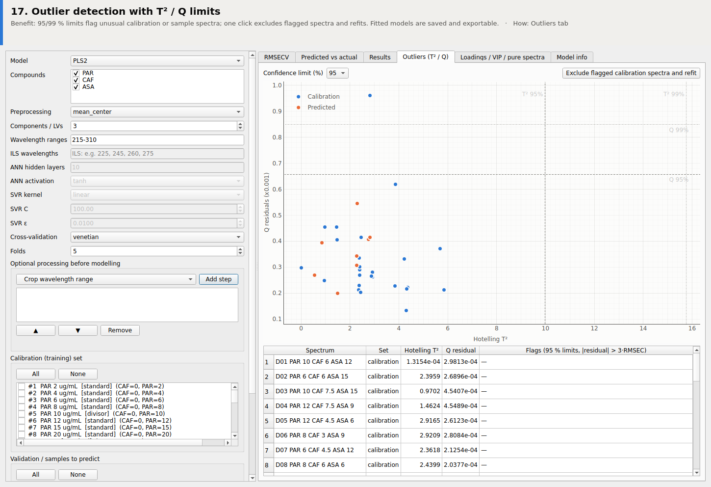

## 18. ICH Q2(R2) validation statistics

**Benefit:** linearity, LOD/LOQ, accuracy, precision/ANOVA, Student's t, F-test and the interval hypothesis test — no spreadsheet formulas to check.

*How:* Tools → Validation statistics

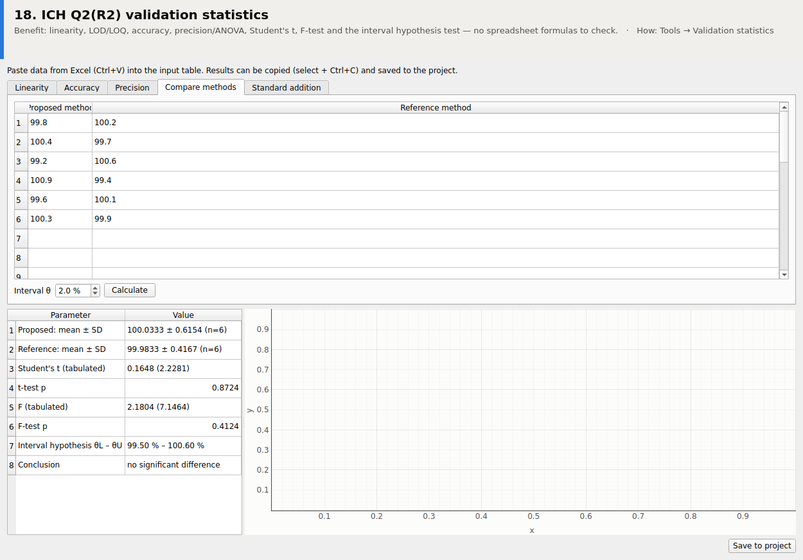

## 19. Calibration design for multivariate models

**Benefit:** Brereton 5-level multifactor design with the volume of each stock solution to pipette — balanced, uncorrelated training mixtures.

*How:* Tools → Calibration design

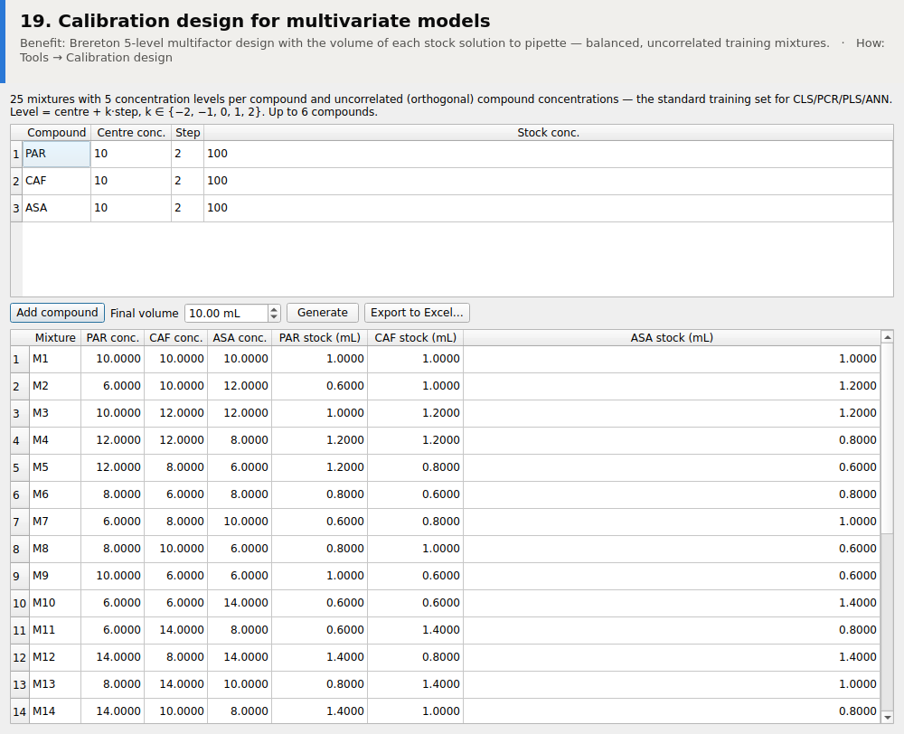

## 20. Greenness assessment (AGREE, Eco-Scale, GAPI)

**Benefit:** the greenness metrics journals ask for, with the pictogram, in the same tool as the analysis.

*How:* Tools → Greenness assessment

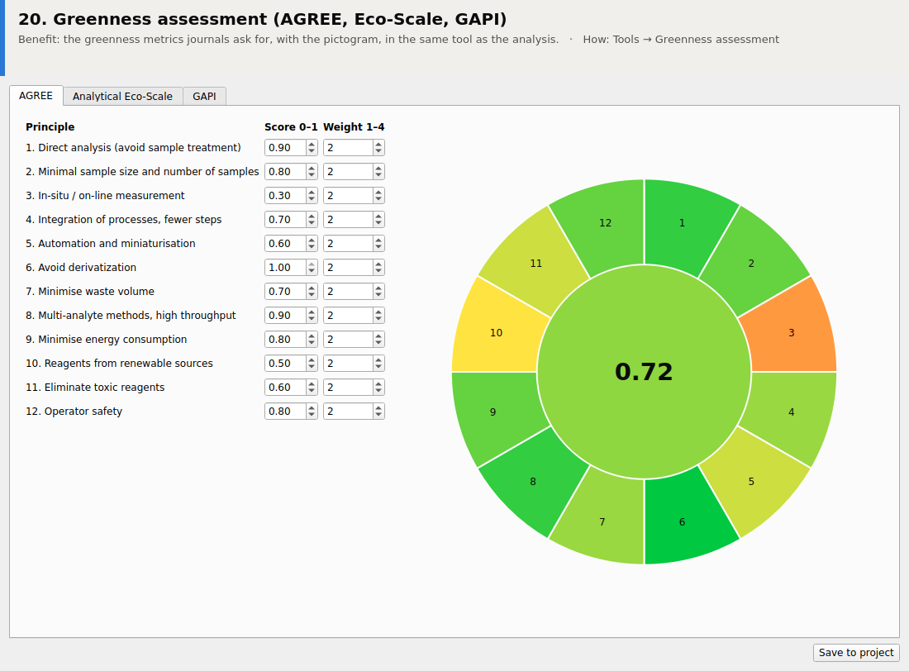

## 21. Publication-quality figures

**Benefit:** any plot → journal-ready TIFF/PNG (300–1200 dpi) or vector SVG/PDF/EPS, size in mm, fonts, black-and-white mode, with live preview.

*How:* Right-click a plot → Export publication figure

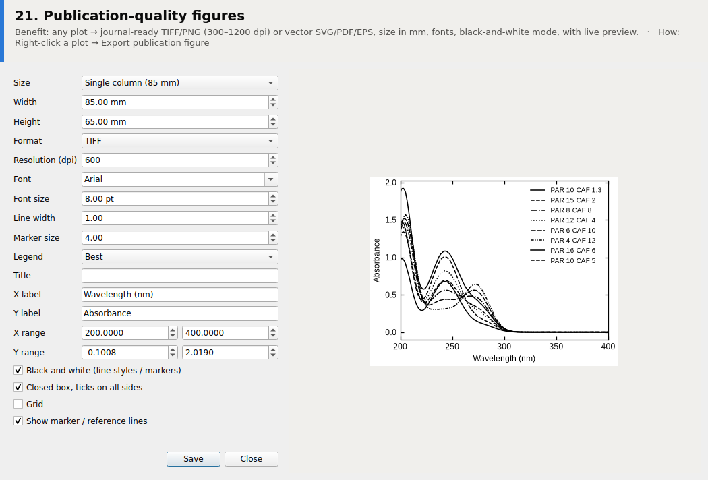

## 22. Saved methods and results, Excel export

**Benefit:** every calibration and assay is stored with its method; results export to Excel (one sheet each) and methods to portable .spmodel files.

*How:* Methods → Saved methods & results

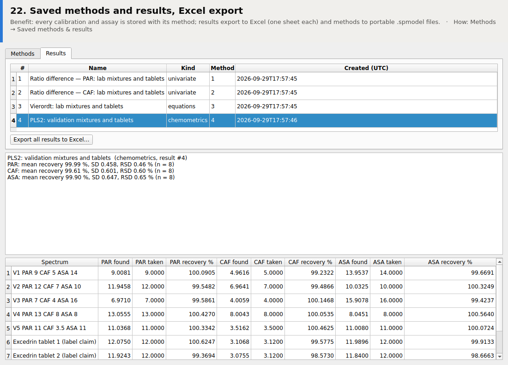

## 23. Trial report with audit trail

**Benefit:** one click produces a PDF/HTML report: spectra, processing lineage, methods, results, integrity check and the audit trail.

*How:* File → Trial report

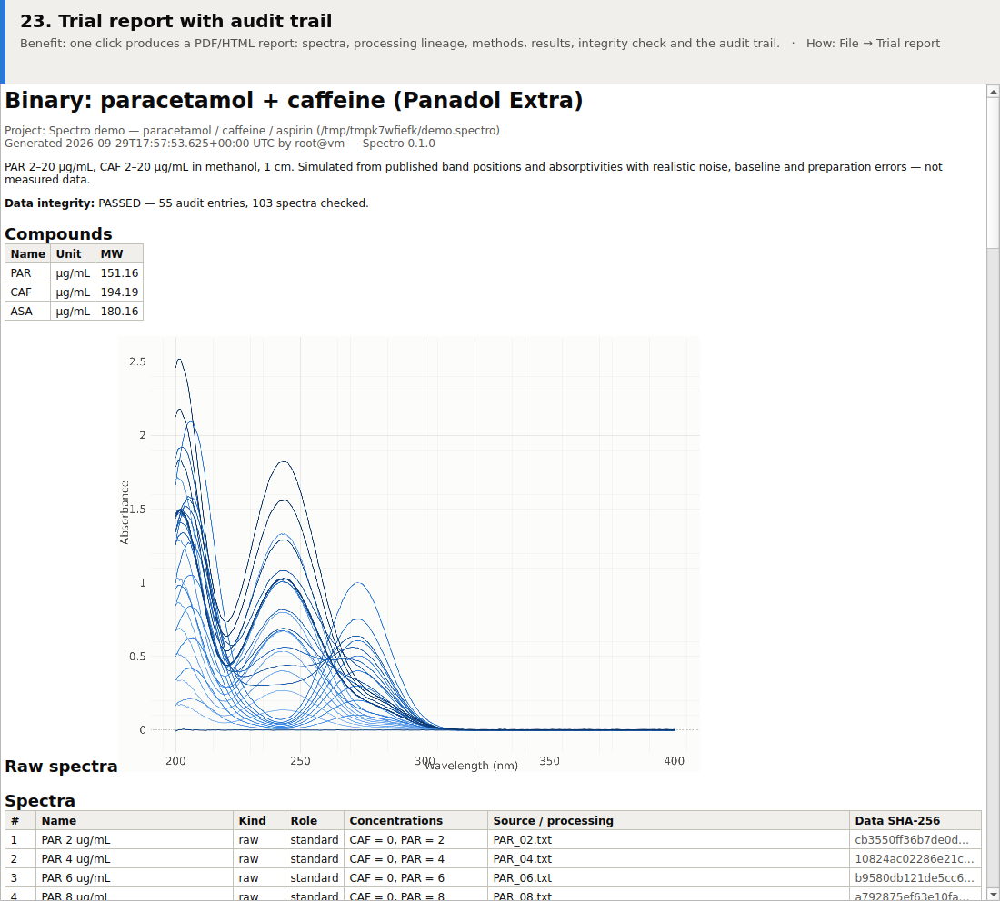
